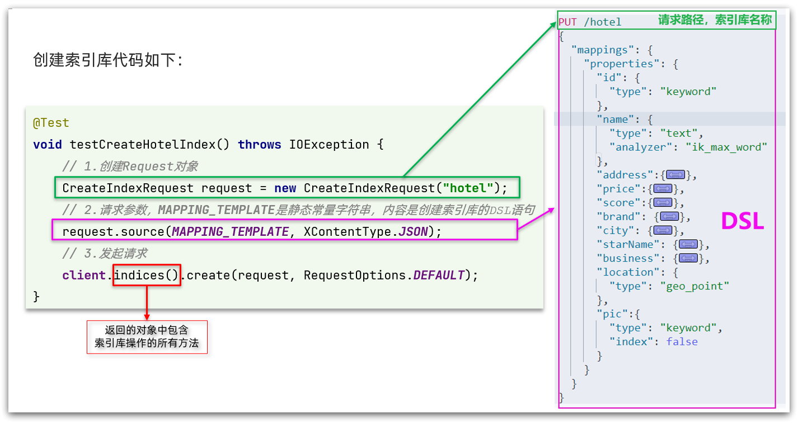

# elasticsearch


# 1. 分布式搜索引擎01


## 1.1 初识elasticsearch

1. 什么是elasticsearch？
    - 一个开源的分布式搜索引擎，可以用来实现搜索、日志统计、分析、系统监控等功能

2. 什么是elastic stack（ELK）？
    * 是以elasticsearch为核心的技术栈，包括beats、Logstash、kibana、elasticsearch

3. 什么是Lucene？
    - 是Apache的开源搜索引擎类库，提供了搜索引擎的核心API


### 1.1.1 倒排索引

### 1.1.2 正向和倒排

- **正向索引**是最传统的，根据id索引的方式。但根据词条查询时，必须先逐条获取每个文档，然后判断文档中是否包含所需要的词条，是**根据文档找词条的过程**。

- 而**倒排索引**则相反，是先找到用户要搜索的词条，根据词条得到保护词条的文档的id，然后根据id获取文档。是**根据词条找文档的过程**。

**正向索引**：

- 优点：
    - 可以给多个字段创建索引
    - 根据索引字段搜索、排序速度非常快
- 缺点：
    - 根据非索引字段，或者索引字段中的部分词条查找时，只能全表扫描。

**倒排索引**：

- 优点：
    - 根据词条搜索、模糊搜索时，速度非常快
- 缺点：
    - 只能给词条创建索引，而不是字段
    - 无法根据字段做排序

### 1.1.3.es的一些概念

我们统一的把mysql与elasticsearch的概念做一下对比：

| **MySQL** | **Elasticsearch** | **说明**                                                     |
| --------- | ----------------- | ------------------------------------------------------------ |
| Table     | Index             | 索引(index)，就是文档的集合，类似数据库的表(table)           |
| Row       | Document          | 文档（Document），就是一条条的数据，类似数据库中的行（Row），文档都是JSON格式 |
| Column    | Field             | 字段（Field），就是JSON文档中的字段，类似数据库中的列（Column） |
| Schema    | Mapping           | Mapping（映射）是索引中文档的约束，例如字段类型约束。类似数据库的表结构（Schema） |
| SQL       | DSL               | DSL是elasticsearch提供的JSON风格的请求语句，用来操作elasticsearch，实现CRUD |

- Mysql：擅长事务类型操作，可以确保数据的安全和一致性

- Elasticsearch：擅长海量数据的搜索、分析、计算

### 1.1.4 安装es、kibana

#### 1.1.4.1 安装单点elasticsearch

1. 创建网络:

    因为我们还需要部署kibana容器，因此需要让es和kibana容器互联。这里先创建一个网络：

    ```sh
    docker network create es-net
    ```

2. 加载镜像

    

上传到虚拟机中，然后运行命令加载即可：

```sh
# 导入数据
docker load -i es.tar
```

同理还有`kibana`的tar包也需要这样做。

3. 运行

    运行docker命令，部署单点es：

    ```sh
    docker run -d \
    	--name es \
        -e "ES_JAVA_OPTS=-Xms512m -Xmx512m" \
        -e "discovery.type=single-node" \
        -v es-data:/usr/share/elasticsearch/data \
        -v es-plugins:/usr/share/elasticsearch/plugins \
        --privileged \
        --network es-net \
        -p 9200:9200 \
        -p 9300:9300 \
    elasticsearch:7.12.1
    ```

    命令解释：

    - `-e "cluster.name=es-docker-cluster"`：设置集群名称
    - `-e "http.host=0.0.0.0"`：监听的地址，可以外网访问
    - `-e "ES_JAVA_OPTS=-Xms512m -Xmx512m"`：内存大小
    - `-e "discovery.type=single-node"`：非集群模式
    - `-v es-data:/usr/share/elasticsearch/data`：挂载逻辑卷，绑定es的数据目录
    - `-v es-logs:/usr/share/elasticsearch/logs`：挂载逻辑卷，绑定es的日志目录
    - `-v es-plugins:/usr/share/elasticsearch/plugins`：挂载逻辑卷，绑定es的插件目录
    - `--privileged`：授予逻辑卷访问权
    - `--network es-net` ：加入一个名为es-net的网络中
    - `-p 9200:9200`：端口映射配置

    

    在浏览器中输入：http://192.168.150.101:9200 即可看到elasticsearch的响应结果

#### 1.1.4.2 部署kibana

1. 镜像安装同上

2. 部署

    运行docker命令，部署kibana

    ```sh
    docker run -d \
    --name kibana \
    -e ELASTICSEARCH_HOSTS=http://es:9200 \
    --network=es-net \
    -p 5601:5601  \
    kibana:7.12.1
    ```

    - `--network es-net` ：加入一个名为es-net的网络中，与elasticsearch在同一个网络中
    - `-e ELASTICSEARCH_HOSTS=http://es:9200"`：设置elasticsearch的地址，因为kibana已经与elasticsearch在一个网络，因此可以用容器名直接访问elasticsearch
    - `-p 5601:5601`：端口映射配置

    kibana启动一般比较慢，需要多``等待``一会

#### 1.1.4.3 DevTools

kibana中提供了一个DevTools界面：


这个界面中可以编写DSL来操作elasticsearch。并且对DSL语句有自动补全功能。


### 1.1.5 IK分词器

分词器的作用是什么？

- 创建倒排索引时对文档分词
- 用户搜索时，对输入的内容分词


IK分词器有几种模式？

- ik_smart：智能切分，粗粒度
- ik_max_word：最细切分，细粒度

1. 在线安装ik插件（较慢）

    ```shell
    # 进入容器内部
    docker exec -it elasticsearch /bin/bash
    
    # 在线下载并安装
    ./bin/elasticsearch-plugin  install https://github.com/medcl/elasticsearch-analysis-ik/releases/download/v7.12.1/elasticsearch-analysis-ik-7.12.1.zip
    
    #退出
    exit
    #重启容器
    docker restart elasticsearch
    ```

2. 离线安装ik插件（推荐）

    安装插件需要知道elasticsearch的plugins目录位置，而我们用了数据卷挂载，因此需要查看elasticsearch的数据卷目录，通过下面命令查看:

    ```sh
    docker volume inspect es-plugins
    ```

    显示结果：

    ```json
    [
        {
            "CreatedAt": "2022-05-06T10:06:34+08:00",
            "Driver": "local",
            "Labels": null,
            "Mountpoint": "/var/lib/docker/volumes/es-plugins/_data",
            ......
        }
    ]
    ```

    说明plugins目录被挂载到了：`/var/lib/docker/volumes/es-plugins/_data `这个目录中。

3. 解压缩分词器安装包

    - 把课前资料中的ik分词器解压缩，重命名为ik

        

4. 上传到es容器的插件数据卷中

    也就是`/var/lib/docker/volumes/es-plugins/_data `

5. 重启容器

    ```shell
    # 4、重启容器
    docker restart es
    ```

    ```sh
    # 查看es日志
    docker logs -f es
    ```

6. 测试：

    IK分词器包含两种模式：

    * `ik_smart`：最少切分

    * `ik_max_word`：最细切分

```json
GET /_analyze
{
  "analyzer": "ik_max_word",
  "text": "黑马程序员学习java太棒了"
}
```

### 1.1.6 扩展词词典

1. 打开IK分词器config目录

2. 在`IKAnalyzer.cfg.xml`配置文件内容添加：

    ```xml
    <?xml version="1.0" encoding="UTF-8"?>
    <!DOCTYPE properties SYSTEM "http://java.sun.com/dtd/properties.dtd">
    <properties>
            <comment>IK Analyzer 扩展配置</comment>
            <!--用户可以在这里配置自己的扩展字典 *** 添加扩展词典-->
            <entry key="ext_dict">ext.dic</entry>
    </properties>
    ```

3. 新建一个 ext.dic，可以参考config目录下复制一个配置文件进行修改

    ```properties
    狠赚一笔
    奥力给
    ```

    注意当前文件的编码必须是 UTF-8 格式，严禁使用Windows记事本编辑

4. 重启elasticsearch 

    ```sh
    docker restart es
    ```

5. 测试效果

### 1.1.7 停用词词典

1. `IKAnalyzer.cfg.xml`配置文件内容添加

2. 新建stopword.dic, 在 stopword.dic 添加停用词

    ```properties
    啊
    嗯
    ```

3. 重启elasticsearch 

    ```sh
    # 重启服务
    docker restart elasticsearch
    docker restart kibana
    ```

4. 测试效果

    

## 1.2 索引库操作

索引库就类似数据库表，mapping映射就类似表的结构。

我们要向es中存储数据，必须先创建“库”和“表”。

### 1.2.1 mapping映射属性

常见的mapping属性包括：

- type：字段数据类型，常见的简单类型有：
    - 字符串：text（可分词的文本）、keyword（精确值，例如：品牌、国家、ip地址）
    - 数值：long、integer、short、byte、double、float、
    - 布尔：boolean
    - 日期：date
    - 对象：object
- index：是否创建索引，默认为true
- analyzer：使用哪种分词器
- properties：该字段的子字段

### 1.2.2 索引库的CRUD(使用Kibana编写DSL)

1. **创建索引库和映射**

    **基本语法**：

    - 请求方式：PUT
    - 请求路径：/索引库名，可以自定义
    - 请求参数：mapping映射

    ```sh
    #创建索引库
    PUT /heima
    {
      "mappings": {
        "properties": {
          "info": {
            "type": "text",
            "analyzer": "ik_smart"
          },
          "email": {
            "type": "keyword",
            "index": false
          },
          "name": {
            "type": "object",
            "properties": {
              "firstName": {
                "type": "keyword"
              },
              "lastName": {
                "type": "keyword"
              }
            }
          }
        }
      }
    }
    ```

2. **查询索引库**

    **基本语法**：

    - 请求方式：GET

    - 请求路径：/索引库名

    - 请求参数：无

    ```sh
    #查询
    GET /heima
    ```

3. **修改索引库**

    `无法修改mapping中已有的字段，但是却允许添加新的字段到mapping中`

    ```sh
    #修改索引库,添加新字段
    PUT /heima/_mapping
    {
      "properties":{
        "age":{
          "type":"integer"
        }
      }
    }
    ```

4. **删除索引库**

    **语法：**

    - 请求方式：DELETE
    - 请求路径：/索引库名
    - 请求参数：无

    ```sh
    #删除
    DELETE /heima
    ```

## 1.3 文档操作

### 1.3.1 新增文档

**语法**:

POST /索引库名/_doc/文档id{}

```json
#插入文档
POST /heima/_doc/1
{
  "info": "黑马程序员Java学员",
  "email": "123@qq.com",
  "name": {
    "fistName": "云",
    "lastName": "赵"
  }
}
```

### 1.3.2 查询文档

**语法：**

```json
GET /{索引库名称}/_doc/{id}
```

```sh
#查询文档
GET /heima/_doc/1
```

### 1.3.3 删除文档

**语法：**

```js
DELETE /{索引库名}/_doc/id值
```

```json
#删除文档
DELETE /heima/_doc/1
```

### 1.3.4 修改文档

修改有两种方式：

- 全量修改：直接覆盖原来的文档

- 增量修改：修改文档中的部分字段

    - 全量修改是覆盖原来的文档,根据id进行修改，若id不存在，直接新增

        **语法**：

        ```json
        PUT /{索引库名}/_doc/文档id
        {
            "字段1": "值1",
            "字段2": "值2",
            // ... 略
        }
        ```

        ```json
        #全量修改文档
        PUT /heima/_doc/3
        {
          "info": "黑马程序员Java学员",
          "email": "zhaoyun@qq.com",
          "name": {
            "fistName": "云",
            "lastName": "赵"
          }
        }
        ```

    - 增量修改是只修改指定id匹配的文档中的**部分字段**

        **语法：**

        ```json
        POST /{索引库名}/_update/文档id
        {
            "doc": {
                 "字段名": "新的值",
            }
        }
        ```

        ```
        #局部修改文档
        POST /heima/_update/1
        {
          "doc": {
            "email": "zhaoyun666@qq.com"
          }
        }
        ```

## 1.4 RestAPI

官方文档地址：https://www.elastic.co/guide/en/elasticsearch/client/index.html

基于`Java High Level Rest Client`

### 1.4.0 导入Demo工程

1. 导入数据(资料tb_hotel.sql)

2. 导入项目(hotel-demo)

3. mapping映射分析:

    创建索引库，最关键的是mapping映射，而mapping映射要考虑的信息包括：

    - 字段名
    - 字段数据类型
    - 是否参与搜索
    - 是否需要分词
    - 如果分词，分词器是什么？

    其中：

    - 字段名、字段数据类型，可以参考数据表结构的名称和类型
    - 是否参与搜索要分析业务来判断，例如图片地址，就无需参与搜索
    - 是否分词呢要看内容，内容如果是一个整体就无需分词，反之则要分词
    - 分词器，我们可以统一使用ik_max_word

地理坐标说明：


copy_to说明:


4. 初始化RestClient

    1. 引入es的RestHighLevelClient依赖：

        ```xml
        <dependency>
            <groupId>org.elasticsearch.client</groupId>
            <artifactId>elasticsearch-rest-high-level-client</artifactId>
        </dependency>
        ```

    2. 因为SpringBoot默认的ES版本是7.6.2，所以我们需要覆盖默认的ES版本：

        ```xml
        <properties>
            <java.version>1.8</java.version>
            <elasticsearch.version>7.12.1</elasticsearch.version>
        </properties>
        ```

    3. 初始化RestHighLevelClient：

        ```java
        @TestInstance(TestInstance.Lifecycle.PER_CLASS)
        public class HotelIndexTest {
            private RestHighLevelClient client;
            @BeforeAll
            void setUp() {
                this.client = new RestHighLevelClient(RestClient.builder(
                        HttpHost.create("http://192.168.48.128:9200")
                ));
            }
            @AfterAll
            void testDown() throws IOException {
                this.client.close();
            }
            @Test
            void testInit() {
                System.out.println(client);
            }
        }
        ```

#### 1.4.1 创建索引库



**示例**：

1. 在hotel-demo的cn.itcast.hotel.constants包下，创建一个类，定义mapping映射的JSON字符串常量：

    ```java
    public class HotelConstants {
        public static final String MAPPING_TEMPLATE = "{\n" +
                "  \"mappings\": {\n" +
                "    \"properties\": {\n" +
                "      \"id\": {\n" +
                "        \"type\": \"keyword\"\n" +
                "      },\n" +
                "      \"name\": {\n" +
                "        \"type\": \"text\",\n" +
                "        \"analyzer\": \"ik_max_word\",\n" +
                "        \"copy_to\": \"all\"\n" +
                "      },\n" +
                "      \"address\": {\n" +
                "        \"type\": \"keyword\"\n" +
                "        , \"index\": false\n" +
                "      },\n" +
                "      \"price\": {\n" +
                "        \"type\": \"keyword\"\n" +
                "      },\n" +
                "      \"socre\": {\n" +
                "        \"type\": \"keyword\"\n" +
                "      },\n" +
                "      \"brand\": {\n" +
                "        \"type\": \"keyword\"\n" +
                "      },\n" +
                "      \"city\": {\n" +
                "        \"type\": \"keyword\"\n" +
                "      },\n" +
                "      \"star_name\": {\n" +
                "        \"type\": \"keyword\"\n" +
                "      },\n" +
                "      \"business\": {\n" +
                "        \"type\": \"keyword\",\n" +
                "        \"copy_to\": \"all\"\n" +
                "      },\n" +
                "      \"location\": {\n" +
                "        \"type\": \"geo_point\"\n" +
                "      },\n" +
                "      \"pic\": {\n" +
                "        \"type\": \"keyword\"\n" +
                "        , \"index\": false\n" +
                "      },\n" +
                "      \"all\": {\n" +
                "        \"type\": \"text\",\n" +
                "        \"analyzer\": \"ik_max_word\"\n" +
                "      }\n" +
                "    }\n" +
                "  }\n" +
                "}";
    }
    ```

2. 在hotel-demo中的HotelIndexTest测试类中，编写单元测试，实现创建索引：

    ```java
    /**
         * 创建索引库
         * @throws IOException
         */
        @Test
        void createHotelIndex() throws IOException {
            // 1. 创建Request对象
            CreateIndexRequest request = new CreateIndexRequest("hotel");
            // 2. 准备请求的参数：DSL语句
            request.source(MAPPING_TEMPLATE, XContentType.JSON);
            // 3. 发起请求
            client.indices().create(request, RequestOptions.DEFAULT);
        }
    ```

#### 1.4.2 删除索引库

```java
/**
     * 删除索引库
     * @throws IOException
     */
    @Test
    void deleteHotelIndex() throws IOException {
        // 1. 创建Request对象
        DeleteIndexRequest request = new DeleteIndexRequest("hotel");
        // 3. 发起请求
        client.indices().delete(request, RequestOptions.DEFAULT);
    }
```

#### 1.4.3 判断索引库是否存在

```java
/**
     * 索引库是否存在
     * @throws IOException
     */
    @Test
    void testExistsHotelIndex() throws IOException {
        // 1. 创建Request对象
        GetIndexRequest request = new GetIndexRequest("hotel");
        // 3. 发起请求
        boolean exists = client.indices().exists(request, RequestOptions.DEFAULT);
        System.err.println(exists? "索引库已经存在！" : "索引库不存在！");
    }
```


## 1.5 RestClient操作文档

### 1.5.0 初始化RestHighLevelClient

```java
@TestInstance(TestInstance.Lifecycle.PER_CLASS)
@SpringBootTest
public class HotelDocumentTest {

    @Autowired
    private IHotelService hotelService;

    private RestHighLevelClient client;

    @BeforeAll
    void setUp() {
        this.client = new RestHighLevelClient(RestClient.builder(
                HttpHost.create("http://192.168.48.128:9200")
        ));
    }

    @AfterAll
    void testDown() throws IOException {
        this.client.close();
    }
}
```


1. 已知Hotel类

    - longitude和latitude需要合并为location

2. HotelDoc类

    `核心代码`：

    ```java
    public HotelDoc(Hotel hotel) {
            this.id = hotel.getId();
            this.name = hotel.getName();
            this.address = hotel.getAddress();
            this.price = hotel.getPrice();
            this.score = hotel.getScore();
            this.brand = hotel.getBrand();
            this.city = hotel.getCity();
            this.starName = hotel.getStarName();
            this.business = hotel.getBusiness();
            this.location = hotel.getLatitude() + ", " + hotel.getLongitude();
            this.pic = hotel.getPic();
        }
    ```


### 1.5.1 新增文档

```java
/**
     * 新增文档
     * @throws IOException
     */
    @Test
    void testAddDocument() throws IOException {
        // 根据id查询酒店数据
        Hotel hotel = hotelService.getById(61083L);
        // 转换为文档类型
        HotelDoc hotelDoc = new HotelDoc(hotel);
        // 1. 准备request对象
        IndexRequest request = new IndexRequest("hotel").id(hotelDoc.getId().toString());
        // 2. 准备JSON文档 （将HotelDoc转json）
        request.source(JSON.toJSONString(hotelDoc), XContentType.JSON);
        // 3. 发送请求
        client.index(request, RequestOptions.DEFAULT);
    }
```

### 1.5.2 查询文档

```java
/**
     * 查询文档
     * @throws IOException
     */
    @Test
    void testGetDocumentById() throws IOException {
        // 1. 准备Request
        GetRequest request = new GetRequest("hotel", "61083");
        // 2. 发送请求，得到响应
        GetResponse response = client.get(request, RequestOptions.DEFAULT);
        // 3. 解析响应结果
        String json = response.getSourceAsString();
		//将 JSON 格式的字符串 json 解析为 Java 对象 HotelDoc
        HotelDoc hotelDoc = JSON.parseObject(json, HotelDoc.class);
        System.out.println("hotelDoc = " + hotelDoc);
    }
```

### 1.5.3 删除文档

```java
/**
     * 删除文档
     */
    @Test
    void testDeleteDocument() throws IOException {
        // 1. 准备Request
        DeleteRequest request = new DeleteRequest("hotel", "61083");
        // 2.发起请求
        client.delete(request, RequestOptions.DEFAULT);
    }
```

### 1.5.4 修改文档

全量修改文档与新增文档的API完全一致，判断依据是ID


`增量修改:`

```java
/**
 * 更新文档
 */
@Test
void testUpdateDocument() throws IOException {
    // 1. 准备Request
    UpdateRequest request = new UpdateRequest("hotel", "61083");
    // 2. 准备请求参数
    request.doc(
            "price", "998",
            "starName", "四钻"
    );
    // 3. 发起请求
    client.update(request, RequestOptions.DEFAULT);

}
```

### 1.5.5 批量导入文档

利用**BulkRequest批量**将数据库数据导入到索引库中

```java
/**
     * 批量新增
     * @throws IOException
     */
    @Test
    void testBulkRequest() throws IOException {
        // 批量查询酒店数据
        List<Hotel> hotels = hotelService.list();
        // 1. 准备Request
        BulkRequest request = new BulkRequest();
        // 2. 准备参数，添加多个新增的Request
        for (Hotel hotel : hotels) {
            // 转换为文档类型HotelDoc
            HotelDoc hotelDoc = new HotelDoc(hotel);
            // 创建新增文档的Request对象
        request.add(new IndexRequest("hotel")
                .id(hotelDoc.getId().toString())
                .source(JSON.toJSONString(hotelDoc), XContentType.JSON)); //将HotelDoc转json）
        }
        // 3. 发送请求
        client.bulk(request, RequestOptions.DEFAULT);
    }
```

# 2. 分布式搜索引擎02

## 1. DSL查询文档

## 1.1 DSL查询分类

Elasticsearch提供了基于JSON的DSL（[Domain Specific Language](https://www.elastic.co/guide/en/elasticsearch/reference/current/query-dsl.html)）来定义查询。常见的查询类型包括：

- **查询所有**：查询出所有数据，一般测试用。例如：match_all

- **全文检索（full text）查询**：利用分词器对用户输入内容分词，然后去倒排索引库中匹配。例如：
    - match_query
    - multi_match_query
- **精确查询**：根据精确词条值查找数据，一般是查找keyword、数值、日期、boolean等类型字段。例如：
    - ids
    - range
    - term
- **地理（geo）查询**：根据经纬度查询。例如：
    - geo_distance
    - geo_bounding_box
- **复合（compound）查询**：复合查询可以将上述各种查询条件组合起来，合并查询条件。例如：
    - bool
    - function_score

查询的语法基本一致：

```json
GET /indexName/_search
{
  "query": {
    "查询类型": {
      "查询条件": "条件值"
    }
  }
}
```

**查询所有**：

```json
// 查询所有
GET /indexName/_search
{
  "query": {
    "match_all": {
    }
  }
}
```

## 1.2 全文检索查询

### 1.2.1 使用场景

全文检索查询的基本流程如下：

- 对用户搜索的内容做分词，得到词条
- 根据词条去倒排索引库中匹配，得到文档id
- 根据文档id找到文档，返回给用户

### 1.2.2 基本语法

常见的全文检索查询包括：

- **match**查询：单字段查询
- **multi_match**查询：多字段查询，任意一个字段符合条件就算符合查询条件

match查询语法如下：

```json
GET /indexName/_search
{
  "query": {
    "match": {
      "FIELD": "TEXT"
    }
  }
}
```

mulit_match语法如下：

```json
GET /indexName/_search
{
  "query": {
    "multi_match": {
      "query": "TEXT",
      "fields": ["FIELD1", " FIELD12"]
    }
  }
}
```

**示例：**

```json
# match查询
GET /hotel/_search
{
  "query": {
    "match": {
      "all": "外滩如家"
    }
  }
}

# multi_match查询
GET /hotel/_search
{
  "query": {
    "multi_match": {
      "query": "外滩如家",
      "fields": ["brand", "name", "business"]
    }
  }
}
```

==搜索字段越多，对查询性能影响越大，因此建议采用copy_to，然后单字段查询的方式。==

## 1.3 精准查询

精确查询一般是查找keyword、数值、日期、boolean等类型字段。所以**不会**对搜索条件分词。常见的有：

- term查询：根据词条精确匹配，一般搜索keyword类型、数值类型、布尔类型、日期类型字段
- range查询：根据数值范围查询，可以是数值、日期的范围

### 1.3.1 term查询

语法说明：

```json
// term查询
GET /indexName/_search
{
  "query": {
    "term": {
      "FIELD": {
        "value": "VALUE"
      }
    }
  }
}
```

**示例：**

```
# term 查询
GET /hotel/_search
{
  "query": {
    "term": {
      "city": {
        "value": "北京"
      }
    }
  }
}
```

### 1.3.2 range查询

基本语法：

```json
// range查询
GET /indexName/_search
{
  "query": {
    "range": {
      "FIELD": {
        "gte": 10, // 这里的gte代表大于等于，gt则代表大于
        "lte": 20 // lte代表小于等于，lt则代表小于
      }
    }
  }
}
```

**示例：**

```json
# range 查询
GET /hotel/_search
{
  "query": {
    "range": {
      "price": {
        "gte": 1000,
        "lte": 3000
      }
    }
  }
}
```

## 1.4 地理坐标查询

所谓的地理坐标查询，其实就是根据经纬度查询，官方文档：https://www.elastic.co/guide/en/elasticsearch/reference/current/geo-queries.html

### 1.4.1 矩形范围查询

矩形范围查询，也就是**geo_bounding_box**查询,查询时，需要指定矩形的**左上**、**右下**两个点的坐标，然后画出一个矩形，落在该矩形内的都是符合条件的点。

语法如下：

```json
// geo_bounding_box查询
GET /indexName/_search
{
  "query": {
    "geo_bounding_box": {
      "FIELD": {
        "top_left": { // 左上点
          "lat": 31.1,
          "lon": 121.5
        },
        "bottom_right": { // 右下点
          "lat": 30.9,
          "lon": 121.7
        }
      }
    }
  }
}
```

### 1.4.2 附近查询

语法说明：

```json
// geo_distance 查询
GET /indexName/_search
{
  "query": {
    "geo_distance": {
      "distance": "15km", // 半径
      "FIELD": "31.21,121.5" // 圆心
    }
  }
}
```

**示例:**

```json
# distance 查询
GET /hotel/_search
{
  "query": {
    "geo_distance": {
      "distance": "2km",
      "location": "31.21, 121.5"
    }
  }
}
```

## 1.5 复合查询

复合（compound）查询：复合查询可以将其它简单查询组合起来，实现更复杂的搜索逻辑。常见的有两种：

- fuction score：算分函数查询，可以控制文档相关性算分，控制文档排名
- bool query：布尔查询，利用逻辑关系组合多个其它的查询，实现复杂搜索

### 1.5.1 相关性算分

当我们利用match查询时，文档结果会根据与搜索词条的关联度打分（_score），返回结果时按照分值降序排列。

在elasticsearch中，早期使用的打分算法是TF-IDF算法，在后来的5.1版本升级中，elasticsearch将算法改进为BM25算法。

### 1.5.2 算分函数查询

要控制相关性算分，就需要利用elasticsearch中的function score 查询了。

#### 1）语法说明


function score 查询中包含四部分内容：

- **原始查询**条件：query部分，基于这个条件搜索文档，并且基于BM25算法给文档打分，**原始算分**（query score)
- **过滤条件**：filter部分，符合该条件的文档才会重新算分
- **算分函数**：符合filter条件的文档要根据这个函数做运算，得到的**函数算分**（function score），有四种函数
    - weight：函数结果是常量
    - field_value_factor：以文档中的某个字段值作为函数结果
    - random_score：以随机数作为函数结果
    - script_score：自定义算分函数算法
- **运算模式**：算分函数的结果、原始查询的相关性算分，两者之间的运算方式，包括：
    - multiply：相乘
    - replace：用function score替换query score
    - 其它，例如：sum、avg、max、min


function score的运行流程如下：

- 1）根据**原始条件**查询搜索文档，并且计算相关性算分，称为**原始算分**（query score）
- 2）根据**``过滤条件``**，过滤文档
- 3）符合**过滤条件**的文档，基于**``算分函数``****运算，得到**函数算分**（function score）
- 4）将**原始算分**（query score）和**函数算分**（function score）基于**``运算模式``**做运算，得到最终结果，作为相关性算分。

#### 2）示例

```java
GET /hotel/_search
{
  "query": {
    "function_score": {
      "query": {  .... }, // 原始查询，可以是任意条件
      "functions": [ // 算分函数
        {
          "filter": { // 满足的条件，品牌必须是如家
            "term": {
              "brand": "如家"
            }
          },
          "weight": 2 // 算分权重为2
        }
      ],
      "boost_mode": "sum" // 加权模式，求和
    }
  }
}
```

### 1.5.3 布尔查询

布尔查询是一个或多个查询子句的组合，每一个子句就是一个**子查询**。子查询的组合方式有：

- must：必须匹配每个子查询，类似“与”
- should：选择性匹配子查询，类似“或”
- must_not：必须不匹配，**不参与算分**，类似“非”
- filter：必须匹配，**不参与算分**

**示例：**

```json
# bool 查询
GET /hotel/_search
{
  "query": {
    "bool": {
      "must": [
        {
          "match": {
            "name": "如家"
          }
        }
      ],
      "filter": [
        {
          "geo_distance": {
            "distance": "10km",
            "location": {
              "lat": 31.21,
              "lon": 121.5
            }
          }
        }
      ],
      "must_not": [
        {
          "range": {
            "price": {
              "gt": 400
            }
          }
        }
      ]
    }
  }
}
```

