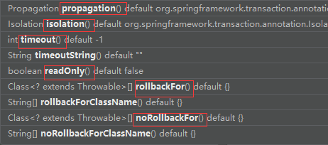

# Spring5简介

## Spring5特性

1. Spring 是轻量级的开源的 JavaEE 框架
2. Spring 有两个核心部分：IOC 和 Aop

   - IOC：控制反转，把创建对象过程交给 Spring 进行管理
- Aop：面向切面，不修改源代码进行功能增强
3. Spring 特点:
   - 方便解耦，简化开发
   - Aop 编程支持
   - 方便程序测试
   - 方便和其他框架进行整合
   - 方便进行事务操作
   - 降低 API 开发难度

## IOC(概念和原理)

1. 什么是IOC:

   * 控制反转，把对象创建和对象之间的调用过程，交给 Spring 进行管理
   * 使用 IOC 目的：为了耦合度降低

2. IOC 底层原理:

   xml 解析、工厂模式、反射

3. 画图理解IOC:

   

## IOC(BeanFactory接口)

1. IOC 思想基于 IOC 容器完成，IOC 容器底层就是对象工厂

2. Spring 提供 IOC 容器实现两种方式：（两个接口）

   * BeanFactory：IOC 容器基本实现，是 Spring 内部的使用接口，不提供开发人员进行使用
     * BeanFactroy采用的是延迟加载形式来注入Bean的，只有在使用到某个Bean时(调用getBean())，才对该Bean进行加载实例化。
   * ApplicationContext：BeanFactory 接口的子接口，提供更多更强大的功能，一般由开发人员进行使用
     * ApplicationContext，它是在容器启动时，一次性创建了所有的Bean。

3. **创建ApplicationContext的方法：** 

   * 丛类路径下加载配置文件:ClassPathXmlApplicationContext ("applicationContext.xml");
   * 从硬盘绝对路径下加载配置文件: FileSystemXmlApplicationContext(“d:/xxx/yyy/xxx”);

4. BeanFactroy接口继承体系

   

## IOC操作bean管理(基于xml方式)

- **创建对象**

  ```xml
  <bean id="user" class="com.atguigu.spring5.User"></bean>
  ```

- **注入属性：**

  1. 使用set方法进行注入：

     ```Java
     1.创建属性对应的set方法
         public void setBName(String BName) {
             this.BName = BName;
         }
         public void setBAuthor(String BAuthor) {
             this.BAuthor = BAuthor;
         }
     ```

     ```xml
     2.set方法注入属性
     <bean 
           id="book" class="com.atguigu.spring5.Book"> </bean>
     <property name="BName" value="易筋经"></property>
     <property name="BAuthor" value="达摩老祖"></property>
     ```

  2. 使用有参构造器进行注入：

     ```java
     //1.有参构造器
     public Orders(String OName, String address) {
         this.OName = OName;
         this.address = address;
     }
     ```

     ```xml
     2.有参构造注入属性
     <bean 
     id="orders" class="com.atguigu.spring5.Orders" >
     <constructor-arg 
                      name="OName" value="macbook"></constructor-arg>
     <constructor-arg name="address" value="China"></constructor-arg>
     </bean>
     ```

## IOC操作bean管理(xml注入其他类型属性)

- 字面量

  ```xml
  1）null 值
  <!--null 值-->
  <property name="address">
   <null/>
  </property>
  （2）属性值包含特殊符号
  <!--属性值包含特殊符号
   1 把<>进行转义 &lt; &gt;
   2 把带特殊符号内容写到 CDATA
  -->
  <property name="address">
   <value><![CDATA[<<南京>>]]></value>
  </property>
  ```

- **外部bean**

   ```xml
   <beans>
   <bean id="userService" class="com.atguigu.spring5.service.UserService" >
   <!--注入UserDao属性
   name:类里边的属性名称 ref:创建userDao对象bean标签的id值-->
   <property name="userDao" ref="userDaoImpl"></property>
   </bean>
       <bean id="userDaoImpl" 		          class="com.atguigu.spring5.dao.UserDaoImpl">
       </bean>
   </beans>
   ```

- **内部bean**

   ```xml
   <!--内部bean-->
   <bean id="emp" class="com.atguigu.spring5.bean.Emp">
   	<!--设置普通属性-->
   	<property name="empName" value="lucy"></property>
   	<property name="gender" value="女"></property>
   	<!--设置对象类型的属性-->
   		<property name="dept">
   	<bean id="dept" class="com.atguigu.spring5.bean.Dept">
   	<property name="deptName" value="安保"></property>
   	</bean>
   		</property>
   </bean>
   ```

- **级联赋值**

   ```java
   1.//生成dept的get方法
       public Dept getDept() {
           return dept;
       }
   ```

   ```xml
   2.<!--级联赋值 基于外部bean-->
       <bean id="emp" class="com.atguigu.spring5.bean.Emp">
       <!--设置普通属性-->
       <property name="empName" value="lucy"></property>
     <!--级联赋值-->
     <property name="dept" ref="dept"></property>
     <property name="dept.deptName" value="技术部"></property>
       </bean>
   <bean id="dept" class="com.atguigu.spring5.bean.Dept">
   </bean>
   ```


## **IOC** **操作** **Bean** 管理（xml 注入集合属性）

- **集合为普通类型**

```java
	//数组类型的属性
    private String[] courses;
    //List集合属性
    private List<String> stuName;
    //Map集合属性
    private Map<String,String> maps;
    //set集合属性
    private Set<String> sets;
	public void setCourses(String[] courses) {
        this.courses = courses;
    }
	public void setStuName(List<String> stuName) {
        this.stuName = stuName;
    }
	public void setMaps(Map<String, String> maps) {
        this.maps = maps;
    }
	public void setSets(Set<String> sets) {
        this.sets = sets;
    }
```

```xml
<!-- 1.集合类型的属性注入-->
    <bean id="student" class="com.atguigu.spring5.collectiontype.student">
        <!--数组类型的属性注入-->
        <property name="courses">
            <array>
                <value>数据结构与算法</value>
                <value>操作系统</value>
                <value>计算机网络</value>
            </array>
        </property>
        <!--List集合属性注入-->
        <property name="stuName">
            <list>
                <value>张三</value>
                <value>李四</value>
            </list>
        </property>
        <!--Set类型属性注入-->
        <property name="sets">
            <set>
                <value>mysql</value>
                <value>redis</value>
            </set>
        </property>
```

```xml
<!--Map类型属性注入-->
        <property name="maps">
            <map>
                <entry key="Java" value="java"></entry>
                <entry key="PHP" value="php"></entry>
            </map>
        </property>
```

**集合为object类型**

```java
private List<Course> courseList;
	public void setCourseList(List<Course> courseList) {
        this.courseList = courseList;
    }
```

```xml
<!--注入list集合值为obj类型-->
         <property name="courseList">
             <list>
                 <ref bean="course1"></ref>
                 <ref bean="course2"></ref>
             </list>
         </property>
	<bean id="course1" class="com.atguigu.spring5.collectiontype.Course">
<property name="CName" value="Spring5框架"></property>
	</bean>
<bean id="course2" class="com.atguigu.spring5.collectiontype.Course">
<property name="CName" value="Mybatis"></property>
</bean>
```

**集合注入提取**

```xml
1.在 spring 配置文件中引入名称空间 util
xmlns:util="http://www.springframework.org/schema/util"
       xsi:schemaLocation="http://www.springframework.org/schema/beans http://www.springframework.org/schema/beans/spring-beans.xsd
                           http://www.springframework.org/schema/util http://www.springframework.org/schema/util/spring-util.xsd">
```

```xml
2.使用 util 标签完成 list 集合注入提取
<!--提取list集合属性注入-->
    <util:list id="book_Name">
        <value>易筋经</value>
        <value>九阴真经</value>
        <value>九阳神功</value>
    </util:list>
<!--提取list集合属性注入使用-->
这两个类中都含有该集合属性，并且有set方法
<bean id="book" class="com.atguigu.spring5.collectiontype.Book" scope="prototype">
<property name="bookName" ref="book_Name"></property>
</bean>
    <bean id="student" 			    		    class="com.atguigu.spring5.collectiontype.student">
        <property name="bookName1" ref="book_Name"></property>
    </bean>

```

## IOC 操作 Bean 管理（FactoryBean）

普通 bean：在配置文件中定义 bean 类型就是返回类型

工厂 bean：在配置文件定义 bean 类型可以和返回类型不一样

- 第一步 创建类，让这个类作为工厂 bean，实现接口 FactoryBean
- 第二步 实现接口里面的方法，在实现的方法中定义返回的 bean 类型

```java
public class MyBean implements FactoryBean<Course> {
 //定义返回 bean
 @Override
 public Course getObject() throws Exception {
 Course course = new Course();
 course.setCname("abc");
 return course;
 }
```

```xml
<bean id="myBean" class="com.atguigu.spring5.factorybean.MyBean">
</bean>
```

```java
ApplicationContext context =
 new ClassPathXmlApplicationContext("bean3.xml");
 Course course = context.getBean("myBean", Course.class);
 System.out.println(course);
```

## IOC 操作 Bean 管理（bean 作用域）

1. 在 Spring 里面，设置创建 bean 实例是单实例还是多实例

   **单实例：(对于所有的请求都是同一个对象去处理)**

   多实例(多次请求创建多个对象进行业务处理)

2. 在 Spring 里面，默认情况下，bean 是单实例对象

3. 如何设置单实例还是多实例：

   - 在 spring 配置文件 bean 标签里面有属性（scope）用于设置单实例还是多实例
   - scope 属性值：  
     1. 第一个值 默认值，singleton，表示是单实例对象
     2. 第二个值 prototype，表示是多实例对象

   **单实例对象：**

   

   ```Java
   Book book1 = context.getBean("book", Book.class);
           Book book2 = context.getBean("book", Book.class);
           System.out.println(book1);
           System.out.println(book2);
   ```

   ```Java
   com.atguigu.spring5.collectiontype.Book@624ea235
   com.atguigu.spring5.collectiontype.Book@624ea235
   ```

​							**多实例对象：**

```xml
设置scope属性为：prototype
<bean id="student" class="com.atguigu.spring5.collectiontype.student" scope="prototype">
<property name="bookName1" ref="book_Name"></property>
</bean>
```

```
com.atguigu.spring5.collectiontype.Book@1a4927d6
com.atguigu.spring5.collectiontype.Book@1a4927d6
```

- **singleton 和 prototype 区别**
  第一 、singleton 单实例，prototype 多实例
  第二、 设置 scope 值是 singleton 时候，加载 spring 配置文件时候就会创建单实例对象
   设置 scope 值是 prototype 时候，不是在加载 spring 配置文件时候创建 对象，在调用
  getBean 方法时候创建多实例对象

## IOC 操作 Bean 管理（bean 生命周期）

1. 生命周期
   （1）从对象创建到对象销毁的过程
2. bean 生命周期
   （1）通过构造器创建 bean 实例（无参数构造）
   （2）为 bean 的属性设置值和对其他 bean 引用（调用 set 方法）
   （3）调用 bean 的初始化的方法（需要进行配置初始化的方法）
   （4）bean 可以使用了（对象获取到了）
   （5）当容器关闭时候，调用 bean 的销毁的方法（需要进行配置销毁的方法）

```java
	//无参数构造器
    public Orders() {
        System.out.println("第一步，执行无参构造器创建bean实例");
    }

    public void setOrderName(String orderName) {
        this.orderName = orderName;
        System.out.println("第二步，调用set方法设置属性值");
    }

    //创建执行的初始化方法
    public void init(){
        System.out.println("第三步，执行初始化的方法");
    }

    //创建执行的销毁方法
    public void destroy(){
        System.out.println("第五步，执行销毁的方法");
    }


```

```xml
<bean id="orders" class="com.atguigu.spring5.beanCycle.Orders"
          init-method="init"
          destroy-method="destroy">
        <property name="orderName" value="手机"></property>
    </bean>
```

```java
ClassPathXmlApplicationContext context = new ClassPathXmlApplicationContext("bean4.xml");
        Orders orders = context.getBean("orders", Orders.class);
        System.out.println("第四步，获取到了创建的bean实例对象");
        System.out.println(orders);

//手动让bean实例销毁
        context.close();
输出：
    第一步，执行无参构造器创建bean实例
    第二步，调用set方法设置属性值
    第三步，执行初始化的方法
    第四步，获取到了创建的bean实例对象
    com.atguigu.spring5.beanCycle.Orders@76494737
    第五步，执行销毁的方法
```

3. bean 的后置处理器，bean 生命周期有七步
   （1）通过构造器创建 bean 实例（无参数构造）
   （2）为 bean 的属性设置值和对其他 bean 引用（调用 set 方法）
   （3）把 bean 实例传递 bean 后置处理器的方法 postProcessBeforeInitialization 
   （4）调用 bean 的初始化的方法（需要进行配置初始化的方法）
   （5）把 bean 实例传递 bean 后置处理器的方法 postProcessAfterInitialization
   （6）bean 可以使用了（对象获取到了）
   （7）当容器关闭时候，调用 bean 的销毁的方法（需要进行配置销毁的方法）

```Java
（1）创建类，实现接口 BeanPostProcessor，创建后置处理器
public class MyBeanPost implements BeanPostProcessor {
    @Override
    public Object postProcessBeforeInitialization(Object bean, String beanName) throws BeansException {
        System.out.println("在初始化之前执行的方法");
        return bean;
    }
    @Override
    public Object postProcessAfterInitialization(Object bean, String beanName) throws BeansException {
        System.out.println("在初始化之后执行的方法");
        return bean;
    }
}
```

```xml
<!--配置后置处理器-->
<bean id="MyBeanPost" class="com.atguigu.spring5.beanCycle.MyBeanPost"></bean>

输出：
	第一步，执行无参构造器创建bean实例
    第二步，调用set方法设置属性值
    在初始化之前执行的方法
    第三步，执行初始化的方法
    在初始化之后执行的方法
    获取到了创建的bean实例对象
    com.atguigu.spring5.beanCycle.Orders@17fc391b
    第五步，执行销毁的方法
```

## IOC 操作 Bean 管理（xml 自动装配）

1. 什么是自动装配：
   根据指定装配规则（属性名称或者属性类型），Spring 自动将匹配的属性值进行注入

2. 自动装配过程

   1. 根据属性名称自动注入

      ```xml
      <!--
      实现自动装配:bean标签中的属性
      autoWrite有两个属性值。byName、byType：根据属性名、属性类型分别进行注入
      byName：注入值bean的id值 和被注入类的属性名称一样
      -->
      <bean id="emp" class="com.atguigu.spring5.autowrite.Emp" autowire="byName">
      </bean>
      <bean id="dept" class="com.atguigu.spring5.autowrite.Dept">
      </bean>
      ```

      

   2. 根据属性类型自动注入

      ```xml
      <bean id="emp" class="com.atguigu.spring5.autowrite.Emp" autowire="byType">
      </bean>
      <bean id="dept" class="com.atguigu.spring5.autowrite.Dept">
      </bean>
      ```

## IOC 操作 Bean 管理(外部属性文件)

1. 直接配置数据库信息

   - 配置德鲁伊连接池

   - 导入德鲁伊连接池依赖 

     ```xml
     <dependency>
         <groupId>com.alibaba</groupId>
         <artifactId>druid</artifactId>
         <version>1.2.4</version>
     </dependency>
     ```

     ```xml
     <!--直接配置连接池-->
     <bean id="DataSource" class="com.alibaba.druid.pool.DruidDataSource">
             <property name="driverClassName" value="com.mysql.cj.jdbc.Driver"></property>
             <property name="url" value="jdbc:mysql://localhost:3306/userDb"></property>
             <property name="username" value="root"></property>
             <property name="password" value="abc123"></property>
         </bean>
     ```

2. 引入外部属性文件配置数据库连接池

   - 创建外部属性文件，properties 格式文件，写数据库信息

     

   - 把外部 properties 属性文件引入到 spring 配置文件中

     ```xml
     引入 context 名称空间
     xmlns:context="http://www.springframework.org/schema/context"
     http://www.springframework.org/schema/context http://www.springframework.org/schema/context/spring-context.xsd
     ```

   - 在 spring 配置文件使用标签引入外部属性文件

     ```xml
     <!--引入外部属性文件-->
         <context:property-placeholder location="jdbc.properties"/>
     <bean id="DataSource" class="com.alibaba.druid.pool.DruidDataSource">
         <property name="driverClassName" value="${prop.driverClass}"></property>
         <property name="url" value="${prop.url}"></property>
         <property name="username" value="${prop.username}"></property>
          <property name="password" value="${prop.password}"></property>
     </bean>
     ```

## IOC 操作 Bean 管理(基于注解方式)

1. **什么是注解：**

   1. 注解是代码特殊标记，格式：@注解名称(属性名称=属性值, 属性名称=属性值..)
   2. 使用注解，注解作用在类上面，方法上面，属性上面
   3. 使用注解目的：简化 xml 配置

2. **Spring 针对 Bean 管理中创建对象提供注解**

   - **@Component**   将当前类标识为**普通**组件

   - **@Service**            将当前类标识为**业务层**组件

   - **@Controller**      将当前类标识为**控制层**组件

   - @**Repository**     将当前类标识为**持久层**组件

     **上面四个注解功能是一样的，都可以用来创建 bean 实例**

3. **基于注解方式实现对象创建**

   1. 第一步 引入依赖

      ```xml
      <dependency>
      	<groupId>org.springframework</groupId>
          <artifactId>spring-aop</artifactId>
          <version>5.2.8.RELEASE</version>
      </dependency>
      ```

   2. 第二步 开启组件扫描

      ```xml
      <context:component-scan base-package="com.atguigu"></context:component-scan>
      ```

   3. 第三步 创建类，在类上面添加创建对象注解

      ```java
      //在注解里面 value 属性值可以省略不写，
      //默认值是类名称，首字母小写
      //UserService -- userService
      @Component(value = "userService") 
      相当于 ->/*<bean id="UserService" class="..."></bean>*/
      public class UserService {
       		public void add() {
       			System.out.println("service add.......");
       		}
      }
      ```

4. **开启组件扫描细节配置**

   ```xml
   <!--示例 1
    use-default-filters="false" 表示现在不使用默认 filter，自己配置 filter
    context:include-filter ，设置扫描哪些内容
   -->
   <context:component-scan base-package="com.atguigu" use-default-filters="false">
    <context:include-filter type="annotation" 
    expression="org.springframework.stereotype.Controller"/>
   </context:component-scan>
   <!--示例 2
    下面配置扫描包所有内容
    context:exclude-filter： 设置哪些内容不进行扫描
   -->
   <context:component-scan base-package="com.atguigu">
    <context:exclude-filter type="annotation" 
    expression="org.springframework.stereotype.Controller"/>
   </context:component-scan>
   ```

5. **基于注解方式实现属性注入**

   1. **@Autowired**：自动装配，根据**属性类型**进行注入

      第一步 把 service 和 dao 对象创建，在 service 和 dao 类添加创建对象注解

      第二步 在 service 注入 dao 对象，在 service 类添加 dao 类型属性，在属性上面使用注解

      ```java
      @Service
      public class UserService {
       //定义 dao 类型属性
       //添加注入属性注解  不需要添加 set 方法
        @Autowired 
        private UserDao userDao;
       public void add() {
       System.out.println("service add.......");
       userDao.add();
       }
      }
      ```

   2. **@Qualifier**：根据**属性名称**进行注入

      这个@Qualifier 注解的使用，和上面@Autowired 一起使用

      ```java
      //添加注入属性注解
      @Autowired //自动装配
      @Qualifier(value = "userDaoImpl1") //根据名称进行注入
      private UserDao userDao;
      
      @Repository(value = "userDaoImpl1") //value的值相当于给类起了个别名
      public class UserDaoImpl implements UserDao{}
      ```

   3. **@Resource**：可以根据**名称**注入,可以根据**类型**注入，

      ```xml
      JDK9移除了这个注解，需要引入依赖
      <dependency>
              <groupId>javax.annotation</groupId>
              <artifactId>javax.annotation-api</artifactId>
              <version>1.2</version>
          </dependency>
      @Resource//默认根据属性名称注入 
      按照类型注入要写@Resource（type=UserDaoImpl.class）
          private UserDao userDao;
      ```

   4. **@Value**：注入**普通类型**属性

      ```xml
      @Value(value = "abc")
          private String userName;
      ```

6. **完全注解开发**

   1. 创建配置类，替代 xml 配置文件

      ```java
      @Configuration
      @ComponentScan(basePackages = {"com.atguigu.spring5"})
      public class SpringConfig {
      }
      ```

   2. 编写测试类

      ```java
      @Test
      public void testAnnotationConfig(){
        ApplicationContext context = new 
       ****AnnotationConfigApplicationContext(SpringConfig.class);
          
        UserService userService = context.getBean("userService", UserService.class);
              System.out.println(userService);
      }
      ```


## AOP(概念)

1. 什么是AOP
   1. 面向切面编程（方面），利用 AOP 可以对业务逻辑的各个部分进行隔离，从而使得业务逻辑各部分之间的<u>耦合度降低</u>，提高程序的可重用性，同时提高了开发的效率。
   2. 通俗描述：不通过修改源代码方式，在主干功能里面添加新功能

## AOP底层原理

1. 有两种情况动态代理
   1. **第一种 有接口情况，使用** **JDK** **动态代理**
      - 创建接口实现类代理对象（也就是创建实现接口的代理类对象），增强类的方法
   2. **第二种 没有接口情况，使用** **CGLIB** **动态代理**
      - 创建子类的代理对象，增强类的方法

## AOP(JDK动态代理)

使用 JDK 动态代理，使用 Proxy 类里面的方法创建代理对象

调用 newProxyInstance 方法

- static [Object]         

- newProxyInstance(ClassLoader loader, 类<?>[] interfaces, InvocationHandler h)

  返回指定接口的代理类的实例，该接口将方法调用分派给指定的调用处理程序。

- 方法有三个参数：

  1. 第一参数，类加载器(被代理类的类加载器)
  2. 第二参数，被代理类所实现的接口
  3. 第三参数，InvocationHandler接口的实现类的对象

**编写** **JDK** **动态代理代码**

1. 创建接口，定义方法

   ```java
   public interface UserDao {
       public int add(int a,int b);
       public String update(String id);
   }
   ```

2. 创建接口实现类(被代理类)，实现方法

   ```java
   public class UserDaoImpl implements UserDao{
       @Override
       public int add(int a, int b) {
           System.out.println("add()执行了。。。");
           return a + b;
       }
       @Override
       public String update(String id) {
           System.out.println("update()执行了。。。");
           return id;
       }
   }
   ```

3. 使用 Proxy 类创建接口代理对象

   ```java
   1.//创建接口实现类代理类对象
   UserDao dao = (UserDao) Proxy.newProxyInstance(UserDaoImpl.class.getClassLoader(), UserDaoImpl.class.getInterfaces(), new MyInvocationHandler(new UserDaoImpl()));
   
   int result = dao.add(1, 2);
           System.out.println("result:" + result);
   String id = dao.update("1234567");
           System.out.println("id:" + id);
   
   
   1.1//创建InvocationHandler接口的实现类
   class MyInvocationHandler implements InvocationHandler {
       private Object obj ; //需要使用被代理类的对象进行赋值
       //通过有参构造，将被代理类对象传进来
       public MyInvocationHandler(Object obj){
           this.obj = obj;
       }
       
   	//增强的逻辑
       /**
        *  打印的语句就相当于增强的方法，新增的方法就写在打印语句这里。
        *  被代理的对象所有的方法调用都会被InvocationHandler的invoke()调用
        *  如果update和add都在主函数执行，会代理两次，可以设置判断，来增强不同的方法；
        */
       @Override
   public Object invoke(Object proxy, Method method, Object[] args) throws Throwable {
           if ("add" != method.getName()){
               System.out.println("不是add方法，增强update方法");
           }else {
               System.out.println("是add方法,增强add方法");
           }
           //方法之前
           System.out.println("方法之前执行。。。" + method.getName() + "传递的参数..." + Arrays.toString(args));
           //被增强的方法执行
           Object res = method.invoke(obj, args);
           //方法之之后
           System.out.println("方法之后执行。。。"+ obj);
           return res;
       }
   ```

## AOP术语

1. **连接点**
   1. 类里面哪些方法可以被增强，这些方法称为连接点
2. **切入点**
   1. 实际被真正增强的方法，称为切入点
3. **通知(增强)**
   1.  实际增强的逻辑部分(代码)称之为通知(增强)
   2. 通知有多种类型
      - 前置通知
      - 后置通知
      - 环绕通知
      - 异常通知
      - 最终通知
4. 切面(是种动作)
   1. 把通知应用到切入点的过程

## AOP操作

1. **Spring** **框架一般都是基于** **AspectJ** **实现** **AOP** **操作**

   - AspectJ 不是 Spring 组成部分，独立 AOP 框架，一般把 AspectJ 和 Spirng 框架一起使用，进行 AOP 操作

2. **基于** **AspectJ** **实现** **AOP** **操作**

   1. 基于 xml 配置文件实现
   2. 基于注解方式实现（使用）

3. **在项目工程里面引入** **AOP** **相关依赖**

   ```xml
   <dependencies>
           <dependency>
               <groupId>org.springframework</groupId>
               <artifactId>spring-beans</artifactId>
               <version>5.2.8.RELEASE</version>
           </dependency>
           <dependency>
               <groupId>org.springframework</groupId>
               <artifactId>spring-context</artifactId>
               <version>5.2.8.RELEASE</version>
           </dependency>
           <dependency>
               <groupId>org.springframework</groupId>
               <artifactId>spring-core</artifactId>
               <version>5.2.8.RELEASE</version>
           </dependency>
           <dependency>
               <groupId>org.springframework</groupId>
               <artifactId>spring-expression</artifactId>
               <version>5.2.8.RELEASE</version>
           </dependency>
           <dependency>
               <groupId>commons-logging</groupId>
               <artifactId>commons-logging</artifactId>
               <version>1.2</version>
           </dependency>
           <dependency>
               <groupId>junit</groupId>
               <artifactId>junit</artifactId>
               <version>4.13.2</version>
           </dependency>
           <dependency>
               <groupId>javax.annotation</groupId>
               <artifactId>javax.annotation-api</artifactId>
               <version>1.2</version>
           </dependency>
               <dependency>
                   <groupId>org.springframework</groupId>
                   <artifactId>spring-aspects</artifactId>
                   <version>5.3.14</version>
               </dependency>
               <dependency>
                   <groupId>org.aspectj</groupId>
                   <artifactId>aspectjweaver</artifactId>
                   <version>1.9.0</version>
               </dependency>
               <dependency>
                   <groupId>aopalliance</groupId>
                   <artifactId>aopalliance</artifactId>
                   <version>1.0</version>
               </dependency>
               <dependency>
                   <groupId>cglib</groupId>
                   <artifactId>cglib</artifactId>
                   <version>3.3.0</version>
               </dependency>
               <dependency>
                   <groupId>org.aspectj</groupId>
                   <artifactId>aspectjtools</artifactId>
                   <version>1.9.5</version>
               </dependency>
           <dependency>
               <groupId>org.springframework</groupId>
               <artifactId>spring-aop</artifactId>
               <version>5.2.8.RELEASE</version>
           </dependency>
       </dependencies>
   ```

4. **切入点表达式**

   1. 切入点表达式作用：知道对哪个类里面的哪个方法进行增强

   2. **语法结构： execution([权限修饰符] [返回类型] [类全路径] [方法名称][参数列表]）**

      - 举例 1：对 com.atguigu.dao.BookDao 类里面的 add 进行增强

        execution(* com.atguigu.dao.BookDao.add(..))

      - 举例 2：对 com.atguigu.dao.BookDao 类里面的所有的方法进行增强

        execution(* com.atguigu.dao.BookDao. *  (..))

      - 举例 3：对 com.atguigu.dao 包里面所有类，类里面所有方法进行增强

        execution(* com.atguigu.dao.* . *(..))


## AOP 操作（AspectJ 注解）

1. **创建类，在类里面定义方法**

   ```java
   //被增强的类
   @Component
   public class User {
       public void add(){
           System.out.println("add...");
       }
   }
   ```

2. **创建增强类（编写增强逻辑）**

   1. 在增强类里面，创建方法，让不同方法代表不同通知类型

      ```java
      //增强的类
      @Component
      public class UserProxy {
       public void before() {//前置通知
       System.out.println("before......");
       }
      }
      ```

3. **进行通知的配置**

   1. 在 spring 配置文件中，开启注解扫描

      ```xml
      xmlns:context="http://www.springframework.org/schema/context"
       xsi:schemaLocation="http://www.springframework.org/schema/beans http://www.springframework.org/schema/beans/spring-beans.xsd                          http://www.springframework.org/schema/context  http://www.springframework.org/schema/context/spring-context.xsd
      
      <!--开启注解扫描-->
          <context:component-scan base-package="com.atguigu.spring5.aopanno"></context:component-scan>
      ```

   2. 使用注解创建 User 和 UserProxy 对象

      ```java
      @Component
      public class User {
      
      //增强的类
      @Component
      public class UserProxy {
      ```

   3. 在增强类上面添加注解 @Aspect

      ```java
      @Aspect    //生成代理对象
      public class UserProxy {
      
      ```

   4. 在 spring 配置文件中开启生成代理对象

      ```xml
        xmlns:aop="http://www.springframework.org/schema/aop"
        xsi:schemaLocation="http://www.springframework.org/schema/beans http://www.springframework.org/schema/beans/spring-beans.xsd                            http://www.springframework.org/schema/aop   http://www.springframework.org/schema/aop/spring-aop.xsd">
       <!--开启Aspect生成代理对象-->
          <aop:aspectj-autoproxy></aop:aspectj-autoproxy>
      ```

4. **配置不同类型的通知**

   1. 在增强类的里面，在作为通知方法上面添加通知类型注解，使用切入点表达式配置

      - ```
        pring5底层变了之后是 环绕前-前置-afterReturning-后置-环绕后
        ```

      - ```
        before是比较谁先执行，after是比较谁后执行，总结就是高优先包裹低优先
        ```

      ```java
      public class UserProxy {
          //前置通知  @Before表示前置通知
          @Before(value = "execution(* com.atguigu.spring5.aopanno.User.add(..))")  //execution(* com.atguigu.spring5.aopanno.User.add(..)) 表示哪个类里边的哪个方法要增强
          public void before(){
              System.out.println("before...");
          }
      
          //最终通知
          @After("execution(* com.atguigu.spring5.aopanno.User.add(..))")
          public void after(){
              System.out.println("after...");
          }
      
          //后置通知（返回通知）
          @AfterReturning("execution(* com.atguigu.spring5.aopanno.User.add(..))")
          public void afterReturning(){
              System.out.println("afterReturning...");
          }
      
          //异常通知
          @AfterThrowing("execution(* com.atguigu.spring5.aopanno.User.add(..))")
          public void AfterThrowing(){
              System.out.println("AfterThrowing...");
          }
      
          //环绕通知
          @Around("execution(* com.atguigu.spring5.aopanno.User.add(..))")
          public void Around(ProceedingJoinPoint proceedingJoinPoint) throws Throwable {
              System.out.println("环绕之前...。。。");
              //被增强的方法执行
              proceedingJoinPoint.proceed();
              System.out.println("环绕之后...。。。");
          }
        }
      ```

5. **相同的切入点抽取**

   ```java
   //相同的切入点抽取
       @Pointcut(value = "execution(* com.atguigu.spring5.aopanno.User.add(..))")
       public void pointDemo(){
   
       }
       
        //前置通知  @Before表示前置通知
       @Before(value = "pointDemo()")  //execution(* com.atguigu.spring5.aopanno.User.add(..)) 表示哪个类里边的哪个方法要增强
       public void before(){
           System.out.println("before...");
       }
   
   ```

6. **有多个增强类多同一个方法进行增强，设置增强类优先级**

   1. 在增强类上面添加注解 @Order(数字类型值)，数字类型值越小优先级越高

      ```java
      @Component
      @Aspect    //生成代理对象
      @Order(3)
      public class UserProxy {
      ```

7. **完全使用注解开发** 

   1. **创建配置类，不需要创建 xml 配置文件**

      ```java
      @Configuration  //注解配置文件
      @ComponentScan(basePackages = {"com.atguigu"})  //注解扫描
      @EnableAspectJAutoProxy(proxyTargetClass = true)   //开启Aspect生成代理对象
      public class ConfigAOP {
      }
      ```

## AOP 操作（AspectJ 配置文件）

1. **创建两个类，增强类和被增强类，创建方法**

2. **在** **spring** **配置文件中创建两个类对象**

   ```java
   <!--创建对象-->
   <bean id="book" class="com.atguigu.spring5.aopxml.Book"></bean>
   <bean id="bookProxy" class="com.atguigu.spring5.aopxml.BookProxy"></bean>
   ```

3. **在** **spring** **配置文件中配置切入点**

   ```java
   <!--配置AOP增强-->
   <aop:config>
       <!--切入点-->
       <aop:pointcut id="bookBuy" expression="execution(* com.atguigu.spring5.aopxml.Book.buy(..))"/>
       <!--配置切面-->
       <aop:aspect ref="bookProxy">
           <!--增强方法作用在具体的方法上-->
           <aop:before method="before" pointcut-ref="bookBuy"/>
       </aop:aspect>
   </aop:config>
   ```

## JdbcTemplate(概念和准备)

1. **什么是** **JdbcTemplate**

   - Spring 框架对 JDBC 进行封装，使用 JdbcTemplate 方便实现对数据库操作

2. **准备工作**

   - 配置环境

     ```xml
     <dependencies>
         <dependency>
             <groupId>org.springframework</groupId>
             <artifactId>spring-beans</artifactId>
             <version>5.2.8.RELEASE</version>
         </dependency>
         <dependency>
             <groupId>org.springframework</groupId>
             <artifactId>spring-context</artifactId>
             <version>5.2.8.RELEASE</version>
         </dependency>
         <dependency>
             <groupId>org.springframework</groupId>
             <artifactId>spring-core</artifactId>
             <version>5.2.8.RELEASE</version>
         </dependency>
         <dependency>
             <groupId>org.springframework</groupId>
             <artifactId>spring-expression</artifactId>
             <version>5.2.8.RELEASE</version>
         </dependency>
         <dependency>
             <groupId>commons-logging</groupId>
             <artifactId>commons-logging</artifactId>
             <version>1.2</version>
         </dependency>
         <dependency>
             <groupId>junit</groupId>
             <artifactId>junit</artifactId>
             <version>4.13.2</version>
         </dependency>
         <dependency>
             <groupId>javax.annotation</groupId>
             <artifactId>javax.annotation-api</artifactId>
             <version>1.2</version>
         </dependency>
     
         <dependency>
             <groupId>org.springframework</groupId>
             <artifactId>spring-aspects</artifactId>
             <version>5.3.14</version>
         </dependency>
     
         <dependency>
             <groupId>org.aspectj</groupId>
             <artifactId>aspectjweaver</artifactId>
             <version>1.9.0</version>
         </dependency>
     
         <dependency>
             <groupId>aopalliance</groupId>
             <artifactId>aopalliance</artifactId>
             <version>1.0</version>
         </dependency>
     
         <dependency>
             <groupId>cglib</groupId>
             <artifactId>cglib</artifactId>
             <version>3.3.0</version>
         </dependency>
     
         <dependency>
             <groupId>org.aspectj</groupId>
             <artifactId>aspectjtools</artifactId>
             <version>1.9.5</version>
         </dependency>
     
         <dependency>
             <groupId>org.springframework</groupId>
             <artifactId>spring-aop</artifactId>
             <version>5.2.8.RELEASE</version>
         </dependency>
     
     <dependency>
         <groupId>org.springframework</groupId>
         <artifactId>spring-jdbc</artifactId>
         <version>5.3.2</version>
     </dependency>
     <dependency>
         <groupId>org.springframework</groupId>
         <artifactId>spring-tx</artifactId>
         <version>5.3.2</version>
     </dependency>
     <dependency>
         <groupId>org.springframework</groupId>
         <artifactId>spring-orm</artifactId>
         <version>5.3.2</version>
     </dependency>
     <dependency>
         <groupId>mysql</groupId>
         <artifactId>mysql-connector-java</artifactId>
         <version>8.0.28</version>
     </dependency>
     <dependency>
         <groupId>com.alibaba</groupId>
         <artifactId>druid</artifactId>
         <version>1.2.4</version>
     </dependency>
     </dependencies>
     ```

   - 在 spring 配置文件配置数据库连接池

     ```xml
     <!--数据库连接池-->
         <bean id="DataSource" class="com.alibaba.druid.pool.DruidDataSource">
             <property name="driverClassName" value="com.mysql.cj.jdbc.Driver"></property>
             <property name="url" value="jdbc:mysql://localhost:3306/spring"></property>
             <property name="username" value="root"></property>
             <property name="password" value="abc123"></property>
         </bean>
     ```

3. 配置 JdbcTemplate 对象，注入 DataSource

   ```xml
   <!--JdbcTemplate对象-->
       <bean id="jdbcTemplate" class="org.springframework.jdbc.core.JdbcTemplate">
           <property name="dataSource" ref="DataSource"></property>
       </bean>
   ```

4. 创建 service 类，创建 dao 类，在 dao 注入 jdbcTemplate 对象

   ```xml
   <!--开启组件扫描-->
       <context:component-scan base-package="com.atguigu.spring5"></context:component-scan>
   ```

   ```java
   @Service
   public class UserService {
       //注入dao
       @Autowired
       private UserDao userDao;
   }
   ```

   ```java
   @Repository
   public class UserDaoImpl implements UserDao {
   
       //注入JdbcTemplate对象
       @Autowired
       private JdbcTemplate jdbcTemplate;
   }
   ```

## **JdbcTemplate** **操作数据库（添加）**

1. **对应数据库创建实体类**

   ```java
   public class User {
       private String userId;
       private String userName;
       private String userStatus;
       
       ...
   }
   ```

2. **编写** **service** **和** **dao**

   1. 在 dao 进行数据库添加操作

   2. 调用 JdbcTemplate 对象里面 update 方法实现添加操作

      - 有两个参数
      - 第一个参数：sql 语句
      - 第二个参数：可变参数，设置 sql 语句值

      ```java
      /添加的方法
          @Override
          public void add(User user) {
              // 1.创建sql
              String sql = "insert into t_user values(?,?,?)";
              //2.填入参数
              Object[] args = { user.getUserId(), user.getUserName(), user.getUserStatus()};
              // 2.调用方法实现
              int update = jdbcTemplate.update(sql, args);
              System.out.println(update);
          }
      ```

3. **测试类**

   ```java
    @Test
       public void testAdd(){
           ApplicationContext context = new ClassPathXmlApplicationContext("bean1.xml");
           UserService userService = context.getBean("userService", UserService.class);
           userService.addUser(new User("001","张三","啊啊啊"));
         }
   ```

## **JdbcTemplate** **操作数据库（修改和删除）**

```java
//修改的方法
    @Override
    public void update(User user) {
        String sql = "update t_user set user_name =? ,user_status =? where user_id =?";
        int update = jdbcTemplate.update(sql,user.getUserName(),user.getUserStatus(), user.getUserId());
        System.out.println(update);
    }

    //删除的方法
    @Override
    public void delete(String id) {
        String sql = "delete from t_user where user_id = ?";
        int update = jdbcTemplate.update(sql, id);
        System.out.println(update);

    }
```

## JdbcTemplate 操作数据库（查询返回某个值）

1. **查询表里面有多少条记录，返回是某个值**

2. **使用** **JdbcTemplate** **实现查询返回某个值代码**

   

   - **有两个参数** 
   - 第一个参数：sql 语句
   - 第二个参数：返回类型 Class

   ```java
   //查询表中的记录数
       @Override
       public int selectCount() {
           String sql = "select count(*) from t_user";
           Integer count = jdbcTemplate.queryForObject(sql, Integer.class);
           return count;
       }
   ```

## JdbcTemplate 操作数据库（查询返回对象）

1. **JdbcTemplate** **实现查询返回对象**

   

   - **有三个参数** 
   - 第一个参数：sql 语句
   - 第二个参数：RowMapper 是接口，针对返回不同类型数据，使用这个接口里面实现类完成数据封装
   - 第三个参数：sql 语句值

   ```Java
   //查询返回对象
   @Override
   public User findUserInfo(String id) {
       String sql = "select * from t_user where user_id=?";
       User user = jdbcTemplate.queryForObject(sql, new BeanPropertyRowMapper<>(User.class), id);
       return user;
   }
   ```

## JdbcTemplate 操作数据库（查询返回集合）

1. **调用** **JdbcTemplate** **方法实现查询返回集合**

   

   - **有三个参数** 
   - 第一个参数：sql 语句
   - 第二个参数：RowMapper 是接口，针对返回不同类型数据，使用这个接口里面实现类完成数据封装
   - 第三个参数：sql 语句

   ```java
   //查询返回集合
   @Override
   public List<User> findAllUser() {
       String sql = "select * from t_user";
       List<User> userList = jdbcTemplate.query(sql, new BeanPropertyRowMapper<>(User.class));
       return userList;
   }
   ```

## **JdbcTemplate** **操作数据库（批量操作）**

1. **批量操作：操作表里面多条记录**

2. **JdbcTemplate** **实现批量添加操作**

   

   - **有两个参数** 
   - 第一个参数：sql 语句
   - 第二个参数：List 集合，添加多条记录数据

   ```java
   //批量添加
   @Override
   public void batchAddUser(List<Object[]> batchArgs) {
       String sql = "insert into t_user values(?,?,?)";
       //底层：从list中取出参数，将每个数组参数用setObject添加到ps对象中，调用ps.addBatch()方法添加到batch中，然后当攒的sql语句达到一定数量（取模）执行，并且ps。clear
       int[] ints = jdbcTemplate.batchUpdate(sql, batchArgs);
       System.out.println(Arrays.toString(ints));
   }
   ```

   ```java
   //批量添加测试
   @Test
   public void testBatchAddUser(){
       ApplicationContext context = new ClassPathXmlApplicationContext("bean1.xml");
       UserService userService = context.getBean("userService", UserService.class);;
       ArrayList<Object[]> userList = new ArrayList<>();
       Object[] u1 = {"3","java","AAA"};
       Object[] u2 = {"4","c++","bbb"};
       Object[] u3 = {"5","php","AAA"};
       userList.add(u1);
       userList.add(u2);
       userList.add(u3);
       userService.batchAdd(userList);
   }
   ```

3. **JdbcTemplate** **实现批量修改操作**

   ```Java
   //批量修改
   @Override
   public void batchUpdate(List<Object[]> batchArgs) {
       String sql = "update t_user set user_name =? ,user_status =? where user_id =?";
       int[] ints = jdbcTemplate.batchUpdate(sql, batchArgs);
       System.out.println(Arrays.toString(ints));
   }
   
   测试代码同上
   ```

4. **JdbcTemplate** **实现批量删除操作**

   ```Java
   //批量删除
   @Override
   public void batchDelete(List<Object[]> ids) {
       String sql = "delete from t_user where user_id = ?";
       int[] ints = jdbcTemplate.batchUpdate(sql, ids);
       System.out.println(Arrays.toString(ints));
   }
   ```

   ```Java
   //批量删除测试
   @Test
   public void testBatchDeleteUser(){
       ApplicationContext context = new ClassPathXmlApplicationContext("bean1.xml");
       UserService userService = context.getBean("userService", UserService.class);;
       ArrayList<Object[]> userIds= new ArrayList<>();
       Object[] u1 = {"3"};
       Object[] u2 = {"4"};
       userIds.add(u1);
       userIds.add(u2);
       userService.batchDelete(userIds);
   }
   ```

## **事务操作（事务概念）**

1.   **什么事务**
   1. 访问并可能更新数据库中各种[数据项](https://baike.baidu.com/item/数据项/3227309?fromModule=lemma_inlink)的一个程序[执行单元](https://baike.baidu.com/item/执行单元/22689638?fromModule=lemma_inlink)(unit)。
   2. 事务是数据库操作最基本单元，逻辑上一组操作，要么都成功，如果有一个失败所有操作都失败
2. **事务四个特性（ACID)**
   - 原子性（atomicity）。一个事务是一个不可分割的工作单位，事务中包括的操作要么都做，要么都不做。
   - 一致性（consistency）。事务必须是使数据库从一个一致性状态变到另一个一致性状态。一致性与原子性是密切相关的。
   - 隔离性（isolation）。一个事务的执行不能被其他事务干扰。即一个事务内部的操作及使用的数据对并发的其他事务是隔离的，并发执行的各个事务之间不能互相干扰。
   - 持久性（durability）。持久性也称永久性（permanence），指一个事务一旦提交，它对数据库中数据的改变就应该是永久性的。接下来的其他操作或故障不应该对其有任何影响。

## **事务操作（搭建事务操作环境）**


1. **创建数据库表，添加记录**

   

2. **创建** **service**，**搭建 dao**，**完成对象创建和注入关系**

   1. service 注入 dao，在 dao 注入 JdbcTemplate，在 JdbcTemplate 注入 DataSource

      ```java
      @Service
      public class UserService {
          //注入Dao
          @Autowired
          private UserDao userDao;
      }
      ```

      ```java
      @Repository
      public class UserDaoImpl implements UserDao{
          @Autowired
          private JdbcTemplate jdbcTemplate;
      }
      ```

3. **在** **dao** **创建两个方法：多钱和少钱的方法，在** **service** **创建方法（转账的方法）**

   ```java
   @Repository
   public class UserDaoImpl implements UserDao{
       @Autowired
       private JdbcTemplate jdbcTemplate;
       //lucy转账100给marry
   @Override
       public void reduceMoney() {
   String sql = "update t_account set money = money - ? where id =?";
           jdbcTemplate.update(sql,100,"1");
       }
   @Override
       public void addMoney() {
   String sql = "update t_account set money = money + ? where id =?";
           jdbcTemplate.update(sql,100,"2");
       }
   }
   ```

   ```java
   @Service
   public class UserService {
       //注入Dao
       @Autowired
       private UserDao userDao;
       //转账的方法
       public void accountMoney(){
               //lucy少100
               userDao.reduceMoney();
               
               //marry多100
               userDao.addMoney();
       }
   }
   
   ```

4. **上面代码，如果正常执行没有问题的，但是如果代码执行过程中出现异常，需要解决**

   - 如何解决呢？

     使用事务进行解决

   1. **事务操作过程**

      ```Java
      //转账的方法
      public void accountMoney(){
          try {
              /**
               * 第一步，开启事务
               */
      
              /**
               * 第二步，进行业务操作
               */
              //lucy少100
              userDao.reduceMoney();
      
              //模拟异常
              int i = 10/0;
      
              //marry多100
              userDao.addMoney();
      
              /**
               * 第三步，没有异常情况，提交事务
               */
      
          } catch (Exception e) {
              e.printStackTrace();
          } finally {
              /**
               * 第四步，出现异常，回滚事务
               */
          }
      }
      ```

## **事务操作（**Spring **事务管理介绍）**

1. **事务添加到** **JavaEE** **三层结构里面** **Service** **层（业务逻辑层）**
2. **在** **Spring** **进行事务管理操作**
   - **有两种方式：**编程式事务管理**和<u>声明式事务管理</u>（使用）**
3. **声明式事务管理**
   1. <u>**基于注解方式（使用）**</u>
   2. 基于 xml **配置文件方式**
4. **在** **Spring** **进行声明式事务管理，底层使用** **AOP** **原理**
5. **Spring** **事务管理** **API**
   - 提供一个接口，代表事务管理器，这个接口针对不同的框架提供不同的实现类
   - 

## **事务操作（注解声明式事务管理）**

1. **在** **spring** **配置文件配置事务管理器**

   ```xml
   <!--配置事务管理器-->
   <bean id="transactionManager" class="org.springframework.jdbc.datasource.DataSourceTransactionManager">
       <!--注入数据源 DataSource-->
       <property name="dataSource" ref="DataSource"></property>
   </bean>
   ```

2. **在** **spring** **配置文件，开启事务注解**

   1. 在 spring 配置文件引入名称空间 tx

      ```xml
      <beans...
      xmlns:tx="http://www.springframework.org/schema/tx"
      xsi:schemaLocation="...    http://www.springframework.org/schema/tx   http://www.springframework.org/schema/tx/spring-tx.xsd">
      ```

   2. 开启事务注解

      ```xml
      <!--开启事务注解-->
      <tx:annotation-driven transaction-manager="transactionManager"></tx:annotation-driven>
      ```

   3. **在** **service** **类上面（或者** **service** **类里面方法上面）添加事务注解**

      - @Transactional，这个注解添加到类上面，也可以添加方法上面
      - 如果把这个注解添加类上面，这个类里面所有的方法都添加事务
      - 如果把这个注解添加方法上面，为这个方法添加事务

      ```xml
      @Service
      @Transactional  //添加事务注解
      public class UserService {}
      ```

## **事务操作（声明式事务管理参数配置）**

```java
@Service
@Transactional(readOnly = false,timeout = -1,propagation = Propagation.REQUIRED,isolation = Isolation.READ_UNCOMMITTED)  //添加事务注解
public class UserService {}
```

1. **在** **service** **类上面添加注解**@Transactional**，在这个注解里面可以配置事务相关参数**

   ​              

2. **propagation**：**事务传播行为**

   1. **指的就是当一个事务方法被另一个事务方法调用时，这个事务方法应该如何运行。**

   2. Propagation ：

      key属性确定代理应该给哪个方法增加事务行为。这样的属性最重要的部份是传播行为。有以下选项可供使用：

      PROPAGATION_REQUIRED--支持当前事务，如果当前没有事务，就新建一个事务。这是最常见的选择。 
      PROPAGATION_SUPPORTS--支持当前事务，如果当前没有事务，就以非事务方式执行。 
      PROPAGATION_MANDATORY--支持当前事务，如果当前没有事务，就抛出异常。 
      PROPAGATION_REQUIRES_NEW--新建事务，如果当前存在事务，把当前事务挂起。 
      PROPAGATION_NOT_SUPPORTED--以非事务方式执行操作，如果当前存在事务，就把当前事务挂起。 
      PROPAGATION_NEVER--以非事务方式执行，如果当前存在事务，则抛出异常。 

      ```java
      /************TransactionDefinition 接口定义****************/
      
      int PROPAGATION_REQUIRED = 0;
      int PROPAGATION_SUPPORTS = 1;
      int PROPAGATION_MANDATORY = 2;
      int PROPAGATION_REQUIRES_NEW = 3;
      int PROPAGATION_NOT_SUPPORTED = 4;
      int PROPAGATION_NEVER = 5;
      int PROPAGATION_NESTED = 6;
      ```

      ```java
      /*********************sample************************/
      ServiceA {
      
      
          void methodA() {
              ServiceB.methodB();
          }
      
      }
      
      ServiceB {
      
      
          void methodB() {
          }
      
      }
      ```

   - PROPAGATION_REQUIRED

     假如当前正要执行的事务不在另外一个事务里，那么就起一个新的事务
     比如说，ServiceB.methodB的事务级别定义为PROPAGATION_REQUIRED, 那么由于执行ServiceA.methodA的时候，ServiceA.methodA已经起了事务，这时调用ServiceB.methodB，   ServiceB.methodB看到自己已经运行在ServiceA.methodA
     的事务内部，就不再起新的事务 。    而假如ServiceA.methodA运行的时候发现自己没有在事务中，他就会为自己分配一个事务。

   - PROPAGATION_REQUIRES_NEW

     比如我们设计ServiceA.methodA的事务级别为PROPAGATION_REQUIRED，ServiceB.methodB的事务级别为PROPAGATION_REQUIRES_NEW，
     那么当执行到ServiceB.methodB的时候，ServiceA.methodA所在的事务就会挂起，ServiceB.methodB会起一个新的事务，等待ServiceB.methodB的事务完成以后，他才继续执行。

   - PROPAGATION_SUPPORTS

     如果当前在事务中，即以事务的形式运行，如果当前不再一个事务中，那么就以非事务的形式运行
     这就跟平常用的普通非事务的代码只有一点点区别了。不理这个，因为我也没有觉得有什么区别

3. **ioslatio**n：**事务隔离级别**

   1. 事务有特性成为隔离性，多事务操作之间不会产生影响。不考虑隔离性产生很多问题

   2. 有三个读问题：脏读、不可重复读、虚（幻）读

      - 脏读：一个未提交事务读取到另一个未提交事务的数据
      - 不可重复读：一个事务先后读取同一条记录，但两次读取的数据不同
      - 幻读：一个未提交事务读取到另一提交事务添加数据

   3. 解决：通过设置事务隔离级别，解决读问题

      

4. **timeout**：**超时时间**
   1. 事务需要在一定时间内进行提交，如果不提交进行回滚
   2. 默认值是 -1 ，设置时间以秒单位进行计算
5. **readOnly**：**是否只读**
   1. 读：查询操作，写：添加修改删除操作
   2. readOnly 默认值 false，表示可以查询，可以添加修改删除操作
   3. 设置 readOnly 值是 true，设置成 true 之后，只能查询
6. **rollbackFor**：**回滚**
   - 设置出现哪些异常进行事务回滚
7. **noRollbackFor**：**不回滚**
   - 设置出现哪些异常不进行事务回滚

## **事务操作（**XML**声明式事务管理）**

1. **在** **spring** **配置文件中进行配置**

   - 第一步 配置事务管理器
   - 第二步 配置通知
   - 第三步 配置切入点和切面

   ```java
   <!-- 1.配置事务管理器-->
   <bean id="transactionManager" class="org.springframework.jdbc.datasource.DataSourceTransactionManager">
       <!--注入数据源 DataSource-->
       <property name="dataSource" ref="DataSource"></property>
   </bean>
   ```

   ```java
   <!-- 2.配置通知-->
   <tx:advice id="interceptor">
       <!--配置事务的相关参数-->
       <tx:attributes>
           <!--指定哪种规则的方法上添加事务-->
           <tx:method name="accountMoney" propagation="REQUIRED" isolation="READ_UNCOMMITTED"/>
           <!--<tx:method name="account*"/>-->
       </tx:attributes>
   </tx:advice>
   ```

   ```java
   <!--3.配置切入点和切面-->
   <aop:config>
       <!--切入点-->
       <aop:pointcut id="pt" expression="execution(* com.atguigu.spring5.service.UserService.*(..))"/>
       <!--切面-->
       <aop:advisor advice-ref="interceptor" pointcut-ref="pt"/>
   </aop:config>
   ```

## **事务操作（完全注解声明式事务管理）**

1. **创建配置类，使用配置类替代** **xml** **配置文件**

   ```java
   @Configuration //配置类注解
   @ComponentScan(basePackages = "com.atguigu.spring5") //开启组件扫描
   @EnableTransactionManagement //开启事务注解
   public class AnnoConfig {
   
       //创建数据库的连接池
       @Bean
       public DruidDataSource getDruidDataSource(){
           DruidDataSource dataSource = new DruidDataSource();
           dataSource.setDriverClassName("com.mysql.cj.jdbc.Driver");
           dataSource.setUrl("jdbc:mysql://localhost:3306/spring");
           dataSource.setUsername("root");
           dataSource.setPassword("abc123");
           return dataSource;
       }
   
       //JdbcTemplate对象
       @Bean
       public JdbcTemplate getJdbcTemplate(DataSource dataSource){  //可以通过在ioc容器中通过DataSource这个类型 找到dataSource
           JdbcTemplate jdbcTemplate = new JdbcTemplate();
           /* 注入DataSource */
           jdbcTemplate.setDataSource(dataSource);
           return jdbcTemplate;
       }
   
       //事务管理器对象
       @Bean
       public DataSourceTransactionManager getDataSourceTransactionManager(DataSource dataSource){
           DataSourceTransactionManager transactionManager = new DataSourceTransactionManager();
           transactionManager.setDataSource(dataSource);
           return transactionManager;
       }
   }
   ```

## **Spring5** **框架新功能**

1. **整个** **Spring5** **框架的代码基于** **Java8**，**运行时兼容** JDK9**，**许多不建议使用的类和方法在代码库中删除

2. **Spring 5.0 框架自带了通用的日志封装** 

   1. Spring5 已经移除 Log4jConfigListener，官方建议使用 Log4j2
   2. Spring5 框架整合 Log4j2

   第一步，配置依赖

   ```xml
   <dependency>
       <groupId>org.apache.logging.log4j</groupId>
       <artifactId>log4j-api</artifactId>
       <version>2.11.2</version>
   </dependency>
   <dependency>
       <groupId>org.apache.logging.log4j</groupId>
       <artifactId>log4j-core</artifactId>
       <version>2.11.2</version>
   </dependency>
   <dependency>
       <groupId>org.slf4j</groupId>
       <artifactId>slf4j-api</artifactId>
       <version>1.7.30</version>
   </dependency>
   <dependency>
       <groupId>org.apache.logging.log4j</groupId>
       <artifactId>log4j-slf4j-impl</artifactId>
       <version>2.11.2</version>
   </dependency>
   ```

   第二步 创建 log4j2.xml 配置文件

   ```xml
   <?xml version="1.0" encoding="UTF-8"?>
   <!--日志级别以及优先级排序: OFF > FATAL > ERROR > WARN > INFO > DEBUG > TRACE > ALL -->
   <!--Configuration后面的status用于设置log4j2自身内部的信息输出，可以不设置，当设置成trace时，可以看到log4j2内部各种详细输出-->
   <configuration status="INFO">
       <!--先定义所有的appender-->
       <appenders>
           <!--输出日志信息到控制台-->
           <console name="Console" target="SYSTEM_OUT">
               <!--控制日志输出的格式-->
               <PatternLayout pattern="%d{yyyy-MM-dd HH:mm:ss.SSS} [%t] %-5level %logger{36} - %msg%n"/>
           </console>
       </appenders>
       <!--然后定义logger，只有定义了logger并引入的appender，appender才会生效-->
       <!--root：用于指定项目的根日志，如果没有单独指定Logger，则会使用root作为默认的日志输出-->
       <loggers>
           <root level="info">
               <appender-ref ref="Console"/>
           </root>
       </loggers>
   </configuration>
   ```

3. **Spring5** **框架核心容器**支持**@Nullable** **注解**

   1. @Nullable 注解可以使用在方法上面，属性上面，参数上面，表示方法返回可以为空，属性值可以为空，参数值可以为空
   2. 注解用在方法上面，方法返回值可以为空
   3. 注解使用在方法参数里面，方法参数可以为空
   4. 注解使用在属性上面，属性值可以为空

4. **Spring5** **核心容器支持函数式风格** **GenericApplicationContext**

   ```java
       //函数式风格创建对象，交给spring进行管理
       @Test
       public void testGenericApplicationContext(){
           //1.创建GenericApplicationContext对象
           GenericApplicationContext context = new GenericApplicationContext();
           //2.调用refresh()刷新整个Spring 上下文信息
           context.refresh();
           //3.通过lambda表达式进行spring对象注册
   //        context.registerBean(User.class, ()-> new User());
           context.registerBean("user1",User.class, ()-> new User());
           //4.获取在Spring注册的对象
   //        User user = (User) context.getBean("com.atguigu.spring5.test.User");
           User user1 = (User) context.getBean("user1");
           System.out.println(user1);
   
       }
   ```

5. **Spring5** **支持整合** **JUnit5**

   - 整合 JUnit4

     第一步，配置依赖

     ```xml
     <dependency>
         <groupId>org.springframework</groupId>
         <artifactId>spring-test</artifactId>
         <version>5.2.5.RELEASE</version>
     </dependency>
     <dependency>
         <groupId>junit</groupId>
         <artifactId>junit</artifactId>
         <version>4.13.2</version>
     </dependency
     ```

     第二步 创建测试类，使用注解方式完成

     ```java
     @RunWith(SpringJUnit4ClassRunner.class) //单元测试框架
     @ContextConfiguration("classpath:bean1.xml") //加载配置文件  相当于获取ApplicationContext 对象
     public class JunitTest4 {
         @Autowired
         private UserService userservice;
         
         @Test
         public void test1(){
             userservice.accountMoney();
         }
     }
     ```

   - Spring5 整合 JUnit5

     第一步，配置依赖

     ```xml
     <dependency>
                 <groupId>org.springframework</groupId>
                 <artifactId>spring-test</artifactId>
                 <version>5.2.5.RELEASE</version>
             </dependency>
     
             <dependency>
                 <groupId>org.junit.jupiter</groupId>
                 <artifactId>junit-jupiter-api</artifactId>
                 <!--RELEASE表示获取最新版本，此文写作时是5.7.0-->
     <!--            <version>RELEASE</version>-->
                 <version>5.7.0</version>
                 <scope>compile</scope>
     </dependency>
     ```

     第二步 创建测试类，使用注解完成

     ```java
     @ExtendWith(SpringExtension.class)
     @ContextConfiguration("classpath:bean1.xml")
     public class JunitTest5 {
     
         @Autowired
         private UserService userService;
     
         @Test
         public void test1(){
             userService.accountMoney();
         }
     }
     ```

   - 使用一个复合注解替代上面两个注解完成整合

     ```java
     @SpringJUnitConfig(locations = "classpath:bean1.xml")  //复合(整合)注解
     public class JunitTest5 {
     
         @Autowired
         private UserService userService;
     
         @Test
         public void test1(){
             userService.accountMoney();
         }
     }
     ```
     
     
     
     
