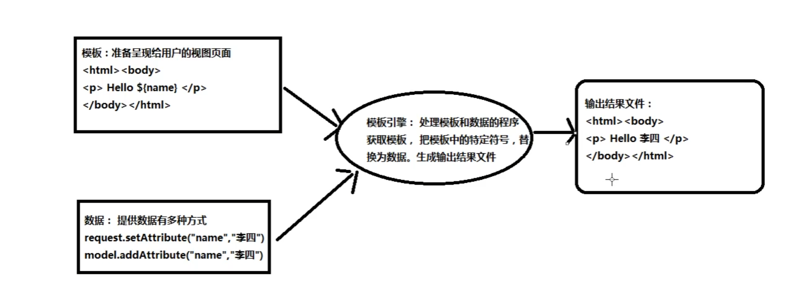
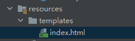

# Thymeleaf

## Thymeleaf简介

官方文档:https://www.thymeleaf.org/documentation.html

**Thymeleaf**是一种适用于 Web 和独立环境的现代服务器端 Java 模板引擎。

Thymeleaf（是服务器端的模板引擎，在服务器端获取模板和数据，生成结果输出给浏览器呈现结果

Thymeleaf 的主要目标是为您的开发工作流程带来优雅*的自然模板*——可以在浏览器中正确显示的 HTML，也可以作为静态原型，允许开发团队进行更强大的协作。

## Thymeleaf模板工作方式



- 模板引擎：处理模板和数据的程序，获取模板，把模板中的特定符号，替换为数据。生成输出结果文件

## 准备依赖

```xml
<dependency>
      <groupId>org.thymeleaf</groupId>
      <artifactId>thymeleaf</artifactId>
      <version>3.0.9.RELEASE</version>
</dependency>
```


## 例子

1. ```java
   public static void main(String[] args) {
           //创建模板引擎
           TemplateEngine engine = new TemplateEngine();
           //准备模板
           String input = "<input type = 'text' th:value = 'hellothymeleaf'/>";
           //准备数据
           Context context = new Context();
           //调用引擎，处理模板和数据
           String out = engine.process(input, context);
           System.out.println("结果数据" + out);
       }
   
   
   out:
   结果数据<input type = 'text' value = 'hellothymeleaf'/>
   ```

2. 模板使用数据

   ```java
   @Test
       public void test01(){
           //创建模板引擎
           TemplateEngine engine = new TemplateEngine();
           //准备模板
           String inStr = "<input type = 'text' th:value = '${name}'/>";
   
           //准备数据
           Context context = new Context();
           context.setVariable("name","张三");
   
           //处理模板和数据
           String html = engine.process(inStr, context);
           System.out.println("html：" + html);
       }
   ```

   ```java
   html：<input type = 'text' value = '张三'/>
   ```

3. 使用模板文件

   ```java
   @Test
       public void test02(){
           //创建模板引擎
           TemplateEngine engine = new TemplateEngine();
           //准备模板  resolver-解析器
           ClassLoaderTemplateResolver resolver = new ClassLoaderTemplateResolver();
   
           //设置引擎使用resolver来找文件
           engine.setTemplateResolver(resolver);
   
           //指定数据
           Context context = new Context();
           context.setVariable("name","张三丰");
   
           //处理模板和数据
           String html = engine.process("main.html", context);
           System.out.println("html：" + html);
       }
   ```

   ```html
   <!--main.html-->
   <!DOCTYPE html>
   <html lang="en">
   <head>
       <meta charset="UTF-8">
       <title>Title</title>
   </head>
   <body>
       模板：<input type="text" th:value="${name}"/>
   </body>
   </html>
   ```

   ```
   输出结果：
   html：<!DOCTYPE html>
   <html lang="en">
   <head>
       <meta charset="UTF-8">
       <title>Title</title>
   </head>
   <body>
       模板：<input type="text" value="张三丰"/>
   </body>
   </html>
   <!---->
   ```

4. 设置模板前后缀

   ```java
    @Test
       public void test03(){
           TemplateEngine engine = new TemplateEngine();
           ClassLoaderTemplateResolver resolver = new ClassLoaderTemplateResolver();
           //查找前缀
           resolver.setPrefix("templates/");
           //查找后缀
           resolver.setSuffix(".html");
   
           //由引擎来设置用到的解析器
           engine.setTemplateResolver(resolver);
   
           Context context = new Context();
           context.setVariable("name","王麻子");
   
           String index = engine.process("index", context);
           System.out.println("index:" + index);
   
       }
   
   ```

   

​							

```html
<!--index.html-->
<!DOCTYPE html>
<html lang="en">
<head>
    <meta charset="UTF-8">
    <title>Title</title>
</head>
<body>
  <input type="text" th:value="${name}"/>

</body>
</html>
```

```
输出结果：
index:<!DOCTYPE html>
<html lang="en">
<head>
    <meta charset="UTF-8">
    <title>Title</title>
</head>
<body>
  <input type="text" value="王麻子"/>

</body>
</html>
```


