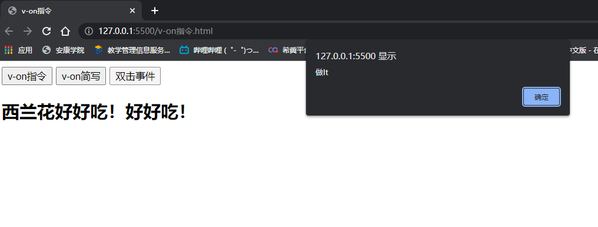

# Vue.js快速入门

## Vue基础

### 1.  Vue简介

- JavaScript框架
- 简化Dom操作
- 响应式数据驱动

### 2. 第一个Vue程序

文档传送门：https://cn.vuejs.org

1. 导入开发版本的Vue.js
2. 创建Vue实例对象, 设置el属性和data属性
3. 使用简洁的模板语法把数据渲染到页面上

```html
H5模板...
<body>
    <div id="app">
        {{message}}
    </div>
<!-- 开发环境版本，包含了有帮助的命令行警告 -->
<script src="https://cdn.jsdelivr.net/npm/vue/dist/vue.js"></script>
    <script>
        var app = new Vue({
            el:"#app",
            data:{
                message:"hello Vue!"
            }
        })
    </script>
</body>
</html>
```

### 3. el:挂载点

```html
<body>
    <h2 id="app" class="app">
        {{ message }}
        <span> {{message}} </span>
    </h2>
    <!-- 开发环境版本，包含了有帮助的命令行警告 -->
    <script src="https://cdn.jsdelivr.net/npm/vue/dist/vue.js"></script>
    <script>
    var app = new Vue({
        //el:"#app",
        //el:".app",
        // el:"div",
        el:"#body",
        data:{
            message:"白马程序员"
        }
    })
</script>
</body>
```

- el是用来设置Vue实例挂载（管理）的元素

- **Vue**实例的作用范围是什么呢？

  Vue会管理el选项**命中的元素**及其内部的后代元素

- **是否可以使用其他的选择器？**

  可以使用其他的选择器,但是建议使用**ID选择器**

- **是否可以设置其他的**dom**元素呢？**

  可以使用其他的双标签,不能使用**HTML**和**BODY**

  

### 4. data:数据对象

```html
<body>
    <div id="app">
        {{ message }}
        <h2> {{ school.name }} {{school.mobile}} </h2>
        <ul>
            <li>{{ campus[0] }}</li>
            <li>{{ campus[1] }}</li>
        </ul>
    </div>
<!-- 开发环境版本，包含了有帮助的命令行警告 -->
<script src="https://cdn.jsdelivr.net/npm/vue/dist/vue.js"></script>
    <script>
        var app = new Vue({
            el:"#app",
            data:{
                message:"你好 小白！",
                school:{
                    name:"白马程序员",
                    mobile:"1234567"
                },
                campus:["铜川市","耀州区","庙湾镇","柳林村"]
            }
            
        })
    </script>
</body>
```


- Vue中用到的数据定义在**data**中
- data中可以写**复杂类型**的数据
- 渲染复杂类型数据时,遵守js的**语法**即可

## **本地应用(指令)**


### 1.v-text指令

设置标签的文本值(textContent)

```html
<body>
    <div id="app">
        <h2 v-text="message + '!'"></h2>
        <h2 v-text="info + '!'">深圳</h2>
        <h2> {{ message + '!' }}深圳</h2>
    </div>
<!-- 开发环境版本，包含了有帮助的命令行警告 -->
<script src="https://cdn.jsdelivr.net/npm/vue/dist/vue.js"></script>
    <script>
        var app1 = new Vue({
            el:"#app",
            data:{
                message:"白马程序员!!!",
                info:"前端"
            }
        })
    </script>
</body>
```


- **v-text**指令的作用是:设置标签的内容(textContent)
- 默认写法会替换全部内容,使用**差值表达式{{}}**可以替换指定内容
- 内部支持写**表达式**

### 2. v-html指令

设置标签的innerHTML

```html
<body>
    <!-- 2.html结构 -->
    <div id="app">
        <p v-html="content"></p>
        <p v-text="content"></p>
    </div>
    <!-- 1.开发环境版本，包含了有帮助的命令行警告 -->
<script src="https://cdn.jsdelivr.net/npm/vue/dist/vue.js"></script>

    <script>
        //  <!-- 3.创建Vue实例 -->
        var app = new Vue({
            el:"#app",
            data:{
                //content:"白马程序员"
                content:"<a href='http://www.bilibili.com'>干杯！</a>"
            }
    })
    </script>
```


-  **v-html**指令的作用是:设置元素的**innerHTML**
-  内容中有**html**结构会被解析为**标签**
-  **v-text**指令无论内容是什么,只会解析为**文本**
-  解析文本使用**v-text,**需要解析**html**结构使用**v-html**

### 3. v-on指令

为元素绑定事件

**文档传送门**:https://cn.vuejs.org/v2/api/#v-on

```html
<body>
    <!-- 2.html结构 -->
    <div id="app">
        <input type="button" value="v-on指令" v-on:click="doIt">
        <input type="button" value="v-on简写" @click="doIt">
        <input type="button" value="双击事件" @dblclick="doIt">
        <h2 @click="changeFood"> {{ food }} </h2>
    </div>
    <!-- 1.开发环境版本，包含了有帮助的命令行警告 -->
<script src="https://cdn.jsdelivr.net/npm/vue/dist/vue.js"></script>

    <script>
        //  <!-- 3.创建Vue实例 -->
        var app = new Vue({
            el:"#app",
            data:{
                food:"西兰花"
            },
            methods: {
                doIt:function(){
                    alert("做It");
                },
                changeFood:function(){
                    //console.log(this.food);
                    this.food+="好好吃！"
                }
            },
        })
    </script>
```



-  **v-on**指令的作用是:为元素绑定**事件**
-  事件名不需要写**on**
-  指令可以简写为**@**
-  绑定的方法定义在**methods**属性中
-  方法内部通过**this**关键字可以访问定义在**data**中数据

## 计数器

1.  **data**中定义数据:比如**num**
2.  **methods**中添加两个方法:比如**add**(递增),**sub**(递减)
3.  使用**v-text**将**num**设置给**span**标签
4.  使用**v-on**将**add**,**sub**分别绑定给+,-按钮
5.  累加的逻辑:小于**10**累加,否则提示
6.  递减的逻辑:大于**0**递减,否则提示

```html
<body>
    <!-- html结构 -->
    <div id="app">
        <!-- 计数器功能区域 -->
        <div class="input-num">
            <button @click="sub">
                -
            </button>
            <span>{{ num }}</span>
            <button @click="add">
                +
            </button>
        </div>
        
    </div>
    <!-- 1.开发环境版本，包含了有帮助的命令行警告 -->
    <script src="https://cdn.jsdelivr.net/npm/vue/dist/vue.js"></script>
    <!-- 编码 -->
    <script>
        //  <!-- 3.创建Vue实例 -->
        var app = new Vue({
            el:"#app",
            data:{
                num:1
            },
            methods:{
                add:function(){
                    if(this.num < 10){
                        this.num++;
                    }else{
                        alert("别点啦，最大啦")
                    }
                   // console.log("add")
                   
                },
                sub:function(){
                    if(this.num > 0){
                        this.num--;
                    }else{
                        alert("别点啦，最小啦")
                    }

                   // console.log("sub")
                }
            }
        })
    </script>
```


-  创建Vue示例时:**el**(挂载点),**data**(数据),**methods**(方法)
-  **v-on**指令的作用是绑定事件,简写为**@**
-  方法中通过**this**,关键字获取**data**中的数据
-  **v-text**指令的作用是:设置元素的**文本值**,简写为**{{}}**
-  **v-html**指令的作用是:设置元素的**innerHTML**

### 4. v-show指令

根据表达值的真假,切换元素的显示和隐藏

```html
<body>
    <!-- 2.html结构 -->
    <div id="app">
        <input type="button" value="切换显示状态" @click="changeIsShow">
        <input type="button" value="累加年龄" v-on:click="addAge">
        
        =18" src="./monkey.gif" alt="">
    </div>
    
    <!-- 1.开发环境版本，包含了有帮助的命令行警告 -->
<script src="https://cdn.jsdelivr.net/npm/vue/dist/vue.js"></script>

    <script>
        //  <!-- 3.创建Vue实例 -->
        var app = new Vue({
            el:"#app",
            data:{
                isShow:false,
                age:17
            },
            methods:{
                changeIsShow:function(){
                    this.isShow  = !this.isShow;
                },
                addAge:function(){
                    this.age++;
                }
            }

        })
    </script>
```


-  **v-show**指令的作用是:根据真假切换元素的显示状态
-  原理是修改元素的display,实现显示隐藏
-  指令后面的内容,最终都会解析为布尔值
-  值为**true**元素显示,值为**false**元素隐藏
-  数据改变之后,对应元素的显示状态会**同步更新**

### 5. v-if指令

根据表达值的真假,切换元素的显示和隐藏(操纵dom元素)

```html
<body>
    <!-- 2.html结构 -->
    <div id="app">
        <input type="button" value="切换显示" @click="toggleIsShow">
        <p v-if="isShow">白马程序员</p>
        <p v-show="isShow">白马程序员 - v-show修饰 </p>
        <h2 v-if="temperature >= 35">热死了</h2>
    </div>
    <!-- 1.开发环境版本，包含了有帮助的命令行警告 -->
<script src="https://cdn.jsdelivr.net/npm/vue/dist/vue.js"></script>

    <script>
        //  <!-- 3.创建Vue实例 -->
        var app = new Vue({
            el:"#app",
            data:{
                isShow:false,
                temperature:20
            },
            methods:{
                toggleIsShow:function(){
                    this.isShow = !this.isShow;
                }
            }
        })
    </script>
```


-  **v-if**指令的作用是:根据表达式的真假切换元素的显示状态
-  本质是通过操纵dom元素来切换显示状态
-  表达式的值为**true**,元素**存在于dom树中**,为false,从dom树中移除
-  频繁的切换**v-show**,反之使用v-if,前者的切换消耗小

### 6. v-bind指令

设置元素的属性(比如:src,title,class)

```html
<body>
    <!-- 2.html结构 -->
    <div id="app">
        
        <br>
        
        
        <br>
        

    </div>
    
    <!-- 1.开发环境版本，包含了有帮助的命令行警告 -->
<script src="https://cdn.jsdelivr.net/npm/vue/dist/vue.js"></script>

    <script>
        //  <!-- 3.创建Vue实例 -->
        var app = new Vue({
            el:"#app",
            data:{
                imgSrc: "https://www.itheima.com/images/logo.png",
                imgTitle:"白马程序员",
                isActive:false
            },
            methods:{
                toggleActive:function(){
                    this.isActive = !this.isActive;
                }
            }
        }) 
    </script>
```


-  **v-bind**指令的作用是:为元素绑定属性
-  完整写法是 **v-bind:属性名**
-  简写的话可以直接省略**v-bind**,只保留 **:属性名**
-  需要动态的增删**class**建议使用对象的方式

## 图片切换

```html
<body>
    <!-- 2.html结构 -->
    <div id="mask">
        <div class="center">
            <h2 class="title">
                
                校园环境
            </h2>
            <!-- 图片 -->
            
            <!-- 左箭头 -->
            <a href="javascript:void(0)" v-show="index!=0" @click="prev" class="left" >
                
            </a>
            <!-- <a href="javascript:void(0)" v-if="index!=0" @click="prev" class="left" >
                
            </a> -->
            <!-- 右箭头 -->
            <a href="javascript:void(0)" v-show="index<imgArr.length-1" @click="next" class="right" >
                
            </a>
        </div>
    </div>
    
    <!-- 1.开发环境版本，包含了有帮助的命令行警告 -->
<script src="https://cdn.jsdelivr.net/npm/vue/dist/vue.js"></script>

    <script>
        //  <!-- 3.创建Vue实例 -->
        var app = new Vue({
            el: "#mask",
            data:{
                imgArr:[
                  "./images/00.jpg",
                  "./images/01.jpg",
                  "./images/02.jpg",
                  "./images/03.jpg",
                  "./images/04.jpg",
                  "./images/05.jpg",
                  "./images/06.jpg",
                  "./images/07.jpg",
                  "./images/08.jpg",
                  "./images/09.jpg",
                  "./images/10.jpg"
                ],
                index: 0
            },
            methods: {
                prev:function(){
                    this.index--;
                },
                next:function(){
                    this.index++;
                }
            }
        })
    </script>
```

-  列表数据使用**数组**保存
-  **v-bind**指令可以设置元素属性,比如**src**
-  **v-show**和**v-if**都可以切换元素的显示状态,频繁切换用**v-show**

### 7. v-for指令

根据数据生成列表结构

```html
<body>
    <!-- 2.html结构 -->
    <div id="app">
        <input type="button" value="添加数据" @click="add">
        <input type="button" value="移除数据" @click="remove">
        <ul>
            <li v-for="(item,index) in arr">
                {{ index+1 }}白马程序员校区：{{ item }}
            </li>
        </ul>
        <h2 v-for="items in vegetables" v-bind:title="items.name">
            {{ items.name }}
        </h2>
    </div>
    <!-- 1.开发环境版本，包含了有帮助的命令行警告 -->
<script src="https://cdn.jsdelivr.net/npm/vue/dist/vue.js"></script>

    <script>
        //  <!-- 3.创建Vue实例 -->
        var app = new Vue({
            el:"#app",
            data:{
                arr:["北京","上海","广州","深圳"],
                vegetables:[
                    {name:"西兰花"},
                    {name:"西红柿"}
                ]
            },
            methods:{
                add:function(){
                    <!--.push()添加 -->
                    this.vegetables.push({name:"花菜炒蛋"})
                },  
                remove:function(){
                    <!--.shift()移除最左侧元素-->
                    this.vegetables.shift();
                }
            }
        })
    </script>
```


- **v-for**指令的作用是:根据数据生成列表结构
-  数组经常和v-for结合使用
-  语法是**( item,index ) in** **数据**
-  item 和 index 可以结合其他指令一起使用
- 数组长度的更新会同步到页面上,是响应式的

### 8. v-on补充

传递自定义参数,事件修饰符

```html
<body>
    <!-- 2.html结构 -->
    <div id="app">
        <input type="button" value="点击" @click="doIt(666,'老铁')">
        <input type="text" @keyup.enter="sayHi">
    </div>
    <!-- 1.开发环境版本，包含了有帮助的命令行警告 -->
<script src="https://cdn.jsdelivr.net/npm/vue/dist/vue.js"></script>

    <script>
        //  <!-- 3.创建Vue实例 -->
        var app = new Vue({
            el:"#app",
            methods:{
              doIt:function(p1,p2){
                console.log("做it");
                console.log(p2);
                console.log(p1);
              },
              sayHi:function(){
                alert("吃了没")
              }  
    
            }
        })
    </script>
```


-  事件绑定的方法写成**函数调用**的形式，可以传入自定义参数
-  定义方法时需要定义形参来接收传入的实参
-  事件的后面跟上 **.修饰符** 可以对事件进行限制
-  **.enter** 可以限制触发的按键为回车
-  事件修饰符有多种

### 9. v-model指令

获取和设置表单元素的值(双向数据绑定)

```html
<body>
    <!-- 2.html结构 -->
    <div id="app">
        <input type="button" value="修改message" @click="setM">
        <input type="text" v-model="message" @keyup.enter="getM">
        <h2> {{ message }}</h2>
    </div>
    <!-- 1.开发环境版本，包含了有帮助的命令行警告 -->
<script src="https://cdn.jsdelivr.net/npm/vue/dist/vue.js"></script>

    <script>
        //  <!-- 3.创建Vue实例 -->
        var app = new Vue({
            el:"#app",
            data:{
                message:"黑马程序员"
            },
            methods:{
                getM:function(){
                    alert(this.message);
                },
                setM:function(){
                    this.message = "啊吧啊吧";
                }
            }
        })
    </script>
```


-  **v-model**指令的作用是便捷的设置和获取表单元素的值
-  绑定的数据会和表单元素值相关联
-  绑定的数据**←→**表单元素的值

## 记事本

1. **新增**

   -  v-for指令的作用
   -  v-model指令的作用
   -  v-on指令,事件修饰符
   -  通过审查元素快速定位 

2. **删除**

   -  数据改变,和数据绑定的元素同步改变
   -  事件的自定义参数
   -  splice方法的作用

3. **统计**

   -  统计信息个数(v-text length)
   -  基于数据的开发方式
   -   v-text指令的作用

4. **清空**

   -  点击清除所有信息(v-on 清空数组)
   -  基于数据的开发方式

5. **隐藏**

   -  没有数据时,隐藏元素(v-show v-if 数组非空)

     

   ```html
   <body>
       <!-- 主体区域 -->
       <section id="todoapp">
           <!-- 输入框 -->
           <header class="header">
               <h1>小黑记事本</h1>
               <input v-model="inputValue"   @keyup.enter="add"  autofocus="autofocus" atuocomplete="off" placeholder="请输入任务"
               class="new-todo"/>
           </header>
           <!-- 列表区域 -->
           <section class="main">
               <ul class="todo-list">
                   <li class="todo" v-for="(item,index) in list">
                       <div class="view">
                           <span class="index">{{ index+1 }}.</span>
                           <label>{{ item }}</label>
                           <button class="destroy" @click="remove(index)"></button>
                       </div>
                   </li>
               </ul>
           </section>
           <!-- 统计和清空 -->
           <footer class="footer">
               <span class="todo-count" v-if="list.length!=0">
                   <strong>{{list.length}}</strong>
                    iteams left 
               </span>
               <button class="clear-completed" v-show="list.length!=0" @click="clear">
                   Clear
               </button>
           </footer>
       </section>
       <!-- 底部 -->
       <footer class="info">
           <!-- <p>
               <a href="http://www.itheima.com/"></a>
           </p> -->
       </footer>
       
       <!-- 1.开发环境版本，包含了有帮助的命令行警告 -->
   <script src="https://cdn.jsdelivr.net/npm/vue/dist/vue.js"></script>
   
       <script>
           //  <!-- 3.创建Vue实例 -->
           var app = new Vue({
               el:"#todoapp",
               data:{
                   list:["写代码","吃法饭","睡觉觉"],
                   inputValue:"好好学习，天天向上"
               },
               methods:{
                   add:function(){
                       this.list.push(this.inputValue);
                   },
                   remove:function(index){
                       this.list.splice(index,1);
                   },
                   clear:function(){
                       this.list = [];
                   }
               }
   
           })
       </script>
   ```

   -  列表结构可以通过v-for指令结合数据生成
   -  v-on结合事件修饰符可以对事件进行限制,比如.enter
   -  v-on在绑定事件时可以传递自定义参数
   -  通过v-model可以快速的设置和获取表单元素的值
   -  基于数据的开发方式

### axios

功能强大的网络请求库

**文档传送门**:https://github.com/axios/axios

```html
<body>
    <input type="button" value="get请求" class="get">
    <input type="button" value="post请求" class="post">
     <!-- 官网提供的 axios 在线地址 -->
     <script src="https://unpkg.com/axios/dist/axios.min.js"></script>
     <script>
         /*
             接口1:随机笑话
             请求地址:https://autumnfish.cn/api/joke/list
             请求方法:get
             请求参数:num(笑话条数,数字)
             响应内容:随机笑话
         */
        document.querySelector(".get").onclick = function(){
            axios.get("https://autumnfish.cn/api/joke/list?num=3")
            //axios.get("https://autumnfish.cn/api/joke/lis21t?num=3")
            .then(function(response){
                console.log(response);
             },function(err){
                console.log(err);
             })
        }
        /*
             接口2:用户注册
             请求地址:https://autumnfish.cn/api/user/reg
             请求方法:post
             请求参数:username(用户名,字符串)
             响应内容:注册成功或失败
         */
        document.querySelector(".post").onclick = function(){
            axios.post("https://autumnfish.cn/api/user/reg",
            //axios.post("https://autumnfish.cn/api/user/reg2133123",
            {username:"tom"})
            .then(function(response){
                console.log(response);
            },function(err){
                console.log(err);
            })
        }
      </script>
```

-  **axios**必须先导入才可以使用
-  使用**get**或**post**方法即可发送对应的请求
-  **then**方法中的回调函数会在请求成功或失败时触发
- 通过回调函数的形参可以获取响应内容,或错误信息

### axios+vue

axios如何结合vue开发网络应用

```html
<body>
    <!-- 2.html结构 -->
    <div id="app">
        <input type="button" value="获取笑话" @click="getJoke">
        <p> {{ joke}} </p>
    </div>
    <!-- 官网提供的 axios 在线地址 -->
    <script src="https://unpkg.com/axios/dist/axios.min.js"></script>
    <!-- 1.开发环境版本，包含了有帮助的命令行警告 -->
<script src="https://cdn.jsdelivr.net/npm/vue/dist/vue.js"></script>
    <script>
        /*
             接口1:随机获取一条笑话
             请求地址:https://autumnfish.cn/api/joke
             请求方法:get
             请求参数:无
             响应内容:随机笑话
         */

        //  <!-- 3.创建Vue实例 -->
        var app = new Vue({
            el:"#app",
            data:{
                joke:"笑话"
            },
            methods:{
                getJoke:function(){
                    console.log(this.joke);
                    var that = this;  //引用传递，不是赋值
                    axios.get("https://autumnfish.cn/api/joke").then(
                        function(response){
                            console.log(response.data);
                            //console.log(this.joke);
                            that.joke = response.data;
                        },function(err){})
                }
            }
        })
    </script>
```

-  **axios**回调函数中的**this**已经改变,无法访问到**data**中数据
-  把**this**保存起来,回调函数中直接使用保存的this**即可**
- var that = this;      引用传递，不是赋值
-  和本地应用的最大区别就是改变了**数据来源**

## 天知道

-   **回车查询**

  1.  应用的逻辑代码建议和页面分离，使用单独的js文件编写

  2.  axios回调函数中this指向改变了，需要额外的保存一份

  3.  服务器返回的数据比较复杂时，获取的时候需要注意层级结构

  4.  按下回车(v-on .enter)

  5.  查询数据(axios 接口 v-model )

  6.  渲染数据(v-for 数组 that)

     

-   **点击查询**

  -  自定义参数可以让代码的复用性更高

  -  methods中定义的方法内部，可以通过this关键字点出其他的方法

  -  点击城市(v-on 自定义参数)

  -  查询数据

  -  渲染数据

  - ```html
    body>
      <div class="wrap" id="app">
        <div class="search_form">
          <div class="logo"></div>
          <div class="form_group">
            <input type="text"   v-model="city" @keyup.enter="searchWeather"   class="input_txt" placeholder="请输入查询的天气"/>
            <button class="input_sub" @click="searchWeather">
              搜 索
            </button>
          </div>
          <div class="hotkey">
            <a href="javascript:;" @click="changeCity('北京')">北京</a>
            <a href="javascript:;" @click="changeCity('上海')">上海</a>
            <a href="javascript:;" @click="changeCity('广州')">广州</a>
            <a href="javascript:;" @click="changeCity('深圳')">深圳</a>
          </div>
        </div>
        <ul class="weather_list">
          <li v-for="items in weatherList">
            <div class="info_type"><span class="iconfont">{{ items.wea }}</span></div>
            <div class="info_temp">
              <b>{{ item.tem2 }}</b>
              ~
              <b>{{ item.tem1 }}</b>
            </div>
            <div class="info_date"><span>{{ item.day }}</span></div>
          </li>
        </ul>
      </div>
      <!-- 开发环境版本，包含了有帮助的命令行警告 -->
      <script src="https://cdn.jsdelivr.net/npm/vue/dist/vue.js"></script>
      <!-- 官网提供的 axios 在线地址 -->
      <script src="https://unpkg.com/axios/dist/axios.min.js"></script>
      <!-- 自己的js -->
      <script src="./js/main.js"></script>
    </body>
    
    ```

    ```javascript
     var app = new Vue({
        el:"div",
        data:{
            city:'',
            weatherList:[]
        },
        methods:{
            searchWeather:function(){
                // console.log("天气查询");
                //console.log(this.city);
                //调用接口
                //保存this
                var that = this.weatherList;
                axios.get("http://ajax-api.itheima.net/api/weather?city="+this.city)
                .then(function(response){
                    //console.log(response);
                    console.log(response.data.data.data);
                    that.weatherList = response.data.data.data
                }).catch(function(err){
    
                })
            },
            changeCity:function(city){
                this.city = city;
                this.searchWeather()
            }
        },
     })
    ```


## 悦听Play

1.   歌曲搜索

   -  1. 按下回车(v-on .enter)
   -  2. 查询数据(axios 接口 v-model )
   -  3. 渲染数据(v-for 数组 that)
   -    服务器返回的数据比较复杂时，获取的时候需要注意层级结构
   -    通过审查元素快速定位到需要操纵的元素

2.   歌曲播放

   -  1. 点击播放(v-on 自定义参数)
   -  2. 歌曲地址获取(接口 歌曲id)
   -  3. 歌曲地址设置(v-bind)
   -   歌曲id依赖歌曲搜索的结果，对于不用的数据也需要关注

3.   歌曲封面

   -  1. 点击播放(增加逻辑)
   -  2. 歌曲封面获取(接口 歌曲id)
   -  3. 歌曲封面设置(v-bind)
   -    在vue中通过v-bind操纵属性
   -    本地无法获取的数据，基本都会有对应的接口
   - 

4.   歌曲评论

   -  1. 点击播放(增加逻辑)
   -  2. 歌曲评论获取(接口 歌曲id)
   -  3. 歌曲评论渲染(v-for)
   -    在vue中通过v-for生成列表

5.   播放动画

   -  1. 监听音乐播放(v-on play)
   -  2. 监听音乐暂停(v-on pause)
   -  3. 操纵类名(v-bind 对象)
   -   audio标签的play事件会在音频播放的时候触发
   -   audio标签的pause事件会在音频暂停的时候触发
   -   通过对象的方式设置类名，类名生效与否取决于后面值的真假

6.   mv播放

   -  1. mv图标显示(v-if)

   -  2. mv地址获取(接口 mvid)

   -  3. 遮罩层(v-show v-on)

   -  4. mv地址设置(v-bind)

     

   ```html
   <body>
       <div class="wrap">
         <!-- 播放器主体区域 -->
         <div class="play_wrap" id="player">
           <div class="search_bar">
             
             <!-- 搜索歌曲 -->
             <input type="text" autocomplete="off"  v-model="query" @keyup.enter="searchMusic"/>
           </div>
           <div class="center_con">
             <!-- 搜索歌曲列表 -->
             <div class='song_wrapper'>
               <ul class="song_list">
                   <li v-for="item in musicList">
                       <a href="javascript:;" @click="playMusic(item.id)"></a> 
                       <b>{{ item.name }}</b> 
                       <span v-if="item.mv!=0" @click="playMV(item.mvid)"><i></i></span>
                     </li>
               </ul>
               
             </div>
             <!-- 歌曲信息容器 -->
             <div class="player_con" :class="{playing:isPlaying}">
               
               <!-- 黑胶碟片 -->
               
               
             </div>
             <!-- 评论容器 -->
             <div class="comment_wrapper">
               <h5 class='title'>热门留言</h5>
               <div class='comment_list'>
                 <dl v-for="item in hotComments">
                   <dt></dt>
                   <dd class="name">{{ item.nickname}}</dd>
                   <dd class="detail">
                     {{ item.content }}
                   </dd>
                 </dl>
               </div>
               
             </div>
           </div>
           <div class="audio_con">
             <audio ref='audio' @play="play" @pause="pause"  :src="musicUrl" controls autoplay loop class="myaudio"></audio>
           </div>
           <div class="video_con" style="display: none;">
             <!-- <video :src="mvUrl" controls="controls"></video>
             <div class="mask" @click="hide"></div> -->
           </div>
         </div>
       </div>
       <!-- 开发环境版本，包含了有帮助的命令行警告 -->
       <script src="https://cdn.jsdelivr.net/npm/vue/dist/vue.js"></script>
       <!-- 官网提供的 axios 在线地址 -->
       <script src="https://unpkg.com/axios/dist/axios.min.js"></script>
       <script src="./js/main.js"></script>
     </body>
     
   ```

   ```js
   
   var app = new Vue({
     el:"#player",
     data:{
       //查询关键字
       query:"",
       //歌曲数组
       musicList:[],
       //歌曲地址
       musicUrl:"",
       //歌曲封面
       musicCover:"",
       //热门评论
       hotComments:[],
       //动画播放状态
       isPlaying:false,
      
     },
     methods:{
       //歌曲搜索
       searchMusic:function(){
         var that = this;
         axios.get("https://autumnfish.cn/cloudsearch?keywords="+this.query)
         .then(function(response){
           //console.log(response);
           that.musicList = response.data.result.songs;
           console.log(response.data.result.songs);
         }),function(err){
   
         }
       },
       //歌曲播放
       playMusic:function(musicId){
         var that = this;
         console.log(musicId);
         axios.get("https://autumnfish.cn/song/url?id="+ musicId)
         .then(function(response){
           //console.log(response.data.data[0].url);
           that.musicUrl=response.data.data[0].url;
         }),function(err){
   
         }
         //歌曲详情获取
         axios.get("https://autumnfish.cn/song/detail?ids="+musicId)
         .then(function(response){
           //console.log(response);
           //console.log(response.data.songs[0].al.picUrl);
           that.musicCover=response.data.songs[0].al.picUrl;
         }),function(err){
   
         }
         //歌曲评论获取
         axios.get("https://autumnfish.cn/comment/hot?type="+musicId)
         .then(function(response){
           //console.log(response);
           //console.log(response.data.hotComments);
           that.hotComments = response.data.hotComments;
         }),function(err){
   
         }
       },
       //歌曲播放
       play:function(){
         //console.log("play");
         this.isPlaying=true;
       },
       //歌曲暂停
       pause:function(){
         //console.log("pause");
         this.isPlaying=false;
       },
      
   
     }
   
   })
   
   ```

   -    不同的接口需要的数据是不同的，文档的阅读需要仔细
   -    页面结构复杂之后，通过审查元素的方式去快速定位相关元素
   -    响应式的数据都需要定义在data中定义