# Java8新特性

##  Java8新特性简介

- 速度更快
- 代码更少（新语法:==Lambda表达式==）
- 强大的==StreamAPI==
- 便于并行
- 最大化减少空指针异常
- Nashorn引擎，允许在Jvm中运行Js应用

## 1. Lambda表达式

### 1.1 Lambda表达式的基本语法

- 举例：(o1, o2) -> Integer.compare(o1, o2);
- 格式：
       -> ：lambda操作符 或 箭头操作符
       ->左边：lambda形参列表 （其实就是接口中抽象方法的形参列表）
       ->右边：lambda体 （其实就是重写的抽象方法的方法体）

### 1.2 lambda表达式的使用：6种情况

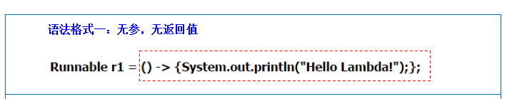

```java
	//1. 无参、无返回值
    @Test
    public void test1(){
        Runnable r1 = new Runnable() {
            @Override
            public void run() {
                System.out.println("我爱北京天安门！");
            }
        };
        r1.run();
        System.out.println("*****************************");

        Runnable r2 = () -> {
            System.out.println("我爱北京故宫！");
        };
        r2.run();
    }
```


```java
//2. lambda需要一个参数，但是没有返回值
@Test
public void test2(){
    Consumer<String> con = new Consumer<String>() {
        @Override
        public void accept(String s) {
            System.out.println(s);
        }
    };
    con.accept("谎言和誓言的区别是什么呢？");
    System.out.println("********************");

    Consumer<String> con1 = (String s) -> {
        System.out.println(s);
    };
    con1.accept("一个是听的人当真了，一个是说的人当真了");

}
```

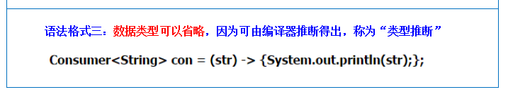

```Java
//3. 数据类型可以省略，因为可由编译器推断得出，称为类型推断
@Test
public void test3(){
    Consumer<String> con1 = (String s) -> {
        System.out.println(s);
    };
    con1.accept("一个是听的人当真了，一个是说的人当真了");
    System.out.println("********************");

    Consumer<String> con2 = (s) -> {
        System.out.println(s);
    };
    con2.accept("一个是听的人当真了，一个是说的人当真了");

}
```

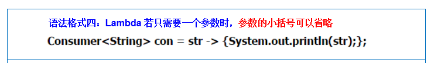

```java
//4. lambda表达式 若只需要一个参数时，参数的小括号可以省略
@Test
public void test4(){
    Consumer<String> con2 = (s) -> {
        System.out.println(s);
    };
    con2.accept("一个是听的人当真了，一个是说的人当真了");
    System.out.println("***********************");

    Consumer<String> con3 = s -> {
        System.out.println(s);
    };
    con3.accept("一个是听的人当真了，一个是说的人当真了");
}
```


```java
//5. lambda表达式 需要两个或以上的参数，多条执行语句，并且可以有返回值
@Test
public void test5(){
    Comparator<Integer> com1 = new Comparator<Integer>() {
        @Override
        public int compare(Integer o1, Integer o2) {
            System.out.println("o1 = " + o1);
            System.out.println("o2 = " + o2);
            return o1.compareTo(o2);
        }
    };
    System.out.println("com1.compare(13,33) = " + com1.compare(13, 33));
    System.out.println("**************************");

    Comparator<Integer> com2 = (o1, o2) -> {
        System.out.println("o1 = " + o1);
        System.out.println("o2 = " + o2);
        return o1.compareTo(o2);
    };
    System.out.println("com2.compare(12,5) = " + com2.compare(12, 5));
}
```

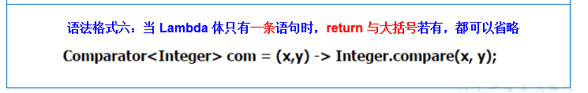

```java
//6. 当lambda体只有一条语句时，return与大括号若有，都可以省略
@Test
public void test6(){
    Comparator<Integer> com1 = (o1, o2) -> {
        return o1.compareTo(o2);
    };
    System.out.println("com1.compare(12,5) = " + com1.compare(12, 5));
    System.out.println("**************************");

    Comparator<Integer> com2 = (o1, o2) ->  o1.compareTo(o2);
    System.out.println("com2.compare(12,23) = " + com2.compare(12, 23));

}
```

## 2. 函数式接口

### 2.1 什么是函数式接口

- 只包含一个抽象方法的接口，称为函数式接口
- 可以通过lambda表达式来创建该接口的对象
- lambda表达式的本质：作为函数式接口的实例
- 在接口上使用@FunctionalInterface 注解可以检验函数式接口

### 2.2 Java8中关于Lambda表达式提供的4个基本的函数式接口：

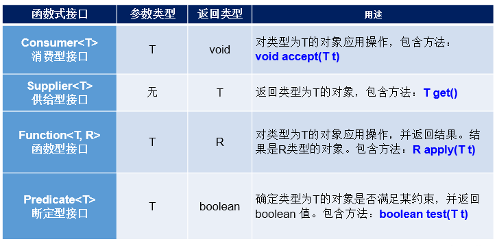

==举例：==

- 消费型接口

    ```Java
    /**
         * 消费型接口 Consumer<T>   void accept(T t)
         */
        @Test
        public void test1(){
            happyTime(500, money -> System.out.println("矿泉水的价格是：" + money));
        }
    
        public void happyTime(double money, Consumer<Double> con){
            con.accept(money);
        }
    ```

- 断定型接口

    ```java
    /**
         * 断定型接口 Predicate<T>  boolean test(T t)
         */
        @Test
        public void test2(){
            List<String> list = Arrays.asList("北京","南京","天津","东京","西京");
            List<String> filterString = filterString(list, new Predicate<String>() {
                @Override
                public boolean test(String s) {
                    return s.contains("京");
                }
            });
            System.out.println("filterString = " + filterString);
            System.out.println("*****************************");
    
            List<String> filterString1 = filterString(list, s ->  s.contains("京"));
            System.out.println("filterString1 = " + filterString1);
        }
    
        //根据给定的规则，过滤集合中的字符串，此规则由Predicate的方法决定
        public List<String> filterString(List<String> list, Predicate<String> pre){
            ArrayList<String> aList = new ArrayList<>();
            for (String s : list){
                if (pre.test(s)){
                    aList.add(s);
                }
            }
            return aList;
        }
    ```

    

## 3.方法引用与构造器引用

### 3.1方法引用

#### 3.1.1 方法引用理解和使用

- 理解：本质上就是Lambda表达式，而lambda表达式作为函数式接口的实例。所以方法引用也是函数式接口的实例
- 使用情景：当要传递给Lambda体的操作，已经有实现的方法了，就可以使用方法引用

#### 3.1.2 方法引用的格式

==使用格式：  类(或对象) :: 方法名==


#### 3.1.3 方法引用的三种情况

1. **情况1**     对象 :: 非静态方法

2. **情况2**     类 :: 静态方法
   
3. **情况3**     类 :: 非静态方法

#### 3.1.4 方法引用的要求

* 要求接口中的抽象方法的形参列表和返回值类型与方法引用的方法的形参列表和返回值类型相同！（针对于**情况1和情况2**）
* 当函数式接口方法的第一个参数是需要引用方法的调用者，并且第二个参数是需要引用方法的参数(或无参数)时：ClassName::methodName（针对于**情况3**）

#### 3.1.5 情况一：对象 :: 实例方法

```java
// 情况一：对象 :: 实例方法
//Consumer中的void accept(T t)
//PrintStream中的void println(T t)
@Test
public void test1() {
   Consumer<String> con1 = str -> System.out.println(str);
   con1.accept("北京");
   System.out.println("*************************");

   /**
    * 当要传递给Lambda体的操作（System.out.println(str)），已经有实现的方法了（PrintStream中的void println(T t)），可以使用方法引用
    *
    * 使用格式：  类(或对象) :: 方法名
    *   System.out.println(str)   System.out(对象) println(方法名)
    */
   PrintStream ps = System.out;
   Consumer<String> con2 = ps :: println;
   con2.accept("beijing");
}
```

#### 3.1.6 情况二：类 :: 静态方法  引用的方法是静态方法

```java
	// 情况二：类 :: 静态方法  引用的方法是静态方法
	//Comparator中的int compare(T t1,T t2)
	//Integer中的int compare(T t1,T t2)
	@Test
	public void test3() {
		Comparator<Integer> com1 = (t1,t2) -> Integer.compare(t1,t2);
		System.out.println("com1.compare(12,21) = " + com1.compare(12, 21));
		System.out.println(" =================== " );
		Comparator<Integer> com2 = Integer :: compare;
		System.out.println("com2.compare(23,13) = " + com2.compare(23, 13));

	}
	
	//Function中的R apply(T t)
	//Math中的Long round(Double d)
	@Test
	public void test4() {
		Function<Double,Long> func1 = t -> Math.round(t);
		System.out.println("func1.apply(12.3) = " + func1.apply(12.3));
		System.out.println(" =================== " );
		Function<Double,Long> func2 = Math :: round;
		System.out.println("func2.apply(12.6) = " + func2.apply(12.6));

	}	
```

#### 3.1.7 情况三：类 :: 实例方法  (有难度)

```java
// 情况三：类 :: 实例方法  (有难度)
// Comparator中的int comapre(T t1,T t2)  两个参数
// String中的int t1.compareTo(t2)  一个参数 ，但是，是以第一个参数作为方法的调用者
@Test
public void test5() {
   Comparator<String> com1 = (s1,s2) -> s1.compareTo(s2);
   System.out.println("com1.compare(\"abc\",\"abd\") = " + com1.compare("abc", "abd"));
   System.out.println(" =================== " );
   Comparator<String> com2 = String::compareTo;
   System.out.println("com2.compare(\"abc\",\"abn\") = " + com2.compare("abc", "abn"));
}

//BiPredicate中的boolean test(T t1, T t2);
//String中的boolean t1.equals(t2)
@Test
public void test6() {
   BiPredicate<String,String> pre1 = (s1, s2) -> s1.equals(s2);
   System.out.println("pre1.test(\"abc\",\"abc\") = " + pre1.test("abc", "abc"));
   System.out.println(" =================== " );
   BiPredicate<String,String> pre2 = String :: equals;
   System.out.println("pre2.test(\"abc\",\"and\") = " + pre2.test("abc", "and"));

}

// Function中的R apply(T t)
// Employee中的String getName();
@Test
public void test7() {
   Function<Employee,String> fun1 = e -> e.getName();
   Employee emp = new Employee(1001, "jerry", 23, 6454);
   System.out.println(fun1.apply(new Employee(1001, "jerry", 23, 6454)));
   System.out.println(" =================== " );
   Function<Employee,String> fun2 = Employee :: getName;
   System.out.println(fun2.apply(emp));

}
```

### 3.2 构造器引用与数组引用

#### 3.2.1 构造器引用


* 和方法引用类似，函数式接口的抽象方法的形参列表和构造器的形参列表一致。

* 抽象方法的返回值类型即为构造器所属的类的类型

* 格式： 类名 :: new

    ```java
    	//构造器引用
        //Supplier中的T get()
        //Employee的空参构造器：Employee()
        @Test
        public void test1(){
            Supplier<Employee> sup1 = new Supplier<Employee>() {
                @Override
                public Employee get() {
                    return new Employee();
                }
            };
            System.out.println("sup1.get() = " + sup1.get());
            System.out.println("************************");
    
            Supplier<Employee> sup2 = () -> new Employee();
            System.out.println("sup2.get() = " + sup2.get());
            System.out.println("************************");
    
            Supplier<Employee> sup3 = Employee::new;
            System.out.println("sup3.get() = " + sup3.get());
    
        }
    
    	//Function中的R apply(T t)
        @Test
        public void test2() {
            Function<Integer, Employee> fun1 = id -> new Employee(id);
            Employee employee = fun1.apply(1001);
            System.out.println("employee = " + employee);
            System.out.println("*****************************");
    
            Function<Integer, Employee> fun2 = Employee :: new;
            System.out.println("fun2.apply(1005) = " + fun2.apply(1005));
        }
    
    	//BiFunction中的R apply(T t,U u)
        @Test
        public void test3(){
            BiFunction<Integer, String, Employee> bFun1 = (id, name) -> new Employee(id, name);
            System.out.println("bFun1.apply(1001,\"tom\") = " + bFun1.apply(1001, "tom"));
            System.out.println("*****************************");
    
            BiFunction<Integer, String, Employee> bFun2 = Employee::new;
            System.out.println("bFun2.apply(1004,\"yeur\") = " + bFun2.apply(1004, "yeur"));
    
        }
    ```

#### 3.2.2 数组引用

大家可以把数组看做是一个特殊的类，则写法与构造器引用一致。

* 格式： 数组类名[] :: new

    ```java
    	//数组引用
        //Function中的R apply(T t)
        @Test
        public void test4(){
            Function<Integer, String[]> func1 = length -> new String[length];
            String[] arr1 = func1.apply(5);
            System.out.println("Arrays.toString(arr1) = " + Arrays.toString(arr1));
            System.out.println("*****************************");
    
            Function<Integer, String[]> func2 = String[] :: new;
            String[] arr2 = func2.apply(10);
            System.out.println("Arrays.toString(arr2) = " + Arrays.toString(arr2));
    
        }
    ```


## 4.StreamAPI

### 4.1 StreamAPI的理解

- Stream API 提供了一种流式的数据处理方式，可以让我们通过链式调用的方式对数据进行一系列操作，最终得到我们想要的结果
- Stream关注的是对数据的运算，与CPU打交道
- 集合关注的是数据的存储，与内存打交道

### 4.2 注意点

① Stream 自己不会存储元素

② Stream 不会改变源对象。相反，他们会返回一个持有结果的新Stream

③ Stream 操作是延迟执行的。这意味着他们会等到需要结果的时候才执行

### 4.3 Stream 执行流程

① Stream的实例化

② 一系列的中间操作（过滤，映射、...）

③ 终止操作


#### 4.3.1 Stream 执行流程的注意点

*   一个中间操作链，对数据源的数据进行处理
*   一旦执行终止操作，就执行中间操作链，并产生结果。之后，不会再被使用

### 4.4 Stream使用步骤一之实例化

#### 4.1.1 创建Stream方式一：通过集合

```java
 /**
     * 创建Stream方式一：通过集合
     */
    @Test
    public void test1(){
        List<Employee> employees = EmployeeData.getEmployees();
//        default Stream<E> stream() : 返回一个顺序流
        Stream<Employee> stream = employees.stream();

//        default Stream<E> parallelStream() : 返回一个并行流
        Stream<Employee> parallelStream = employees.parallelStream();
    }
```

#### 4.1.2 创建Stream方式二：通过数组

```java
/**
 * 创建Stream方式二：通过数组
 */
@Test
public void test2(){
    int[] arr = new int[]{1,2,3};
    //调用Arrays类的static <T> Stream<T> stream(T[] array): 返回一个流
    IntStream stream = Arrays.stream(arr);

    Employee e1 = new Employee(1001,"Tom1");
    Employee e2 = new Employee(1002,"Tom2");
    Employee[] arr2 = new Employee[]{e1,e2};
    Stream<Employee> stream1 = Arrays.stream(arr2);

}
```

#### 4.1.3 创建Stream方式三：通过Stream的of()

```java
/**
 * 创建Stream方式三：通过Stream的of()
 */
@Test
public void test3(){
    Stream<Integer> stream = Stream.of(1, 2, 3, 4, 5, 6);

}
```

#### 4.1.4 创建Stream方式四：创建无限流

```java
	/**
     * 创建Stream方式四：创建无限流
     */
    @Test
    public void test4(){
//        迭代
//      public static<T> Stream<T> iterate(final T seed, final UnaryOperator<T> f)
        //遍历前10个偶数
        Stream.iterate(0, t -> t + 2).limit(10).forEach(System.out :: println);

//        生成
//      public static<T> Stream<T> generate(Supplier<T> s)
        Stream.generate(Math :: random).limit(10).forEach(System.out :: println);

    }
```


### 4.5 Stream使用步骤二之中间操作

1. **筛选与切片**

    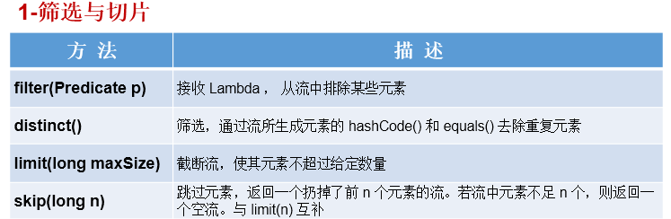

    ```java
    //1. 筛选与切片
        @Test
        public void test1(){
            List<Employee> list = EmployeeData.getEmployees();
    //        filter(Predicate p) --接收 Lambda，从流中排除某些元素
            Stream<Employee> stream = list.stream();
            //练习：员工表中薪资大于7000的员工信息
            stream.filter(employee -> employee.getSalary() > 7000).forEach(System.out :: println);
            System.out.println("*************************");
    //        limit(n) -- 截断流，使其元素不超过给定量
            list.stream().limit(3).forEach(System.out :: println);
            System.out.println("*************************");
    //        skip(n) -- 跳过元素，返回一个扔掉了前n个元素的流。若流中元素不足n个，则返回一个空流。与limit(n)互补
            list.stream().skip(30).forEach(System.out :: println);
    //        distinct() -- 筛选，通过流所生成的元素的 hashCode() 和 equals() 去除重复元素
            list.add(new Employee(1010, "刘强东", 40, 8000));
            list.add(new Employee(1010, "刘强东", 40, 8000));
            list.add(new Employee(1010, "刘强东", 40, 8000));
            list.add(new Employee(1010, "刘强东", 40, 8000));
            list.add(new Employee(1010, "刘强东", 40, 8000));
    
            list.stream().distinct().forEach(System.out :: println);
    
        }
    ```

2. **映射**

    

    - map(Function f) 接受一个 Function 函数作为参数，该函数用来将流中的每个元素映射为另一个元素。
    - latMap(Function f) 也接受一个 Function 函数作为参数，但它的作用是将流中的每个元素转换为一个流，再将这些流合并成一个流

    ```java
    @Test
        public void test2() {
    //        map(Function f)——接收一个函数作为参数，将元素转换成其他形式或提取信息，该函数会被应用到每个元素上，并将其映射成一个新的元素。
            List<String> list = Arrays.asList("aa", "bb", "cc", "dd");
            list.stream().map(str -> str.toUpperCase()).forEach(System.out::println);
            System.out.println("*********************************");
    //        练习1：获取员工姓名长度大于3的员工的姓名。
            List<Employee> employeeList = EmployeeData.getEmployees();
            Stream<String> nameStream = employeeList.stream().map(Employee::getName);
            //一个全是员工姓名的Stream
            nameStream.filter(name -> name.length() > 3).forEach(System.out::println);
            System.out.println("*************************************");
    
    
            Stream<Stream<Character>> streamStream = list.stream().map(StreamAPITest1::fromStringToStream);
            streamStream.forEach(s -> {
                s.forEach(System.out :: println);
            });
            System.out.println("================================");
    //        练习2：
    //        flatMap(Function f)——接收一个函数作为参数，将流中的每个值都换成另一个流，然后把所有流连接成一个流。
    //    将字符串中的多个字符构成的集合转换为对应的Stream的实例
            Stream<Character> characterStream = list.stream().flatMap(StreamAPITest1::fromStringToStream);
            characterStream.forEach(System.out :: println);
    
        }
    
     	/**
         * 将字符串中的多个字符 构成的集合转换为对应的Stream实例
         * @param str
         * @return Stream
         */
        public static Stream<Character> fromStringToStream(String str){ //aa
            ArrayList<Character> list = new ArrayList<>();
            for (Character c : str.toCharArray()){
                list.add(c);
            }
           return list.stream();
        }
    ```

3. **排序**

    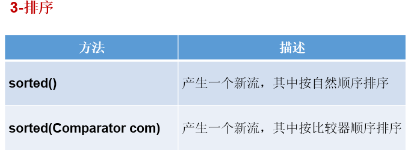

    ```java
        @Test
        public void test4(){
    //        sorted()-- 自然排序
            List<Integer> list = Arrays.asList(12, 43, 65, 34, 87, 0, -98, 6);
            list.stream().sorted().forEach(System.out :: println);
    
            //抛异常，原因：Employee没有实现Comparable接口
    //        List<Employee> employeeList = EmployeeData.getEmployees();
    //        employeeList.stream().sorted().forEach(System.out::println);
    
    //        sorted(Comparator com)-- 定制排序
            List<Employee> employees = EmployeeData.getEmployees();
            employees.stream()
                    .sorted((e1, e2) -> {
                        int ageValue = Integer.compare(e1.getAge(),e2.getAge());
                        if (ageValue != 0){
                            return ageValue;
                        }else {
                            return -Double.compare(e1.getSalary(), e2.getSalary());
                        } }
                    ).forEach(System.out::println);
            
        }
    ```


### 4.6 Stream使用步骤三之终止操作

1. **匹配与查找**

    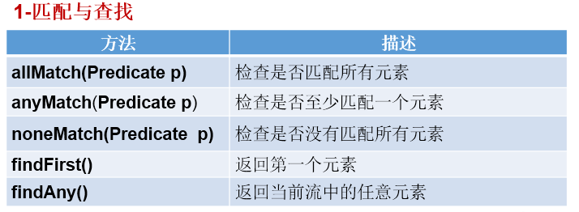

    ```java
        //1 -匹配与查找
        @Test
        public void test1(){
            List<Employee> employees = EmployeeData.getEmployees();
    
    //        allMatch(Predicate p)——检查是否匹配所有元素。
    //          练习：是否所有的员工的年龄都大于18
            boolean allMatch = employees.stream().allMatch(employee -> employee.getAge() > 18);
            System.out.println("allMatch = " + allMatch);
    
    //        anyMatch(Predicate p)——检查是否至少匹配一个元素。
    //         练习：是否存在员工的工资大于 10000
            boolean anyMatch = employees.stream().anyMatch(employee -> employee.getSalary() > 10000);
            System.out.println("anyMatch = " + anyMatch);
    
    //        noneMatch(Predicate p)——检查是否没有匹配的元素。
    //          练习：是否存在员工姓“雷”
            boolean noneMatch = employees.stream().noneMatch(employee -> employee.getName().startsWith("雷"));
            System.out.println("noneMatch = " + noneMatch);
    
    //        findFirst——返回第一个元素
            Optional<Employee> first = employees.stream().findFirst();
            System.out.println("firstEmp = " + first);
    
    //        findAny——返回当前流中的任意元素
            Optional<Employee> employee = employees.parallelStream().findAny();
            System.out.println("employee = " + employee);
            
        }
    ```

    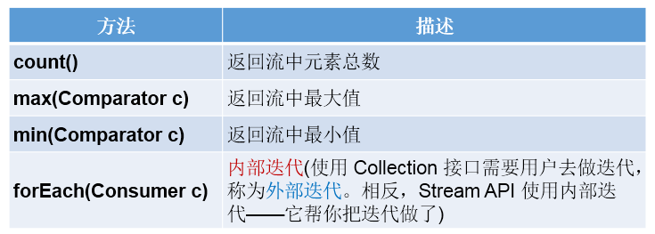


```java
@Test
    public void test2(){
        List<Employee> employees = EmployeeData.getEmployees();
    // count——返回流中元素的总个数
        long count = employees.stream().filter(employee -> employee.getSalary() > 5000).count();
        System.out.println("count = " + count);

//        max(Comparator c)——返回流中最大值
//        练习：返回最高的工资
        Stream<Double> salaryStream = employees.stream().map(employee -> employee.getSalary());
        Optional<Double> maxSalary = salaryStream.max(Double::compare);
        System.out.println("maxSalary = " + maxSalary);

//        min(Comparator c)——返回流中最小值
//        练习：返回最低工资的员工
        Optional<Employee> minSEmp = employees.stream().min((e1, e2) -> Double.compare(e1.getSalary(), e2.getSalary()));
        System.out.println("minSEmp = " + minSEmp);

//        forEach(Consumer c)——内部迭代 :终止操作
        employees.stream().forEach(System.out::println);

        //使用集合的遍历操作
        employees.forEach(System.out::println);

    }
```

2. **归约**

    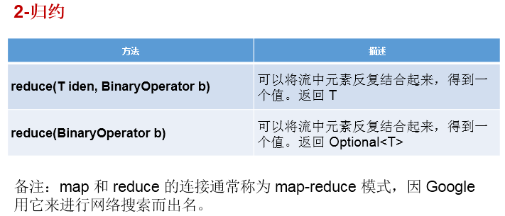

    ```java
    //2 -归约
        @Test
        public void test3(){
    //        reduce(T identity, BinaryOperator)——可以将流中元素反复结合起来，得到一个值。返回 T
    //        练习1：计算1-10的自然数的和
            List<Integer> list = Arrays.asList(1,2,3,4,5,6,7,8,9,10);
            Integer sum = list.stream().reduce(0, Integer::sum);//参数一：初始值
            System.out.println("sum = " + sum);
    
    //        reduce(BinaryOperator) ——可以将流中元素反复结合起来，得到一个值。返回 Optional<T>
    //        练习2：计算公司所有员工工资的总和
            List<Employee> employees = EmployeeData.getEmployees();
            Stream<Double> salaryStream = employees.stream().map(Employee::getSalary);
    //        Optional<Double> sumSal = salaryStream.reduce(Double::sum);
            Optional<Double> sumSal = salaryStream.reduce((d1, d2) -> d1 + d2);
            System.out.println("sumSal = " + sumSal);
    
        }
    ```

3. **收集**

    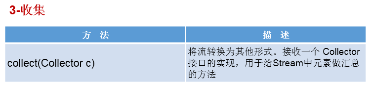

    ```java
    //3 -收集
        @Test
        public void test4(){
    //        collect(Collector c)——将流转换为其他形式。接收一个 Collector接口的实现，用于给Stream中元素做汇总的方法
    //        练习1：查找工资大于6000的员工，结果返回为一个List或Set
            List<Employee> employees = EmployeeData.getEmployees();
            List<Employee> employeeList = employees.stream().filter(employee -> employee.getSalary() > 6000).collect(Collectors.toList());
            employeeList.forEach(System.out::println);
            System.out.println("********************************");
    
            Set<Employee> employeeSet = employees.stream().filter(employee -> employee.getSalary() > 6000).collect(Collectors.toSet());
            employeeSet.forEach(System.out::println);
        }
    ```

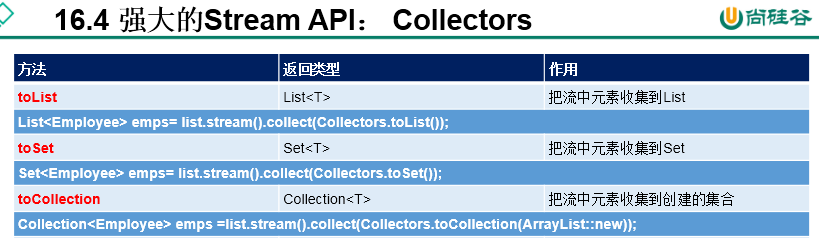


## 5. Optional类

1. **理解**

    - Optional类：为了避免在程序中出现空指针异常而创建的
    - Optional<T> 类(java.util.Optional) 是一个容器类，它可以保存类型T的值，代表这个值存在。或者仅仅保存null，表示这个值不存在。原来用 null 表示一个值不存在，现在 Optional 可以更好的表达这个概念。并且可以避免空指针异常。

2. **常用方法**：

    ```java
    @Test
        public void test1(){
            //empty():创建的Optional对象内部的value = null
            Optional<Object> op1 = Optional.empty();
            if(!op1.isPresent()){//Optional封装的数据是否包含数据
                System.out.println("数据为空");
    
            }
            System.out.println(op1);
            System.out.println(op1.isPresent());
            //如果Optional封装的数据value为空，则get()报错。否则，value不为空时，返回value.
    //        System.out.println(op1.get());
    
        }
    
        @Test
        public void test2(){
            String str = "hello";
    //        str = null;
            //of(T t):封装数据t生成Optional对象。要求t非空，否则报错。
            Optional<String> op1 = Optional.of(str);
            //get()通常与of()方法搭配使用。用于获取内部的封装的数据value
            String str1 = op1.get();
            System.out.println(str1);
    
        }
    
        @Test
        public void test3(){
            String str = "beijing";
            str = null;
            //ofNullable(T t) ：封装数据t赋给Optional内部的value。不要求t非空
            Optional<String> op1 = Optional.ofNullable(str);
            //orElse(T t1):如果Optional内部的value非空，则返回此value值。如果
            //value为空，则返回t1.
            String str2 = op1.orElse("shanghai");
    
            System.out.println(str2);//
    
    
        }
    ```

    ```java
    @Test
        public void test2(){
            Girl girl = new Girl();
            girl = null;
            //.ofNullable(T t)：t可以为null
            Optional<Girl> optionalGirl = Optional.ofNullable(girl);
            System.out.println("optionalGirl = " + optionalGirl);
    
            //orElse(T t1):如果当前的Optional内部封装的t是非空的，则返回内部的t
            //如果内部的t是空的，则返回orElse() 方法中的t1
            Girl girl1 = optionalGirl.orElse(new Girl("马思纯"));
            System.out.println("optionalGirl = " + girl1);
    
        }
    
    
    
    //使用Optional类的getGirlName
        public String getGirlName2(Boy boy) {
            Optional<Boy> optionalBoy = Optional.ofNullable(boy);
            //此时的boy1一定非空
            Boy boy1 = optionalBoy.orElse(new Boy(new Girl("景甜")));
            Girl girl = boy1.getGirl();
    
            Optional<Girl> optionalGirl = Optional.ofNullable(girl);
            //此时的girl1一定非空
            Girl girl1 = optionalGirl.orElse(new Girl("刘亦菲"));
            return girl1.getName();
    
        }
    
        @Test
        public void test5(){
            Boy boy = null;
            boy = new Boy();  //boy 不为空 boy.getGirl()为空
            boy = new Boy(new Girl("刘诗诗"));
            String girlName = getGirlName2(boy);
            System.out.println("girlName = " + girlName);
    
        }
    ```

    

