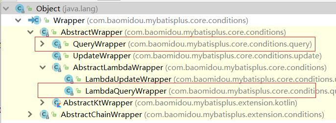
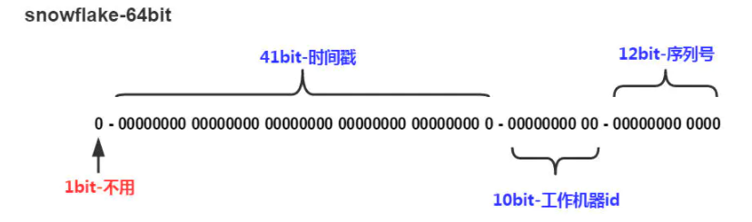
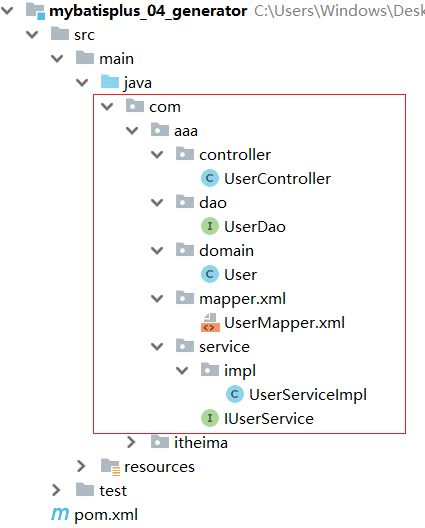

# MybatisPlus笔记

## 1.MybatisPlus入门与简介

### 1.1 入门案例

- 基于SpringBoot使用MyBatisPlus

#### 步骤一:创建数据库和表

#### 步骤2:创建SpringBoot工程

#### **步骤3:勾选配置使用技术**

- 只有一个SQL 下的MySQL Driver
- 由于MP并未被收录到idea的系统内置配置，无法直接选择加入，需要手动在pom.xml中配置添加

#### 步骤4:pom.xml补全依赖

```xml
<dependency>
    <groupId>com.baomidou</groupId>
    <artifactId>mybatis-plus-boot-starter</artifactId>
    <version>3.4.1</version>
</dependency>
<dependency>
    <groupId>com.alibaba</groupId>
    <artifactId>druid</artifactId>
    <version>1.1.16</version>
</dependency>
<dependency>
    <groupId>org.projectlombok</groupId>
    <artifactId>lombok</artifactId>
</dependency>
```


**说明:**

* druid数据源可以加也可以不加，SpringBoot有内置的数据源，可以配置成使用Druid数据源
* 从MP的依赖关系可以看出，通过依赖传递已经将**MyBatis与MyBatis整合Spring的jar包导入**，我们不需要额外在添加MyBatis的相关jar包

#### 步骤5:添加MP的相关配置信息

`application.yml`

```yaml
spring:
  datasource:
    type: com.alibaba.druid.pool.DruidDataSource
    driver-class-name: com.mysql.cj.jdbc.Driver
    url: jdbc:mysql://localhost:3306/mybatisplus_db?serverTimezone=UTC
    username: root
    password: abc123
```

#### 步骤6:根据数据库表创建实体类

```java
@Data
@AllArgsConstructor
@NoArgsConstructor
public class User {
        private Long id;
        private String name;
        private String password;
        private Integer age;
        private String tel;
}

```

#### 步骤7:创建Dao接口

```java
//要继承BaseMapper 泛型为实体类
@Mapper
public interface UserDao extends BaseMapper<User> {
}
```

#### 步骤8:配置引导类

**说明:Dao接口要想被容器扫描到**，有两种解决方案:

* 方案一:在Dao接口上添加`@Mapper`注解，并且确保Dao处在引导类所在包或其子包中
    * 该方案的缺点是需要在每一Dao接口中添加注解
* 方案二:在引导类上添加`@MapperScan`注解，其属性为所要扫描的Dao所在包
    * 该方案的好处是只需要写一次，则指定包下的所有Dao接口都能被扫描到，`@Mapper`就可以不写。

#### 步骤9:编写测试类

```java
@Autowired
	private UserDao userDao;

	@Test
	void testGetAll() {
		List<User> userList = userDao.selectList(null);
		System.out.println(userList);
	}
```

### 1.2 MybatisPlus简介

MyBatisPlus的官网为:`https://mp.baomidou.com/`

MP的特性:

- 无侵入：只做增强不做改变，不会对现有工程产生影响
- 强大的 CRUD 操作：内置通用 Mapper，少量配置即可实现单表CRUD 操作
- 支持 Lambda：编写查询条件无需担心字段写错
- 支持主键自动生成
- 内置分页插件
- ……

## 2，标准数据层开发

### 2.1标准CRUD使用


```java
@Autowired
	private UserDao userDao;

	/**
	 * 添加
	 */
	@Test
	void testSave() {
		User user = new User();
		user.setName("李佳豪");
		user.setPassword("110120");
		user.setAge(21);
		user.setTel("12345678");
		userDao.insert(user);
	}

	/**
	 * 删除
	 */
	@Test
	void testDelete() {
		userDao.deleteById(1640655501236199425L);
	}

	/**
	 * 更新
	 */
	@Test
	void testUpdate() {
		User user = new User();
		user.setId(1L);
		user.setName("李佳豪666");
		user.setPassword("李佳豪888");
		userDao.updateById(user);

	}

	/**
	 * 根据查询
	 */
	@Test
	void testGetById() {
		User user = userDao.selectById(2L);
		System.out.println(user);
	}

	/**
	 * 查询所有
	 */
	@Test
	void testGetAll() {
		List<User> userList = userDao.selectList(null);
		System.out.println(userList);
	}

```

### 2.2 分页功能

分页查询使用的方法是:

```java
IPage<T> selectPage(IPage<T> page, Wrapper<T> queryWrapper)
```

- IPage:用来构建分页查询条件
- Wrapper：用来构建条件查询的条件，目前我们没有可直接传为Null
- IPage:返回值，你会发现构建分页条件和方法的返回值都是IPage

#### **步骤1:调用方法传入参数获取返回值**

```java
	/**
	 * 分页查询 
	 */
	@Test
	void testSelectPage() {
		IPage page = new Page(2,3);
		userDao.selectPage(page,null);
		System.out.println("当前页码值：" + page.getCurrent());
		System.out.println("每页显示数：" + page.getSize());
		System.out.println("一共多少页：" + page.getPages());
		System.out.println("一共多少条数据：" + page.getTotal());
		System.out.println("数据：" + page.getRecords());

	}
```

#### **步骤2:配置类里边配置分页拦截器**

```java
@Configuration
public class MPConfig {

    /**
     * 配置mp的分页拦截器
     * @return mpinterceptor
     */
    @Bean
    public MybatisPlusInterceptor mpInterceptor (){
        MybatisPlusInterceptor mpinterceptor = new MybatisPlusInterceptor();
        //定义分页拦截器
        mpinterceptor.addInnerInterceptor(new PaginationInnerInterceptor());
        return mpinterceptor;
    }

}
```

#### 步骤3:运行测试程序（可以开启日志查看）

`application.yml`

```yaml
#开启mp的日志
mybatis-plus:
  configuration:
    log-impl: org.apache.ibatis.logging.stdout.StdOutImpl
```

## 3，DQL编程控制

* 条件查询方式
* 查询投影
* 查询条件设定
* 字段映射与表名映射

### 3.1 条件查询

#### 3.1.1 条件查询的类


- 编写UserDao接口
- 编写模型类
- 编写引导类
- 编写配置文件
- 编写测试类(**如上**)

———–**日志处理**：

- 取消初始化spring日志打印，resources目录下添加logback.xml，名称固定，内容如下:

```xml
<?xml version="1.0" encoding="UTF-8"?>
<configuration>
</configuration>
```

+ 取消MybatisPlus启动banner图标

    ```yaml
    # mybatis-plus日志控制台输出
    mybatis-plus:
      configuration:
        log-impl: org.apache.ibatis.logging.stdout.StdOutImpl
      global-config:
        banner: off # 关闭mybatisplus启动图标
    ```

    

- 取消SpringBoot的log打印

- ```yaml
    spring:
      main:
        banner-mode: off # 关闭SpringBoot启动图标(banner)
    ```

#### 3.1.2 构建条件查询

在进行查询的时候，我们的入口是在Wrapper这个类上，因为它是一个接口，所以我们需要去找它对应的实现类，关于实现类也有很多，说明我们有多种构建查询条件对象的方式



1. ==QueryWrapper==

    ```java
        QueryWrapper qw = new QueryWrapper();
        qw.lt("age",18);
        List<User> userList = userDao.selectList(qw);
        System.out.println(userList);
    ```

2. ==QueryWrapper的基础上使用lambda==

    ```java
          QueryWrapper<User> qw = new QueryWrapper();
          qw.lambda().lt(User::getAge,10);
          List<User> userList = userDao.selectList(qw);
          System.out.println(userList);
    ```

3. ==LambdaQueryWrapper==

    ```java
          LambdaQueryWrapper<User> lqw = new LambdaQueryWrapper<>();
          lqw.lt(User::getAge,10);
          List<User> userList = userDao.selectList(lqw);
          System.out.println(userList);
    ```


#### 3.1.3 多条件构建

 –**lt（小于） gt（大于） or（或者）**– 

~~~Java
```java
      LambdaQueryWrapper<User> lqw = new LambdaQueryWrapper<>();
      //10—30岁之间
      lqw.lt(User::getAge,10);s
      lqw.gt(User::getAge,30);
	  //支持链式编程
      lqw.lt(User::getAge,30).gt(User::getAge,10);

      //小于10或者大于30岁
      lqw.lt(User::getAge,10).or().gt(User::getAge,30);
      List<User> userList = userDao.selectList(lqw);
      System.out.println(userList);

~~~

#### 3.1.4 null判定

- 一般在进行查询时，需要进行条件判断，如果前端传递过来的参数是空值，这时候一般就需要过滤掉

```Java
@Data
public class User {
    private Long id;
    private String name;
    private String password;
    private Integer age;
    private String tel;
}

@Data
public class UserQuery extends User {
    private Integer age2;
}
```

```Java
    //模拟页面传递过来的查询数据
    UserQuery uq = new UserQuery();
//    uq.setAge(10);  此时age属性即为null
    uq.setAge2(30);   

	//null值判定
    LambdaQueryWrapper<User> lqw = new LambdaQueryWrapper<>();
      //默认即使为空值 仍会传参
//      lqw.lt(User::getAge,uq.getAge2());
      //先判断第一个条件，根据结果，判断是否连接
      lqw.lt(null != uq.getAge2(),User::getAge,uq.getAge2())
      .gt(null != uq.getAge(),User::getAge,uq.getAge());
      List<User> userList = userDao.selectList(lqw);
      System.out.println(userList);
```


### 3.2 查询投影

在查询数据的时候，什么都没有做默认就是查询表中所有字段的内容，我们所说的**查询投影即不查询所有字段，只查询出指定内容的数据。**

#### 3.2.1查询指定字段

1. 查询结果包含模型类中的部分属性（可以用lambada)

    ```java
        //查询投影
        LambdaQueryWrapper<User> lqw = new LambdaQueryWrapper<>();
        //设置查询字段
        lqw.select(User::getId,User::getName,User::getAge);
        List<User> userList = userDao.selectList(lqw);
        System.out.println(userList);
    ```

2. 查询结果包含模型类中未定义的属性

    ```Java
    //查询投影
    QueryWrapper<User> lqw = new QueryWrapper();
    //设置查询字段 （手动指定）
    lqw.select("count(*) as count , tel");
    lqw.groupBy("tel");
    List<Map<String, Object>> userList = userDao.selectMaps(lqw);
    System.out.println(userList);
    ```

#### 3.2.2 聚合查询

 需求:聚合函数查询，完成count、max、min、avg、sum的使用

 count:总记录数

 max:最大值

 min:最小值

 avg:平均值

 sum:求和

```java
@SpringBootTest
class Mybatisplus02DqlApplicationTests {

    @Autowired
    private UserDao userDao;
    
    @Test
    void testGetAll(){
        QueryWrapper<User> lqw = new QueryWrapper<User>();
        //lqw.select("count(*) as count");
        //SELECT count(*) as count FROM user
        //lqw.select("max(age) as maxAge");
        //SELECT max(age) as maxAge FROM user
        //lqw.select("min(age) as minAge");
        //SELECT min(age) as minAge FROM user
        //lqw.select("sum(age) as sumAge");
        //SELECT sum(age) as sumAge FROM user
        lqw.select("avg(age) as avgAge");
        //SELECT avg(age) as avgAge FROM user
        List<Map<String, Object>> userList = userDao.selectMaps(lqw);
        System.out.println(userList);
    }
}
```

为了在做结果封装的时候能够更简单，我们将上面的聚合函数都起了个名称，方面后期来获取这些数据

#### 3.2.3 分组查询

  需求:分组查询，完成 group by的查询使用

```java
@SpringBootTest
class Mybatisplus02DqlApplicationTests {

    @Autowired
    private UserDao userDao;
    
    @Test
    void testGetAll(){
        QueryWrapper<User> lqw = new QueryWrapper<User>();
        lqw.select("count(*) as count,tel");
        lqw.groupBy("tel");
        List<Map<String, Object>> list = userDao.selectMaps(lqw);
        System.out.println(list);
    }
}
```

* groupBy为分组，最终的sql语句为

    ```sql
    SELECT count(*) as count,tel FROM user GROUP BY tel
    ```

**注意:**

* 聚合与分组查询，无法使用lambda表达式来完成
* MP只是对MyBatis的增强，如果MP实现不了，我们可以直接在DAO接口中使用MyBatis的方式实现

### 3.3 查询条件

前面我们只使用了lt()和gt(),除了这两个方法外，MP还封装了很多条件对应的方法，这一节我们重点把MP提供的查询条件方法进行学习下。

MP的查询条件有很多:

* 范围匹配（> 、 = 、between）
* 模糊匹配（like）
* 空判定（null）
* 包含性匹配（in）
* 分组（group）
* 排序（order）
* ……

#### 3.3.1 等值查询

 需求:根据用户名和密码查询用户信息

```java
@SpringBootTest
class Mybatisplus02DqlApplicationTests {

    @Autowired
    private UserDao userDao;
    
    @Test
    void testGetAll(){
        LambdaQueryWrapper<User> lqw = new LambdaQueryWrapper<User>();
        lqw.eq(User::getName, "Jerry").eq(User::getPassword, "jerry");
        User loginUser = userDao.selectOne(lqw);
        System.out.println(loginUser);
    }
}
```

* eq()： 相当于 `=`,对应的sql语句为

    ```sql
    SELECT id,name,password,age,tel FROM user WHERE (name = ? AND password = ?)
    ```

* selectList：查询结果为多个或者单个

* selectOne:查询结果为单个

#### 3.3.2 范围查询

 需求:对年龄进行范围查询，使用lt()、le()、gt()、ge()、between()进行范围查询

```java
@SpringBootTest
class Mybatisplus02DqlApplicationTests {

    @Autowired
    private UserDao userDao;
    
    @Test
    void testGetAll(){
        LambdaQueryWrapper<User> lqw = new LambdaQueryWrapper<User>();
        lqw.between(User::getAge, 10, 30);
        //SELECT id,name,password,age,tel FROM user WHERE (age BETWEEN ? AND ?)
        List<User> userList = userDao.selectList(lqw);
        System.out.println(userList);
    }
}
```

* gt():大于(>)
* ge():大于等于(>=)
* lt():小于(<)
* lte():小于等于(<=)
* between():between ? and ?

#### 3.3.3 模糊查询

 需求:查询表中name属性的值以`J`开头的用户信息,使用like进行模糊查询

```java
@SpringBootTest
class Mybatisplus02DqlApplicationTests {

    @Autowired
    private UserDao userDao;
    
    @Test
    void testGetAll(){
        LambdaQueryWrapper<User> lqw = new LambdaQueryWrapper<User>();
        lqw.likeLeft(User::getName, "J");
        //SELECT id,name,password,age,tel FROM user WHERE (name LIKE ?)
        List<User> userList = userDao.selectList(lqw);
        System.out.println(userList);
    }
}
```

* like():前后加百分号,如 %J%
* likeLeft():前面加百分号,如 %J
* likeRight():后面加百分号,如 J%

#### 3.3.4 排序查询

 需求:查询所有数据，然后按照id降序

```java
@SpringBootTest
class Mybatisplus02DqlApplicationTests {

    @Autowired
    private UserDao userDao;
    
    @Test
    void testGetAll(){
        LambdaQueryWrapper<User> lwq = new LambdaQueryWrapper<>();
        /**
         * condition ：条件，返回boolean，
         		当condition为true，进行排序，如果为false，则不排序
         * isAsc:是否为升序，true为升序，false为降序
         * columns：需要操作的列
         */
        lwq.orderBy(true,false, User::getId);

        userDao.selectList(lw
    }
}
```

除了上面演示的这种实现方式，还有很多其他的排序方法可以被调用，如图:


* orderBy排序
    * condition:条件，true则添加排序，false则不添加排序
    * isAsc:是否为升序，true升序，false降序
    * columns:排序字段，可以有多个
* orderByAsc/Desc(单个column):按照指定字段进行升序/降序
* orderByAsc/Desc(多个column):按照多个字段进行升序/降序
* orderByAsc/Desc
    * condition:条件，true添加排序，false不添加排序
    * 多个columns：按照多个字段进行排序

除了上面介绍的这几种查询条件构建方法以外还会有很多其他的方法，比如isNull,isNotNull,in,notIn等等方法可供选择，具体参考官方文档的条件构造器来学习使用，具体的网址为:

`https://mp.baomidou.com/guide/wrapper.html#abstractwrapper`


### 3.4 映射匹配兼容性

#### 问题1:表字段与编码属性设计不同步

- MP给我们提供了一个注解`@TableField`,使用该注解可以实现模型类属性名和表的列名之间的映射关系

#### 问题2:编码中添加了数据库中未定义的属性

- `@TableField`注解，它有一个属性叫`exist`，设置该字段是否在数据库表中存在，如果设置为false则不存在，生成sql语句查询的时候，就不会再查询该字段了。

#### 问题3：采用默认查询开放了更多的字段查看权限

- 限制哪些字段默认不要进行查询。解决方案是`@TableField`注解的一个属性叫`select`，该属性设置默认是否需要查询该字段的值，true(默认值)表示默认查询该字段，false表示默认不查询该字段。

##### 知识点1：@TableField

| 名称     | @TableField                                                  |
| -------- | ------------------------------------------------------------ |
| 类型     | ==属性注解==                                                 |
| 位置     | 模型类属性定义上方                                           |
| 作用     | 设置当前属性对应的数据库表中的字段关系                       |
| 相关属性 | value(默认)：设置数据库表字段名称<br/>exist:设置属性在数据库表字段中是否存在，默认为true，此属性不能与value合并使用<br/>select:设置属性是否参与查询，此属性与select()映射配置不冲突 |

#### 问题4:表名与编码开发设计不同步

MP提供的另外一个注解`@TableName`来设置表与模型类之间的对应关系。

##### 知识点2：@TableName

| 名称     | @TableName                    |
| -------- | ----------------------------- |
| 类型     | ==类注解==                    |
| 位置     | 模型类定义上方                |
| 作用     | 设置当前类对应于数据库表关系  |
| 相关属性 | value(默认)：设置数据库表名称 |

```java
@TableName("tb_user")  //表名映射
@Data
@AllArgsConstructor
@NoArgsConstructor
public class User {
        private Long id;
        private String name;
        /**
         * 起别名表中为pwd , 不参与查询
         */
        @TableField(value = "pwd",select = false)

        private String password;
        private Integer age;
        private String tel;
        /**
         * //表中不存在
         */
        @TableField(exist = false)
        private Integer online;
}
```


## 4，DML编程控制

### 4.1 id生成策略控制

#### 知识点1：@TableId

| 名称     | @TableId                                                     |
| -------- | ------------------------------------------------------------ |
| 类型     | ==属性注解==                                                 |
| 位置     | 模型类中用于表示主键的属性定义上方                           |
| 作用     | 设置当前类中主键属性的生成策略                               |
| 相关属性 | value(默认)：设置数据库表主键名称<br/>type:设置主键属性的生成策略，值查照IdType的枚举值 |

#### 4.1.1 AUTO策略等

##### 设置生成策略为AUTO

```java
@Data
@TableName("tbl_user")
public class User {
    @TableId(type = IdType.AUTO)
    private Long id;
    private String name;
    @TableField(value="pwd",select=false)
    private String password;
    private Integer age;
    private String tel;
    @TableField(exist=false)
    private Integer online;
}
```

还有如下几种生成策略:

* NONE: 不设置id生成策略
* INPUT:用户手工输入id   ==**注意:**这种ID生成策略，需要将表的自增策略删除掉==
* ASSIGN_ID:雪花算法生成id(可兼容数值型与字符串型)  ==**注意:**这种生成策略，不需要手动设置ID，如果手动设置ID，则会使用自己设置的值。==
* ASSIGN_UUID:以UUID生成算法作为id生成策略 ==使用uuid需要注意的是，主键的类型不能是Long，而应该改成String类型==
* 其他的几个策略均已过时，都将被ASSIGN_ID和ASSIGN_UUID代替掉。

**拓展:**

分布式ID是什么?

* 当数据量足够大的时候，一台数据库服务器存储不下，这个时候就需要多台数据库服务器进行存储
* 比如订单表就有可能被存储在不同的服务器上
* 如果用数据库表的自增主键，因为在两台服务器上所以会出现冲突
* 这个时候就需要一个全局唯一ID,这个ID就是分布式ID。

#### 4.1.2 雪花算法:

雪花算法(SnowFlake),是Twitter官方给出的算法实现 是用Scala写的。其生成的结果是一个64bit大小整数，它的结构如下图:



1. 1bit,不用,因为二进制中最高位是符号位，1表示负数，0表示正数。生成的id一般都是用整数，所以最高位固定为0。
2. 41bit-时间戳，用来记录时间戳，毫秒级
3. 10bit-工作机器id，用来记录工作机器id,其中高位5bit是数据中心ID其取值范围0-31，低位5bit是工作节点ID其取值范围0-31，两个组合起来最多可以容纳1024个节点
4. 序列号占用12bit，每个节点每毫秒0开始不断累加，最多可以累加到4095，一共可以产生4096个ID

#### 4.1.3 ID生成策略对比

介绍了这些主键ID的生成策略，我们以后该用哪个呢?

* NONE: 不设置id生成策略，MP不自动生成，约等于INPUT,所以这两种方式都需要用户手动设置，但是手动设置第一个问题是容易出现相同的ID造成主键冲突，为了保证主键不冲突就需要做很多判定，实现起来比较复杂
* AUTO:数据库ID自增,这种策略适合在数据库服务器只有1台的情况下使用,不可作为分布式ID使用
* ASSIGN_UUID:可以在分布式的情况下使用，而且能够保证唯一，但是生成的主键是32位的字符串，长度过长占用空间而且还不能排序，查询性能也慢
* ASSIGN_ID:可以在分布式的情况下使用，生成的是Long类型的数字，可以排序性能也高，但是生成的策略和服务器时间有关，如果修改了系统时间就有可能导致出现重复主键
* 综上所述，每一种主键策略都有自己的优缺点，根据自己项目业务的实际情况来选择使用才是最明智的选择。

#### 4.1.4 简化配置

* 如果要在项目中的每一个模型类上都需要使用相同的生成策略

    ```yaml
    mybatis-plus:
      global-config:
        db-config:
          #id 生成策略
        	id-type: assign_id
    ```

    ###### ==配置完成后，每个模型类的主键ID策略都将成为assign_id.==

##### 数据库表与模型类的映射关系

* 假如数据库表的名称都以`tbl_`开头

```yaml
mybatis-plus:
  global-config:
    db-config:
    #表名前缀
    	table-prefix: tbl_
```

==这样MP就会拿 `tbl_`加上模型类的首字母小写，就刚好组装成数据库的表名。==

==每个模型类的表名都以tbl_开头==


### 4.2 多记录操作

`批量删除`

```java
int deleteBatchIds(@Param(Constants.COLLECTION) Collection<? extends Serializable> idList);
```

```java
	/**
     * 批量删除  根据id
     */
    @Test
    void testDeleteBatchIds() {
        ArrayList<Long> list = new ArrayList<>();
        list.add(1641018371937521665L);
        list.add(1641019291949654017L);
        userDao.deleteBatchIds(list);
    }
```

`批量查询`

```java
List<T> selectBatchIds(@Param(Constants.COLLECTION) Collection<? extends Serializable> idList);
```

```java
 	/**
     * 批量查询  根据id
     */
    @Test
    void testSelectBatchIds() {
        ArrayList<Long> list = new ArrayList<>();
        list.add(1L);
        list.add(2L);
        list.add(3L);
        userDao.selectBatchIds(list);
    }
```

### 4.3 逻辑删除

1. `逻辑删除是指在数据库中不是真正删除数据，而是通过一个标识位来表示该数据已被删除。`

2. 逻辑删除可以通过在实体类中添加一个标识位字段（比如 `deleted`）来实现。当执行删除操作时，MyBatis-Plus 会将该字段的值设置为已删除的标识值，而不是直接从数据库中删除该记录。

3. **逻辑删除的好处在于，可以保留被删除数据的历史记录，以便日后进行数据分析或者恢复数据。此外，逻辑删除还可以避免误删数据，提高数据的安全性。**

#### 步骤1:修改数据库表添加`deleted`列

- 字段名可以任意，内容也可以自定义，比如`0`代表正常，`1`代表删除，可以在添加列的同时设置其默认值为`0`正常。

#### 步骤2:实体类添加属性

- (1)添加与数据库表的列对应的一个属性名，名称可以任意，如果和数据表列名对不上，可以使用@TableField进行关系映射，如果一致，则会自动对应。

- (2)标识新增的字段为逻辑删除字段，使用`@TableLogic`

```java
 	    /**
         * 逻辑删除字段，标记当前记录是否被删除
         * value为正常数据的值，delval为删除数据的值
         */
        @TableLogic(value = "0", delval = "1")
        private Integer deleted;
```

#### 步骤3:运行删除方法

```java
 userDao.deleteById(2L);
```


从测试结果来看，逻辑删除最后走的是`update`操作，会将指定的字段修改成删除状态对应的值。


**逻辑删除，对查询的影响呢?**

* 执行查询操作

    ```java
    @SpringBootTest
    class Mybatisplus03DqlApplicationTests {
    
        @Autowired
        private UserDao userDao;
    	
        @Test
        void testFind(){
           System.out.println(userDao.selectList(null));
        }
    }
    ```

* 运行测试，会发现打印出来的sql语句中会多一个查询条件，如:

    

 MP的逻辑删除会将所有的查询都添加一个未被删除的条件，也就是已经被删除的数据是不应该被查询出来的。

- 如果还是想把已经删除的数据都查询出来该如何实现呢?

    ```java
    @Mapper
    public interface UserDao extends BaseMapper<User> {
        //查询所有数据包含已经被删除的数据
        @Select("select * from tbl_user")
        public List<User> selectAll();
    }
    ```

- 如果每个表都要有逻辑删除，那么就需要在每个模型类的属性上添加`@TableLogic`注解，如何优化?

    在配置文件中添加全局配置，如下:

    ```yaml
    mybatis-plus:
      global-config:
        db-config:
         #逻辑删除
          #逻辑删除指定的属性
          logic-delete-field: del
          #不删除的标记为 0
          logic-not-delete-value: 0
          #删除的标记为 1
          logic-delete-value: 1
    ```

    ==逻辑删除的本质其实是修改操作。如果加了逻辑删除字段，查询数据时也会自动带上逻辑删除字段。==

执行的SQL语句为:

UPDATE tbl_user SET ==deleted===1 where id = ? AND ==deleted===0

#### 知识点1：@TableLogic

| 名称     | @TableLogic                               |
| -------- | ----------------------------------------- |
| 类型     | ==属性注解==                              |
| 位置     | 模型类中用于表示删除字段的属性定义上方    |
| 作用     | 标识该字段为进行逻辑删除的字段            |
| 相关属性 | value：逻辑未删除值<br/>delval:逻辑删除值 |

### 4.4 乐观锁

- **基于version实现乐观锁**
- 当多个用户尝试更新同一条数据时，乐观锁机制可以确保只有一个用户能够成功更新数据，从而避免数据不一致的问题。
- 在基于版本实现乐观锁的机制中，每个数据对象都有一个版本号，当一个线程想要更新数据时，它会首先读取当前版本号并将其保存在本地。然后它会执行更新操作，如果在此期间数据的版本号没有发生改变，则更新操作成功，否则它会抛出一个异常或者提示用户重试。

#### 4.4.1 实现步骤

##### 步骤1:数据库表添加列

- 列名可以任意，比如使用`version`,给列设置默认值为`1`

##### 步骤2:在模型类中添加对应的属性

- 根据添加的字段列名，在模型类中添加对应的属性值

    ```java
    		/**
             * 版本控制 乐观锁
             */
            @Version
            private Integer version;
    ```

##### 步骤3:添加乐观锁的拦截器

```Java
@Configuration
public class MpConfig {
    @Bean
    public MybatisPlusInterceptor mpInterceptor() {
        //1.定义Mp拦截器
        MybatisPlusInterceptor mpInterceptor = new MybatisPlusInterceptor();
        //2.添加乐观锁拦截器
        mpInterceptor.addInnerInterceptor(new OptimisticLockerInnerInterceptor());
        return mpInterceptor;
    }
}
```


##### 步骤4:执行更新操作

- 实现乐观锁，首先第一步应该是拿到表中的version==查询==，然后拿version当条件，进行判断决定是否可以更新
- 两种操作方式

```java
 @Test
    void  testLock() {
        //方式一：
        User user = new User();
        user.setId(3L);
        user.setName("Jock666");
        user.setVersion(0);
        userDao.updateById(user);

        //方式二：
        //1.先通过id将要修改的数据查询出来
        User user = userDao.selectById(3L);  //version = 3

        User user2 = userDao.selectById(3L);  //version = 3
        //2.将要修改的属性逐一设置进去
        user2.setName("jockaaa");
        userDao.updateById(user2);     //version = 4


        user.setName("jockbbb");
        userDao.updateById(user);     //verson != 3 无法更新
    }
```

**参考官方文档**来实现:

`https://mp.baomidou.com/guide/interceptor-optimistic-locker.html#optimisticlockerinnerinterceptor`


## 5，快速开发

### 代码生成器实现


#### 步骤1:创建一个Maven项目

#### 代码2:导入对应的jar包

```xml
<?xml version="1.0" encoding="UTF-8"?>
<project xmlns="http://maven.apache.org/POM/4.0.0" xmlns:xsi="http://www.w3.org/2001/XMLSchema-instance"
         xsi:schemaLocation="http://maven.apache.org/POM/4.0.0 https://maven.apache.org/xsd/maven-4.0.0.xsd">
    <modelVersion>4.0.0</modelVersion>
    <parent>
        <groupId>org.springframework.boot</groupId>
        <artifactId>spring-boot-starter-parent</artifactId>
        <version>2.5.1</version>
    </parent>
    <groupId>com.itheima</groupId>
    <artifactId>mybatisplus_04_generator</artifactId>
    <version>0.0.1-SNAPSHOT</version>
    <properties>
        <java.version>1.8</java.version>
    </properties>
    <dependencies>
        <!--spring webmvc-->
        <dependency>
            <groupId>org.springframework.boot</groupId>
            <artifactId>spring-boot-starter-web</artifactId>
        </dependency>

        <!--mybatisplus-->
        <dependency>
            <groupId>com.baomidou</groupId>
            <artifactId>mybatis-plus-boot-starter</artifactId>
            <version>3.4.1</version>
        </dependency>

        <!--druid-->
        <dependency>
            <groupId>com.alibaba</groupId>
            <artifactId>druid</artifactId>
            <version>1.1.16</version>
        </dependency>

        <!--mysql-->
        <dependency>
            <groupId>mysql</groupId>
            <artifactId>mysql-connector-java</artifactId>
            <scope>runtime</scope>
        </dependency>

        <!--test-->
        <dependency>
            <groupId>org.springframework.boot</groupId>
            <artifactId>spring-boot-starter-test</artifactId>
            <scope>test</scope>
        </dependency>

        <!--lombok-->
        <dependency>
            <groupId>org.projectlombok</groupId>
            <artifactId>lombok</artifactId>
            <version>1.18.12</version>
        </dependency>

        <!--代码生成器-->
        <dependency>
            <groupId>com.baomidou</groupId>
            <artifactId>mybatis-plus-generator</artifactId>
            <version>3.4.1</version>
        </dependency>

        <!--velocity模板引擎-->
        <dependency>
            <groupId>org.apache.velocity</groupId>
            <artifactId>velocity-engine-core</artifactId>
            <version>2.3</version>
        </dependency>

    </dependencies>

    <build>
        <plugins>
            <plugin>
                <groupId>org.springframework.boot</groupId>
                <artifactId>spring-boot-maven-plugin</artifactId>
            </plugin>
        </plugins>
    </build>

</project>

```

#### 步骤3:编写引导类

```java
@SpringBootApplication
public class Mybatisplus04GeneratorApplication {

    public static void main(String[] args) {
        SpringApplication.run(Mybatisplus04GeneratorApplication.class, args);
    }

}
```

#### 步骤4:创建代码生成类

public class CodeGenerator {
    public static void main(String[] args) {
        //1.获取代码生成器的对象
        AutoGenerator autoGenerator = new AutoGenerator();

```java
    //设置数据库相关配置
    DataSourceConfig dataSource = new DataSourceConfig();
    dataSource.setDriverName("com.mysql.cj.jdbc.Driver");
    dataSource.setUrl("jdbc:mysql://localhost:3306/mybatisplus_db?serverTimezone=UTC");
    dataSource.setUsername("root");
    dataSource.setPassword("root");
    autoGenerator.setDataSource(dataSource);

    //设置全局配置
    GlobalConfig globalConfig = new GlobalConfig();
    globalConfig.setOutputDir(System.getProperty("user.dir")+"/mybatisplus_04_generator/src/main/java");    //设置代码生成位置
    globalConfig.setOpen(false);    //设置生成完毕后是否打开生成代码所在的目录
    globalConfig.setAuthor("黑马程序员");    //设置作者
    globalConfig.setFileOverride(true);     //设置是否覆盖原始生成的文件
    globalConfig.setMapperName("%sDao");    //设置数据层接口名，%s为占位符，指代模块名称
    globalConfig.setIdType(IdType.ASSIGN_ID);   //设置Id生成策略
    autoGenerator.setGlobalConfig(globalConfig);

    //设置包名相关配置
    PackageConfig packageInfo = new PackageConfig();
    packageInfo.setParent("com.aaa");   //设置生成的包名，与代码所在位置不冲突，二者叠加组成完整路径
    packageInfo.setEntity("domain");    //设置实体类包名
    packageInfo.setMapper("dao");   //设置数据层包名
    autoGenerator.setPackageInfo(packageInfo);

    //策略设置
    StrategyConfig strategyConfig = new StrategyConfig();
    strategyConfig.setInclude("tbl_user");  //设置当前参与生成的表名，参数为可变参数
    strategyConfig.setTablePrefix("tbl_");  //设置数据库表的前缀名称，模块名 = 数据库表名 - 前缀名  例如： User = tbl_user - tbl_
    strategyConfig.setRestControllerStyle(true);    //设置是否启用Rest风格
    strategyConfig.setVersionFieldName("version");  //设置乐观锁字段名
    strategyConfig.setLogicDeleteFieldName("deleted");  //设置逻辑删除字段名
    strategyConfig.setEntityLombokModel(true);  //设置是否启用lombok
    autoGenerator.setStrategy(strategyConfig);
    //2.执行生成操作
    autoGenerator.execute();
}
```
}

对于代码生成器中的代码内容，我们可以直接从官方文档中获取代码进行修改，

`https://mp.baomidou.com/guide/generator.html


#### 步骤5:运行程序

运行成功后，会在当前项目中生成很多代码，代码包含`controller`,`service`，`mapper`和`entity`




至此代码生成器就已经完成工作，我们能快速根据数据库表来创建对应的类，简化我们的代码开发。

###  MP中Service的CRUD

回顾我们之前业务层代码的编写，编写接口和对应的实现类:

```java
public interface UserService{
	
}

@Service
public class UserServiceImpl implements UserService{

}
```

接口和实现类有了以后，需要在接口和实现类中声明方法

```java
public interface UserService{
	public List<User> findAll();
}

@Service
public class UserServiceImpl implements UserService{
    @Autowired
    private UserDao userDao;
    
	public List<User> findAll(){
        return userDao.selectList(null);
    }
}
```

MP看到上面的代码以后就说这些方法也是比较固定和通用的，那我来帮你抽取下，所以MP提供了一个Service接口和实现类，分别是:`IService`和`ServiceImpl`,后者是对前者的一个具体实现。

以后我们自己写的Service就可以进行如下修改:

```java
public interface UserService extends IService<User>{
	
}

@Service
public class UserServiceImpl extends ServiceImpl<UserDao, User> implements UserService{

}
```

修改以后的好处是，MP已经帮我们把业务层的一些基础的增删改查都已经实现了，可以直接进行使用。

编写测试类进行测试:

```java
@SpringBootTest
class Mybatisplus04GeneratorApplicationTests {

    private IUserService userService;

    @Test
    void testFindAll() {
        List<User> list = userService.list();
        System.out.println(list);
    }

}
```

**注意:**mybatisplus_04_generator项目中对于MyBatis的环境是没有进行配置，如果想要运行，需要提取将配置文件中的内容进行完善后在运行。

思考:在MP封装的Service层都有哪些方法可以用?

查看官方文档:`https://mp.baomidou.com/guide/crud-interface.html`,这些提供的方法大家可以参考官方文档进行学习使用，方法的名称可能有些变化，但是方法对应的参数和返回值基本类似。
