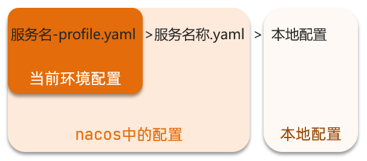
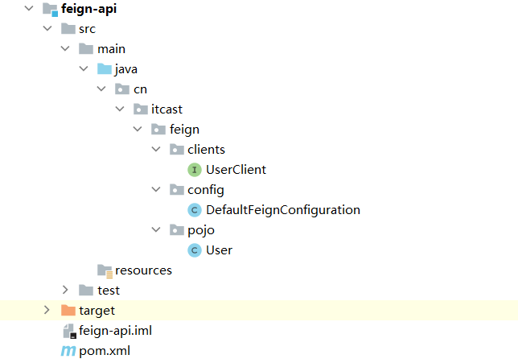

# SpringCloud1

## 1. Eureka注册中心

### 1.1 搭建eureka注册中心

- 首先在eureka注册中心的Application添加@EnableEurekaServer注解

```Java
@EnableEurekaServer
@SpringBootApplication
public class EurekaApplication {
    public static void main(String[] args) {
        SpringApplication.run(EurekaApplication.class, args);
    }

}
```

1. 创建eureka注册中心首先要引入

    ```XML
    <dependency>
    <groupId>org.springframework.cloud</groupId>
    <artifactId>spring-cloud-starter-netflix-eureka-server</artifactId>
    </dependency>
    ```

    - 用于构建Eureka Server注册中心的依赖包，它提供了Eureka Server相关的组件和配置。

2. 配置eureka的配置文件

    ```yaml
    server:
      port: 10086 # 服务端口
    spring:
      application:
        name: eurekaserver # eureka的服务名称
    eureka:
      client:
        service-url: # eureka的地址信息
          defaultZone: http://127.0.0.1:10086/eureka
    ```

==将该模块注册为一个Eureka Server实例，用于管理和调度其它微服务的状态和实例信息。==


### 1.2 将应用程序注册到Eureka Server的客户端

1. 引入Eureka Client的依赖包，它提供了将应用程序注册到Eureka Server的客户端功能

    ```xml
    <dependency>
    <groupId>org.springframework.cloud</groupId>
    <artifactId>spring-cloud-starter-netflix-eureka-client</artifactId>
    </dependency>
    ```

2. 应用程序的配置文件

    ```yaml
    spring:
      application:
        name: userservice # user服务的服务名称
        
    eureka:
      client:
        service-url: # eureka的地址信息
          defaultZone: http://127.0.0.1:10086/eureka
    ```

    ==在应用程序运行时，Eureka Client将这些信息通过一个心跳机制发送给Eureka Server，并根据Eureka Server返回的服务信息来实现负载均衡和服务发现等功能。==

### 服务发现

- 在进行远程调用的时候，就可以将url地址里面的ip地址替换为应用程序配置文件的服务名称 ==userservice==

    如：

    ```java
     String url = "http://localhost:8081/user/1/" + order.getUserId();
     替换为
     String url = "http://userservice/user/" + order.getUserId();
    ```

- 给RestTemplat添加**@LoadBalanced注解实现负载均衡**

## 2. Ribbon负载均衡

### 2.1 自定义负载均衡策略

两种方式：

- 代码方式：在order-service中的OrderApplication类中，定义一个新的IRule：

```java
@Bean
public IRule randomRule(){
    return new RandomRule();
}
```

- 配置文件方式：在order-service的application.yml文件中，添加新的配置也可以修改规则：

```yaml
userservice: # 给某个微服务配置负载均衡规则，这里是userservice服务
  ribbon:
    NFLoadBalancerRuleClassName: com.netflix.loadbalancer.RandomRule # 负载均衡规则 
```

 ==**注意**，一般用默认的负载均衡规则，不做修改。==

### 饥饿加载

Ribbon默认是采用懒加载，即第一次访问时才会去创建LoadBalanceClient，请求时间会很长。

而饥饿加载则会在项目启动时创建，降低第一次访问的耗时，通过下面配置开启饥饿加载：

```yaml
ribbon:
  eager-load:
    enabled: true # 开启饥饿加载
    clients: # 指定饥饿加载的服务名称
      - userservice
```

## 3. Nacos快速入门

[Nacos](https://nacos.io/)

### 3.1 安装和启动

- 下载:GitHub的Release下载页：https://github.com/alibaba/nacos/releases

- 解压

- 启动：加压后进入bin目录 cmd窗口打开 执行windows命令

    ```
    startup.cmd -m standalone
    ```

- 访问 在浏览器输入地址：http://127.0.0.1:8848/nacos即可

### 3.2 服务注册到Nacos

- **父工程依赖配置**： 由于nacos是阿里巴巴开发的 配置阿里巴巴的依赖管理 可以更好的配置版本

    ```xml
     <!--spring-cloud-alibaba-->
    <dependency>
      <groupId>com.alibaba.cloud</groupId>
      <artifactId>spring-cloud-alibaba-dependencies</artifactId>
      <version>2.2.5.RELEASE</version>
      <type>pom</type>
      <scope>import</scope>
    </dependency>
    ```

    ==如果有关于Eureka的依赖，则需要注释掉==

- **子工程服务注册**：

    1. pom文件依赖注入：

        ```xml
         <!-- nacos客户端依赖包 -->
        <dependency>
          <groupId>com.alibaba.cloud</groupId>
          <artifactId>spring-cloud-starter-alibaba-nacos-discovery</artifactId>
            </dependency>
        <!--配置中心来做配置管理-->
        <dependency>
            <groupId>com.alibaba.cloud</groupId>
            <artifactId>spring-cloud-starter-alibaba-nacos-config</artifactId>
        </dependency>
        ```

    2. yaml文件配置注册信息：

        ```yaml
        spring:  
          cloud:
            nacos:
              server-addr: localhost:8848 #nacos服务端口
        ```

    3. 重启服务，即可在nacos控制台查看注册信息

### 3.3 Nacos 服务分级存储模型

一个**服务**可以有多个**实例**，例如我们的user-service，假如这些实例分布于全国各地的不同机房，例如：

- 127.0.0.1:8081，在上海机房
- 127.0.0.1:8082，在上海机房
- 127.0.0.1:8083，在杭州机房

Nacos就将同一机房内的实例 划分为一个**集群**。

也就是说，user-service是服务，一个服务可以包含多个集群，如杭州、上海，每个集群下可以有多个实例，形成分级模型

==微服务互相访问时，应该尽可能访问同集群实例，因为本地访问速度更快。当本集群内不可用时，才访问其它集群==


#### 3.3.1 给服务配置集群

- 修改服务的yaml文件

    ```yaml
    spring:    
      cloud:
        nacos:
          server-addr: localhost:8848
          discovery:
            cluster-name: HZ #设置集群名称 -杭州
    ```

    修改完集群配置信息，重启服务

    若修改其他实例的集群名称，需要重启Nacos

#### 3.3.2 同集群下的负载均衡策略

```yaml
userservice:
  ribbon:   # 配置负载均衡规则
    NFLoadBalancerRuleClassName: com.alibaba.cloud.nacos.ribbon.NacosRule # 负载均衡规则  --优先选择本地集群
```


### 3.4 服务实例权重设置

**Nacos提供了权重配置来控制访问频率，权重越大则访问频率越高。**

在**nacos控制台**，找到user-service的实例列表，点击**编辑**，即可修改权重

==如果权重修改为0，则该实例永远不会被访问==

### 3.5 环境隔离

Nacos提供了namespace来实现环境隔离功能。

- nacos中可以有多个namespace
- 不同namespace之间相互隔离，例如**不同namespace的服务互相不可见**

1. 创建namespace

    在nacos控制台，左侧命名空间，选择新增命名空间，填写空间名和描述。即可生成

    **记录生成的命名空间id**

    

2. 给微服务配置namespace

    - 修改服务的yaml文件

        ```yaml
        spring:     
          cloud:
            nacos:
              server-addr: localhost:8848
              discovery:
                cluster-name: HZ #设置集群名称 -杭州
                namespace: ff3566eb-5882-413e-bb2a-79702954388e #dev环境 命名空间id
        ```

        

3. 重启服务

### 3.6 Nacos与Eureka的区别

Nacos的服务实例分为两种l类型：

- 临时实例：如果实例宕机超过一定时间，会从服务列表剔除，默认的类型。

- 非临时实例：如果实例宕机，不会从服务列表剔除，也可以叫永久实例。

配置一个服务实例为永久实例：

```yaml
spring:
  cloud:
    nacos:
      discovery:
        ephemeral: false # 设置为非临时实例
```

Nacos和Eureka整体结构类似，服务注册、服务拉取、心跳等待，但是也存在一些差异：


- Nacos与eureka的共同点
    - 都支持服务注册和服务拉取
    - 都支持服务提供者心跳方式做健康检测

- Nacos与Eureka的区别
    - Nacos支持服务端主动检测提供者状态：临时实例采用心跳模式，非临时实例采用主动检测模式
    - 临时实例心跳不正常会被剔除，非临时实例则不会被剔除
    - Nacos支持服务列表变更的消息推送模式，服务列表更新更及时
    - Nacos集群默认采用AP方式，当集群中存在非临时实例时，采用CP模式；Eureka采用AP方式


## 4. Nacos配置管理

### 4.1 统一配置管理

#### 4.1.1 在nacos中添加配置文件

1. 在nacos控制面板左侧，配置管理的配置列表右上角➕新建
2. Data ID为新建配置文件的id：[服务器名称 - profile ].后缀名

==需要热更新的配置才有放到nacos管理的必要==

#### 4.1.2 从微服务中拉取配置

spring引入了一种新的配置文件：bootstrap.yaml文件，会在application.yml之前被读取，流程如下：


1. 引入nacos-config依赖

```xml
<!--nacos配置管理依赖-->
<dependency>
    <groupId>com.alibaba.cloud</groupId>
    <artifactId>spring-cloud-starter-alibaba-nacos-config</artifactId>
</dependency>
```

2. 添加bootstrap.yaml

    在user-service中添加一个bootstrap.yaml文件：

    ```
    spring:
      application:
        name: userservice # 服务名称
      profiles:
        active: dev #开发环境，这里是dev 
      cloud:
        nacos:
          server-addr: localhost:8848 # Nacos地址
          config:
            file-extension: yaml # 文件后缀名
    ```

    

即：读取的文件名称为`userservice-dev.yaml`

3. 读取nacos配置

    在user-service中的UserController中添加业务逻辑，读取pattern.dateformat配置

```java
@Slf4j
@RestController
@RequestMapping("/user")
public class UserController {

    @Autowired
    private UserService userService;

    @Value("${pattern.dateformat}")
    private String dateformat;
    
    @GetMapping("now")
    public String now(){
        return LocalDateTime.now().format(DateTimeFormatter.ofPattern(dateformat));
    }
    // ...略
}
```

### 4.2 配置热更新

#### 4.2.1 方式一：

在@Value注入的变量所在类上添加注解@RefreshScope：


#### 4.2.2 方式二：

使用@ConfigurationProperties注解代替@Value注解。

在user-service服务中，添加一个类，读取patterrn.dateformat属性：

```java
@Component
@Data
@ConfigurationProperties(prefix = "pattern")
public class PatternProperties {
    private String dateformat;
}
```

```java
@Slf4j
@RestController
@RequestMapping("/user")
//@RefreshScope   需要注释
public class UserController {

    @Autowired
    private UserService userService;

//    @Value("${pattern.dateformat}")
//    private String dateformat;

    @Autowired
    private PatternProperties properties;  //引入类

    @GetMapping("now")
    public String now(){
        return LocalDateTime.now().format(DateTimeFormatter.ofPattern(properties.getDateformat()));
    }
```


### 4.3 配置共享

微服务启动时，会读取多个配置文件，其中配置文件id不含环境的配置文件，就可以被多个环境所共享


1. **添加一个环境共享配置**（注：Data ID 必须不含环境）

2. **在user-service中读取共享配置**

    ```java
    @Data
    @Component
    @ConfigurationProperties(prefix = "pattern")
    public class PatternProperties {
        private String dateformat;
        private String envSharedValue;  //多环境共享属性
    ```

    ```java
    @Slf4j
    @RestController
    @RequestMapping("/user")
    public class UserController {
    
        @Autowired
        private PatternProperties properties;
    
        @GetMapping("prop")
        public PatternProperties properties(){
            return properties;
        }
    ```

    

3. **运行两个UserApplication，使用不同的profile**（在Idea的service中，选择一个Application，Shift+F4，在配置界面中 Active profiles： 填入其他环境名称 ）

4. 访问http://localhost:8081/user/prop

    

`配置共享的优先级:`




### 4.4 搭建nacos集群

搭建集群的基本步骤：

- 搭建数据库，初始化数据库表结构
- 下载nacos安装包
- 配置nacos
- 启动nacos集群  startup.cmd
- nginx反向代理


## 5. Feign远程调用

### 5.1 Feign替代RestTemplate

1. **引入依赖**

    ```xml
    <dependency>
        <groupId>org.springframework.cloud</groupId>
        <artifactId>spring-cloud-starter-openfeign</artifactId>
    </dependency>
    ```

2. **添加注解**

    在order-service的启动类添加注解开启Feign的功能：

    ```java
    @EnableFeignClients  //**
    @SpringBootApplication
    public class OrderApplication {}
    ```

3. **编写Feign的客户端**

在order-service中新建一个接口，内容如下：

```java
@FeignClient("userservice")
public interface UserClient {

    @GetMapping("/user/{id}")
    User findById(@PathVariable("id") Long id);
}

```

此客户端主要是基于SpringMVC的注解来声明远程调用的信息

- 服务名称：userservice
- 请求方式：GET
- 请求路径：/user/{id}
- 请求参数：Long id
- 返回值类型：User

这样，==Feign就可以帮助我们发送http请求，无需自己使用RestTemplate来发送==

4. 测试

    ```java
    @Service
    public class OrderService {
    
        @Autowired
        private OrderMapper orderMapper;
        @Autowired
        private UserClient userClient;  //**
    
        public Order queryOrderById(Long orderId) {
            // 1.查询订单
            Order order = orderMapper.findById(orderId);
            // 2.用Feign远程调用
            User user = userClient.findById(order.getUserId());  //**
            // 3.封装user到order
            order.setUser(user);
            // 4.返回
            return order;
        }
    }
    ```

### 5.2 自定义配置

| 类型                   | 作用             | 说明                                                   |
| ---------------------- | ---------------- | ------------------------------------------------------ |
| **feign.Logger.Level** | 修改日志级别     | 包含四种不同的级别：NONE、BASIC、HEADERS、FULL         |
| feign.codec.Decoder    | 响应结果的解析器 | http远程调用的结果做解析，例如解析json字符串为java对象 |
| feign.codec.Encoder    | 请求参数编码     | 将请求参数编码，便于通过http请求发送                   |
| feign. Contract        | 支持的注解格式   | 默认是SpringMVC的注解                                  |
| feign. Retryer         | 失败重试机制     | 请求失败的重试机制，默认是没有，不过会使用Ribbon的重试 |


#### 5.2.1 配置文件方式

基于配置文件修改feign的日志级别可以针对**单个服务**：

```yaml
feign:  
  client:
    config: 
      userservice: # 针对某个微服务的配置
        loggerLevel: FULL #  日志级别 
```

也可以针对**所有服务**：

```yaml
feign:  
  client:
    config: 
      default: # 这里用default就是全局配置，如果是写服务名称，则是针对某个微服务的配置
        loggerLevel: FULL #  日志级别 
```

日志的级别分为四种：

- NONE：不记录任何日志信息，这是默认值。
- BASIC：仅记录请求的方法，URL以及响应状态码和执行时间
- HEADERS：在BASIC的基础上，额外记录了请求和响应的头信息
- FULL：记录所有请求和响应的明细，包括头信息、请求体、元数据。

#### 5.2.2 Java代码方式

基于Java代码来修改日志级别，先声明一个类，然后声明一个Logger.Level的对象：

```java
public class DefaultFeignConfiguration {
    @Bean
    public Logger.Level logLevel(){
        return Logger.Level.BASIC;
    }
}
```


如果要**全局生效**，将其放到启动类的@EnableFeignClients这个注解中：

```java
@EnableFeignClients(defaultConfiguration = DefaultFeignConfiguration .class) 
```


如果是**局部生效**，则把它放到对应的@FeignClient这个注解中：

```java
@FeignClient(value = "userservice", configuration = DefaultFeignConfiguration .class) 
```

### 5.3 Feign使用优化

提高Feign的性能主要手段就是使用**连接池**代替默认的URLConnection。

用Apache的HttpClient来演示:

1. **引入Apache的HttpClient依赖**

```xml
<!--httpClient的依赖 -->
<dependency>
    <groupId>io.github.openfeign</groupId>
    <artifactId>feign-httpclient</artifactId>
</dependency>
```

2. **配置连接池**

在order-service的application.yml中添加配置：

```yaml
feign:
  client:
    config:
      default: # default全局的配置
        loggerLevel: BASIC # 日志级别，BASIC就是基本的请求和响应信息
  httpclient:
    enabled: true # 开启feign对HttpClient的支持
    max-connections: 200 # 最大的连接数
    max-connections-per-route: 50 # 每个路径的最大连接数
```

总结，Feign的优化：

1.日志级别尽量用basic

2.使用HttpClient或OKHttp代替URLConnection

①  引入feign-httpClient依赖

②  配置文件开启httpClient功能，设置连接池参数


### 5.4 最佳实践

仔细观察可以发现，Feign的客户端与服务提供者的controller代码非常相似。

我们可以简化这种重复的代码编写

#### 5.4.1 继承方式

1）定义一个API接口，利用定义方法，并基于SpringMVC注解做声明。

2）Feign客户端和Controller都集成改接口


优点：

- 简单
- 实现了代码共享

缺点：

- 服务提供方、服务消费方紧耦合

- 参数列表中的注解映射并不会继承，因此Controller中必须再次声明方法、参数列表、注解

#### 5.4.2 抽取方式

例如，将UserClient、User、Feign的默认配置都抽取到一个feign-api包中，所有微服务引用该依赖包，即可直接使用。


#### 5.4.3 基于抽取的最佳实践

1. **抽取**

    首先创建一个module，命名为feign-api：

    在feign-api中然后引入feign的starter依赖

    ```xml
    <dependency>
        <groupId>org.springframework.cloud</groupId>
        <artifactId>spring-cloud-starter-openfeign</artifactId>
    </dependency>
    ```

    然后，order-service中编写的UserClient、User、DefaultFeignConfiguration都复制到feign-api项目中

    

2. **在order-service中使用feign-api**

    **删除order-service中的UserClient、User、DefaultFeignConfiguration等类或接口。**

    在order-service的pom文件中中引入feign-api的依赖：

    ```xml
    <dependency>
        <groupId>cn.itcast.demo</groupId>
        <artifactId>feign-api</artifactId>
        <version>1.0</version>
    </dependency>
    ```

    修改order-service中的所有与上述三个组件有关的导包部分，改成导入feign-api中的包

3. **重启测试**

    发现UserClient现在在cn.itcast.feign.clients包下，

    而order-service的@EnableFeignClients注解是在cn.itcast.order包下，不在同一个包，无法扫描到UserClient

    

4. **解决扫描包问题**

方式一：

指定Feign应该扫描的包：

```java
@EnableFeignClients(basePackages = "cn.itcast.feign.clients")
```


方式二：  

指定需要加载的Client接口：

```java
@EnableFeignClients(clients = {UserClient.class})
```

==推荐==


## 6. Gateway服务网关

SpringCloudGateway则是基于Spring5中提供的WebFlux，属于响应式编程的实现，具备更好的性能。


网关的**核心功能特性**：

**权限控制**：网关作为微服务入口，需要校验用户是是否有请求资格，如果没有则进行拦截。

**路由和负载均衡**：一切请求都必须先经过gateway，但网关不处理业务，而是根据某种规则，把请求转发到某个微服务，这个过程叫做路由。当然路由的目标服务有多个时，还需要做负载均衡。

**限流**：当请求流量过高时，在网关中按照下流的微服务能够接受的速度来放行请求，避免服务压力过大。


### 6.1 gateway快速入门

1. 创建gateway服务模块，引入依赖

```xml
<!--网关-->
<dependency>
    <groupId>org.springframework.cloud</groupId>
    <artifactId>spring-cloud-starter-gateway</artifactId>
</dependency>
<!--nacos服务发现依赖-->
<dependency>
    <groupId>com.alibaba.cloud</groupId>
    <artifactId>spring-cloud-starter-alibaba-nacos-discovery</artifactId>
</dependency>
```

2. 编写启动类 (springboot 启动类)
3. 编写基础配置和路由规则

```yaml
server:
  port: 10010 # 网关端口
spring:
  application:
    name: gateway # 服务名称
  cloud:
    nacos:
      server-addr: localhost:8848 # nacos地址
    gateway:
      routes: # 网关路由配置
        - id: user-service # 路由id，自定义，只要唯一即可
uri: http://127.0.0.1:8081 # 路由的目标地址 http就是固定地址
          uri: lb://userservice # 路由的目标地址 lb就是负载均衡，后面跟服务名称
          predicates: # 路由断言，也就是判断请求是否符合路由规则的条件
            - Path=/user/** # 这个是按照路径匹配，只要以/user/开头就符合要求
```

4. 重启测试

重启网关，访问http://localhost:10010/user/1时，符合`/user/**`规则，请求转发到uri：http://userservice/user/1


### 6.2 断言工厂

在配置文件中写的断言规则只是字符串，这些字符串会被**Predicate Factory**读取并处理，转变为路由判断的条件

例如Path=/user/**是按照路径匹配，这个规则是由

`org.springframework.cloud.gateway.handler.predicate.PathRoutePredicateFactory`类来

处理的，像这样的断言工厂在SpringCloudGateway还有十几个


(https://cloud.spring.io/spring-cloud-gateway/reference/html/#gateway-request-predicates-factories)


### 6.3 过滤器工厂

GatewayFilter是网关中提供的一种过滤器，可以对进入网关的请求和微服务返回的响应做处理

(https://cloud.spring.io/spring-cloud-gateway/reference/html/#gatewayfilter-factories)

#### 6.3.1 请求头过滤器

以AddRequestHeader 为例

**需求**：给所有进入userservice的请求添加一个请求头：Truth=Never give up!

修改gateway服务的application.yml文件，添加路由过滤即可:

```yaml
spring:
  cloud:
    gateway:
      routes:
      - id: user-service 
        uri: lb://userservice 
        predicates: 
        - Path=/user/** 
        filters: # 过滤器
        - AddRequestHeader=Truth, Never give up! # 添加请求头
```

当前过滤器写在userservice路由下，因此仅仅对访问userservice的请求有效。


#### 6.3.2 默认过滤器

对所有的路由都生效，则可以将过滤器工厂写到default下。格式如下：

```yaml
spring:
  cloud:
    gateway:
      routes:
      - id: user-service 
        uri: lb://userservice 
        predicates: 
        - Path=/user/**
      default-filters: # 默认过滤项
      - AddRequestHeader=Truth, Never give up 
```

### 6.4 全局过滤器

#### 6.4.1 全局过滤器作用

全局过滤器的作用也是处理一切进入网关的请求和微服务响应，与GatewayFilter的作用一样。区别在于GatewayFilter通过配置定义，处理逻辑是固定的；而GlobalFilter的逻辑需要自己写代码实现。

定义方式是实现GlobalFilter接口。

```java
public interface GlobalFilter {
    /**
     *  处理当前请求，有必要的话通过{@link GatewayFilterChain}将请求交给下一个过滤器处理
     *
     * @param exchange 请求上下文，里面可以获取Request、Response等信息
     * @param chain 用来把请求委托给下一个过滤器 
     * @return {@code Mono<Void>} 返回标示当前过滤器业务结束
     */
    Mono<Void> filter(ServerWebExchange exchange, GatewayFilterChain chain);
}
```


在filter中编写自定义逻辑，可以实现下列功能：

- 登录状态判断
- 权限校验
- 请求限流等

#### 6.4.2 自定义全局过滤器

需求：定义全局过滤器，拦截请求，判断请求的参数是否满足下面条件：

- 参数中是否有authorization，

- authorization参数值是否为admin

如果同时满足则放行，否则拦截

```java
//@Order(-1)
@Component
public class AuthorizeFilter implements GlobalFilter, Ordered {

    @Override
    public Mono<Void> filter(ServerWebExchange exchange, GatewayFilterChain chain) {
        // 1.获取请求参数
        ServerHttpRequest request = exchange.getRequest();
        MultiValueMap<String, String> params = request.getQueryParams();
        // 2.获取参数中的authorization 参数
        String auth = params.getFirst("authorization");
        // 3.判断参数是否等于admin
        if ("admin".equals(auth)) {
            // 4.是，放行
            return chain.filter(exchange);
        }
        // 5.否，拦截
        // 5.1设置状态码
        exchange.getResponse().setStatusCode(HttpStatus.UNAUTHORIZED);
        // 5.2拦截请求
        return exchange.getResponse().setComplete();
    }

    @Override
    public int getOrder() {
        return -1;
    }
}
```

#### 6.4.3 过滤器执行顺序

请求进入网关会碰到三类过滤器：当前路由的过滤器、DefaultFilter、GlobalFilter

请求路由后，会将当前路由过滤器和DefaultFilter、GlobalFilter，合并到一个**过滤器链（集合）**中，**排序后**依次执行每个过滤器


排序的规则是什么呢？

- 每一个过滤器都必须指定一个int类型的order值，**order值越小，优先级越高，执行顺序越靠前**。
- GlobalFilter通过实现Ordered接口，或者添加@Order注解来指定order值，由我们自己指定
- 路由过滤器和defaultFilter的order由Spring指定，默认是按照声明顺序从1递增。
- 当过滤器的order值一样时，会按照 defaultFilter > 路由过滤器 > GlobalFilter的顺序执行。

#### 6.4.4 解决跨域问题

跨域：域名不一致就是跨域,主要包括：

- 域名不同
- 域名相同，端口不同

跨域问题：浏览器禁止请求的发起者与服务端发生跨域ajax请求，请求被浏览器拦截的问题

例如，如果一个页面中引用了一个 JavaScript 代码，而这个代码要请求另一个不同域名下的 API，则就会出现跨域问题。


在gateway服务的application.yml文件中，添加下面的配置：

```yaml
spring:
  cloud:
    gateway:
      # 。。。
      globalcors: # 全局的跨域处理
        add-to-simple-url-handler-mapping: true # 解决options请求被拦截问题
        corsConfigurations:
          '[/**]':
            allowedOrigins: # 允许哪些网站的跨域请求 
              - "http://localhost:8090"
            allowedMethods: # 允许的跨域ajax的请求方式
              - "GET"
              - "POST"
              - "DELETE"
              - "PUT"
              - "OPTIONS"
            allowedHeaders: "*" # 允许在请求中携带的头信息
            allowCredentials: true # 是否允许携带cookie
            maxAge: 360000 # 这次跨域检测的有效期
```


## 7. Docker快速入门

1. Docker是一个快速交付应用、运行应用的技术，具备下列优势：

- 可以将程序及其依赖、运行环境一起打包为一个**镜像**，可以迁移到任意Linux操作系统
- 运行时利用沙箱机制形成**隔离容器**，各个应用互不干扰
- 启动、移除都可以通过一行命令完成，方便快捷

2. Docker和虚拟机的差异：

- docker是一个系统进程；虚拟机是在操作系统中的操作系统

- docker体积小、启动速度快、性能好；虚拟机体积大、启动速度慢、性能一般

3. 镜像和容器

    **镜像**：

    - 将应用程序及其依赖、环境、配置打包在一起

    **容器**：

    - 镜像**运行**起来就是容器，一个镜像可以运行多个容器

    Docker结构：

    - 服务端：接收命令或远程请求，操作镜像或容器

    - 客户端：发送命令或者请求到Docker服务端

    DockerHub：

    - 一个镜像托管的服务器，类似的还有阿里云镜像服务，统称为DockerRegistry(https://hub.docker.com/_/registry)

### 7.1 Docker的基本操作

#### 7.1.1 镜像操作

1. 镜像名称：[repository]:[tag]。
2. 镜像命令：
    - 拉取镜像：docker pull [repository]
    - 查看拉取到的镜像：docker images
    - 镜像导出磁盘：docker save -o [保存的目标文件名称] [镜像名称]
    - 把导出的镜像通过load加载回来：docker load -i [保存的目标文件名称]
    - 删除本地的nginx镜像：docker rmi [repository]:[tag]

#### 7.1.2 容器操作

1. 容器的相关命令：

    - docker exec 进入容器执行命令

    - docker logs 查看容器运行日志  添加 -f 参数可以持续查看日志

    - docker ps -a  查看所有的容器及状态

        

        ```sh
        docker exec -it mn bash
        ```

        命令解读：

        - docker exec ：进入容器内部，执行一个命令

        - -it : 给当前进入的容器创建一个标准输入、输出终端，允许我们与容器交互

        - mn ：要进入的容器的名称

        - bash：进入容器后执行的命令，bash是一个linux终端交互命令

        

- docker run：创建并运行一个容器，处于运行状态

- docker pause：让一个运行的容器暂停

- docker unpause：让一个容器从暂停状态恢复运行

- docker stop：停止一个运行的容器

- docker start：让一个停止的容器再次运行

- docker rm：删除一个容器

    

```shell
docker run --name containerName -p 80:80 -d nginx
```

docker run命令的常见参数有哪些？

- --name：指定容器名称
- -p：指定端口映射
- -d：让容器后台运行

#### 7.1.3 数据卷（容器数据管理）

##### 7.1.3.1 什么是数据卷

**数据卷（volume）**是一个虚拟目录，指向宿主机文件系统中的某个目录。

**数据卷**的作用：

- 将`容器`与`数据`分离，解耦合，方便操作容器内数据，保证数据安全


`一旦完成数据卷挂载，对容器的一切操作都会作用在数据卷对应的宿主机目录了。`

##### 7.1.3.2 数据卷操作命令

数据卷操作的基本语法如下：

```sh
docker volume [COMMAND]
```

docker volume命令是数据卷操作，根据命令后跟随的command来确定下一步的操作：

- docker volume create：创建数据卷
- docker volume ls：查看所有数据卷
- docker volume inspect：查看数据卷详细信息，包括关联的宿主机目录位置
- docker volume rm：删除指定数据卷
- docker volume prune：删除所有未使用的数据卷

##### 7.1.3.2 挂载数据卷

通过 -v 参数来挂载一个数据卷到某个容器内目录，命令格式如下：

```sh
docker run \
  --name mn \
  -v html:/root/html \
  -p 8080:80
  nginx \
```

这里的-v就是挂载数据卷的命令：

- `-v html:/root/htm` ：把html数据卷挂载到容器内的/root/html这个目录中

##### 7.1.3.3 挂载数据卷到容器内目录

创建容器并挂载数据卷到容器内的HTML目录

```sh
docker run --name mn -v html:/usr/share/nginx/html -p 80:80 -d nginx
```

##### 7.1.3.4 挂载数据卷到本地目录

 容器不仅仅可以挂载数据卷，也可以直接挂载到宿主机目录上。关联关系如下：

- 带数据卷模式：宿主机目录 --> 数据卷 ---> 容器内目录
- 直接挂载模式：宿主机目录 ---> 容器内目录


**语法**：

目录挂载与数据卷挂载的语法是类似的：

- -v [宿主机目录]:[容器内目录]
- -v [宿主机文件]:[容器内文件]

==数据卷挂载==与==目录直接挂载==的

- 数据卷挂载`耦合度低`，由docker来管理目录，但是目录较深，不好找
- 目录挂载`耦合度高`，需要我们自己管理目录，不过目录容易寻找查看

### 7.2 Dockerfile自定义镜像


**Dockerfile**就是一个文本文件，其中包含一个个的**指令(Instruction)**，用指令来说明要执行什么操作来构建镜像。每一个指令都会形成一层Layer。

 https://docs.docker.com/engine/reference/builder


###　7.3 构建Java项目

#### 7.3.1 基于Ubuntu构建Java项目

1. 新建一个空文件夹docker-demo

2. 拷贝课前资料中的docker-demo.jar文件到docker-demo这个目录

3. 拷贝课前资料中的jdk8.tar.gz文件到docker-demo这个目录

4. 拷贝课前资料提供的Dockerfile到docker-demo这个目录

    ```dockerfile
    # 指定基础镜像
    FROM ubuntu:16.04
    # 配置环境变量，JDK的安装目录
    ENV JAVA_DIR=/usr/local
    
    # 拷贝jdk和java项目的包
    COPY ./jdk8.tar.gz $JAVA_DIR/
    COPY ./docker-demo.jar /tmp/app.jar
    
    # 安装JDK
    RUN cd $JAVA_DIR \
     && tar -xf ./jdk8.tar.gz \
     && mv ./jdk1.8.0_144 ./java8
    
    # 配置环境变量
    ENV JAVA_HOME=$JAVA_DIR/java8
    ENV PATH=$PATH:$JAVA_HOME/bin
    
    # 暴露端口
    EXPOSE 8090
    # 入口，java项目的启动命令
    ENTRYPOINT java -jar /tmp/app.jar
    ```

5. 进入docker-demo

6. 运行命令：

    ```
    docker build -t javaweb:1.0 .
    ```

最后访问 http://192.168.48.128:8090/hello/count，其中的ip改成你的虚拟机ip

#### 7.3.2 基于java8构建Java项目

需求：基于java:8-alpine镜像，将一个Java项目构建为镜像

实现思路如下：

- ① 新建一个空的目录，然后在目录中新建一个文件，命名为Dockerfile

- ② 拷贝课前资料提供的docker-demo.jar到这个目录中

- ③ 编写Dockerfile文件：

    - a ）基于java:8-alpine作为基础镜像

    - b ）将app.jar拷贝到镜像中

    - c ）暴露端口

    - d ）编写入口ENTRYPOINT

        内容如下：

        ```dockerfile
        FROM java:8-alpine
        COPY ./app.jar /tmp/app.jar
        EXPOSE 8090
        ENTRYPOINT java -jar /tmp/app.jar
        ```

        

- ④ 使用docker build命令构建镜像

- ⑤ 使用docker run创建容器并运行

### 7.4 Docker-Compose

Docker Compose可以基于Compose文件帮我们快速的部署分布式应用，而无需手动一个个创建和运行容器！

#### 7.4.1 Compose文件

**Compose文件**是一个文本文件，通过指令定义集群中的每个容器如何运行。格式如下：

```json
version: "3.8"
 services:
  mysql:
    image: mysql:5.7.25
    environment:
     MYSQL_ROOT_PASSWORD: 123 
    volumes:
     - "/tmp/mysql/data:/var/lib/mysql"
     - "/tmp/mysql/conf/hmy.cnf:/etc/mysql/conf.d/hmy.cnf"
  web:
    build: .
    ports:
     - "8090:8090"

```

上面的Compose文件就描述一个项目，其中包含两个容器：

- mysql：一个基于`mysql:5.7.25`镜像构建的容器，并且挂载了两个目录
- web：一个基于`docker build`临时构建的镜像容器，映射端口时8090


DockerCompose的详细语法参考官网：https://docs.docker.com/compose/compose-file/

#### 7.4.2 部署微服务集群

**实现思路**：

① 查看课前资料提供的cloud-demo文件夹，里面已经编写好了docker-compose文件

② 修改自己的cloud-demo项目，将数据库、nacos地址都命名为docker-compose中的服务名

③ 使用maven打包工具，将项目中的每个微服务都打包为app.jar

④ 将打包好的app.jar拷贝到cloud-demo中的每一个对应的子目录中

⑤ 将cloud-demo上传至虚拟机，利用 docker-compose up -d 来部署


1. docker-compose.yml:

    ```yaml
    version: "3.2"
    
    services:
      nacos:
        image: nacos/nacos-server
        environment:
          MODE: standalone
        ports:
          - "8848:8848"
      mysql:
        image: mysql:5.7.25
        environment:
          MYSQL_ROOT_PASSWORD: 123
        volumes:
          - "$PWD/mysql/data:/var/lib/mysql"
          - "$PWD/mysql/conf:/etc/mysql/conf.d/"
      userservice:
        build: ./user-service
      orderservice:
        build: ./order-service
      gateway:
        build: ./gateway
        ports:
          - "10010:10010"
    ```

    可以看到，其中包含5个service服务：

    - `nacos`：作为注册中心和配置中心
        - `image: nacos/nacos-server`： 基于nacos/nacos-server镜像构建
        - `environment`：环境变量
            - `MODE: standalone`：单点模式启动
        - `ports`：端口映射，这里暴露了8848端口
    - `mysql`：数据库
        - `image: mysql:5.7.25`：镜像版本是mysql:5.7.25
        - `environment`：环境变量
            - `MYSQL_ROOT_PASSWORD: 123`：设置数据库root账户的密码为123
        - `volumes`：数据卷挂载，这里挂载了mysql的data、conf目录，其中有我提前准备好的数据
    - `userservice`、`orderservice`、`gateway`：都是基于Dockerfile临时构建的

2. 每个微服务目录都包含一个Dockerfile文件：

```dockerfile
FROM java:8-alpine
COPY ./app.jar /tmp/app.jar
ENTRYPOINT java -jar /tmp/app.jar
```

3. 将order-service、user-service、gateway服务的mysql、nacos地址都修改为基于容器名的访问。

    如下所示：

    ```yaml
    spring:
      datasource:
        url: jdbc:mysql://mysql:3306/cloud_order?useSSL=false
        username: root
        password: 123
        driver-class-name: com.mysql.jdbc.Driver
      application:
        name: orderservice
      cloud:
        nacos:
          server-addr: nacos:8848 # nacos服务地址
    ```

4. 将我们的每个微服务都打包。因为之前查看到Dockerfile中的jar包名称都是app.jar，因此我们的每个微服务都需要用这个名称.

    ```xml
    <build>
      <!-- 服务打包的最终名称 -->
      <finalName>app</finalName>
      <plugins>
        <plugin>
          <groupId>org.springframework.boot</groupId>
          <artifactId>spring-boot-maven-plugin</artifactId>
        </plugin>
      </plugins>
    </build>
    ```

5. 拷贝jar包到部署目录(order-service、user-service、gateway)

6. 需要将文件整个cloud-demo文件夹**上传到虚拟机**中，理由DockerCompose部署。

    部署：

    进入cloud-demo目录，然后运行下面的命令：

    ```sh
    docker-compose up -d
    ```

    http://192.168.48.128:10010/user/2?authorization=admin


### 7.5 Docker镜像仓库

官网地址：https://hub.docker.com/_/registry

#### 7.5.1 搭建带有图形化界面镜像仓库

1. 创建文件夹 mkdir registry-ui

2. 进入文件夹 创建yaml文件   touch docker-compose.yaml

    ```yaml
    version: '3.0'
    services:
      registry:
        image: registry
        volumes:
          - ./registry-data:/var/lib/registry
      ui:
        image: joxit/docker-registry-ui:static
        ports:
          - 8080:80
        environment:
          - REGISTRY_TITLE=左东的私有仓库
          - REGISTRY_URL=http://registry:5000
        depends_on:
          - registry
    ```

3. 部署：docker-compose up -d

4. 访问：http://192.168.48.128:8080/

#### 7.5.2 推送、拉取镜像

推送镜像到私有镜像服务必须先tag，步骤如下：

① 重新tag本地镜像，名称前缀为私有仓库的地址：192.168.150.101:8080/

 ```sh
docker tag nginx:latest 192.168.150.101:8080/nginx:1.0 
 ```

② 推送镜像

```sh
docker push 192.168.150.101:8080/nginx:1.0 
```

③ 拉取镜像

```sh
docker pull 192.168.150.101:8080/nginx:1.0 
```

